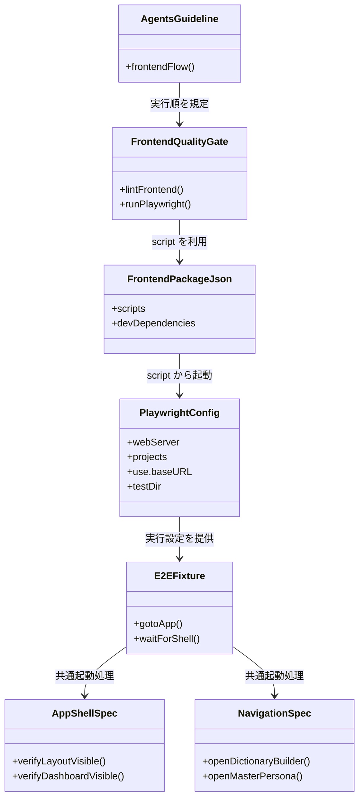
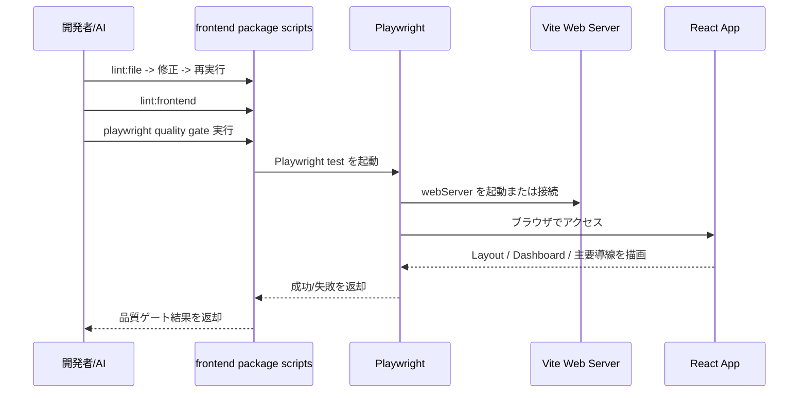

## Context

現状の `frontend` は `typecheck`、`lint`、`vitest`、`build` までは整備されているが、画面ルーティング、レイアウト描画、主要ページ遷移、Wails binding 変更に伴う実行時破損を検出する E2E 層を持っていない。`frontend/src/App.tsx` は `HashRouter` 配下で `Dashboard`、`DictionaryBuilder`、`MasterPersona` を公開しており、`Layout` はサイドバー、ログビューア、詳細ペインを常時描画する構成であるため、統合退行はコンポーネント単体テストだけでは取りこぼしやすい。

この change では、フロントエンド品質ゲートへ Playwright を追加し、ローカル開発時に再現しやすい形で UI 統合検証を実行可能にする。対象はまず Vite ベースの frontend とし、Wails ネイティブ shell そのものの完全再現ではなく、現行 React 画面の主要導線を安定して検証する MVP を先に成立させる。

制約は次のとおり。

- `frontend_architecture.md` に従い、ページ責務は描画に限定されている前提を崩さない
- `frontend-code-quality-guardrails` の既存 lint/test/build 導線へ自然に接続する
- 導入ライブラリはデファクトスタンダードに限定し、E2E には Playwright を採用する
- テスト仕様の詳細は `standard_test_spec.md` を参照しつつ、ここでは基盤と運用設計に集中する

## Goals / Non-Goals

**Goals:**

- `frontend` 配下に Playwright の設定、script、fixture、初期 E2E シナリオを追加する
- 開発者と AI が `lint:file -> 修正 -> 再実行 -> lint:frontend -> Playwright` の順で品質確認できる導線を定義する
- 最低限のゲートとして「アプリ起動」「主要レイアウト表示」「主要画面遷移」を検証する
- Wails 固有 API を直接叩かなくても成立するテスト対象と、将来 Wails 実行統合が必要な領域を分離する
- `AGENTS.md` と spec に Playwright を品質ゲートとして追記できる設計根拠を残す

**Non-Goals:**

- Wails デスクトップバイナリ全体を Playwright で直接操作するフルネイティブ E2E の構築
- 全ページ、全フォーム、全バックエンド連携を一度に E2E 化すること
- 既存 Vitest テストを Playwright へ置き換えること
- CI 構成の全面刷新や、ブラウザマトリクスの広範囲展開

## Decisions

### 1. E2E の実行対象は MVP では `frontend` の Vite アプリに限定する

Playwright は `frontend` ワークスペース内で実行し、`vite` の dev server または preview を起動してブラウザ E2E を行う。Wails ランタイム依存の検証は初期段階では対象外とし、React 側のルーティング、レイアウト、主要画面の描画と導線確認を優先する。

理由:

- Wails ネイティブウィンドウを含む E2E は初期導入コストが高く、基盤整備の最初の一歩としては不安定になりやすい
- 現在の退行リスクの大半は `frontend/src/App.tsx`、`Layout.tsx`、主要 page/hook 配線の破損であり、ブラウザ層だけでも価値が高い
- Playwright の標準的な `webServer` 導線をそのまま使える

代替案:

- Wails 実行プロセスを直接起動して E2E する案
  - 却下。実装難度と保守コストが高く、基盤導入の最初の成果としては重い
- Vitest + Testing Library のみで統合退行を担保する案
  - 却下。実ブラウザでのルーティング、レイアウト、導線確認が不足する

### 2. Playwright の設定と script は `frontend` ワークスペースに閉じ込める

依存追加、`playwright.config.*`、`tests/e2e`、共通 fixture、起動 script は `frontend` 配下へ配置する。ルート `package.json` には必要なら委譲 script のみを追加し、実体は frontend に集約する。

理由:

- フロントエンド品質ゲートの責務を frontend ワークスペースへ集約できる
- Node 依存のインストール単位が既存構成と一致する
- `frontend-code-quality-guardrails` の script 設計と整合する

代替案:

- ルート直下に E2E 設定を置く案
  - 却下。frontend 固有の品質ゲートなのに責務が分散する

### 3. 初期シナリオは「殴られにくい導線」から始める

最初の E2E は次の 3 系統を対象にする。

- アプリ起動時に `Layout` の主要構造が表示される
- ダッシュボード初期表示が成立する
- サイドバーまたはルーティング導線から `DictionaryBuilder` と `MasterPersona` へ遷移できる

この change では、バックエンドデータ前提や長時間ジョブ前提のシナリオは避け、静的レンダリングと基本導線の成立を品質ゲートにする。

理由:

- データ依存や Wails bridge 依存が少なく、E2E の安定性が高い
- UI shell と主要 page 配線の破損を早期に検知できる

代替案:

- いきなりジョブ実行や Wails API 呼び出しを含むシナリオを組む案
  - 却下。fixture や mock 層の整備が先に必要で、MVP の失敗率が上がる

### 4. 品質ゲート接続は `frontend` の既存 `check` 系列を拡張する

Playwright 実行は新しい script として追加し、最終的に `lint:frontend` の後段または `check` の一部として呼び出せる形にする。`AGENTS.md` ではフロント変更時の標準フローを `lint:file -> 修正 -> 再実行 -> lint:frontend -> Playwright` として明示する。

理由:

- 既存運用を崩さずに E2E を必須ゲートへ組み込める
- AI の作業フローに明示しやすい

代替案:

- Playwright を任意実行の補助テストに留める案
  - 却下。今回の依頼は品質ゲート化が目的であり、必須導線へ組み込む必要がある

### 5. 共通 fixture で起動 URL と待機条件を吸収する

Playwright test 側には共通 fixture または helper を用意し、ベース URL、初期待機、主要レイアウトの可視確認を集約する。個別 spec ごとにページ起動処理を重複させない。

理由:

- 今後シナリオを増やしても保守しやすい
- ログインや Wails mock などの前提追加にも対応しやすい

代替案:

- 各テストファイルで都度 `page.goto` と待機を書く案
  - 却下。初期は簡単でも、将来的に E2E が増えると重複が増える

## クラス図

## シーケンス図

## Risks / Trade-offs

- [Wails 固有 API を伴う画面でブラウザ E2E が不安定になる] → 初期対象をレイアウトと主要導線に絞り、Wails 依存が強い操作は後続 change で mock 方針を定義する
- [Playwright 導入で frontend の依存と初回セットアップコストが増える] → 依存は Playwright のみに限定し、script と README/AGENTS で導線を固定する
- [E2E が遅くなり、日常修正の反復が鈍る] → 最小シナリオだけを品質ゲート対象にし、重いケースは将来別 tag や別 script へ分離する
- [HashRouter のため URL 遷移確認の書き方が通常 SPA と異なる] → 共通 fixture で URL 判定と待機条件を吸収する
- [ネイティブ Wails shell の不具合を MVP では拾えない] → 本 change ではフロント統合退行の早期検知に限定し、ネイティブ統合は別段階として明示する

## Migration Plan

1. `frontend` に Playwright 依存と設定ファイル、実行 script を追加する
2. 共通 fixture と初期 E2E シナリオを追加する
3. `frontend-code-quality-guardrails` 相当の運用に合わせて script 接続を更新する
4. `AGENTS.md` にフロント品質ゲートとして Playwright 実行を追記する
5. ローカルで `lint:file`, `lint:frontend`, Playwright を順に実行し、ゲートが成立することを確認する

ロールバックは Playwright 関連ファイルと script 追加を戻せばよく、既存フロント機能へのデータ移行は発生しない。

## Open Questions

- Playwright 実行時の起動対象を `vite dev` にするか `vite preview` にするか。開発速度を優先するなら前者、build 後整合性を重視するなら後者
- Wails API 依存の強い画面に対し、将来的に mock 層を frontend 側で持つか、Wails 起動統合へ進むか
- ルート `package.json` に frontend E2E への委譲 script を追加するか、frontend ワークスペース実行に限定するか
