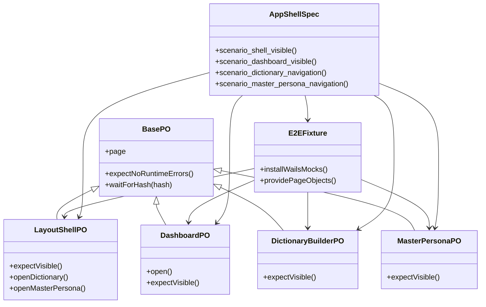
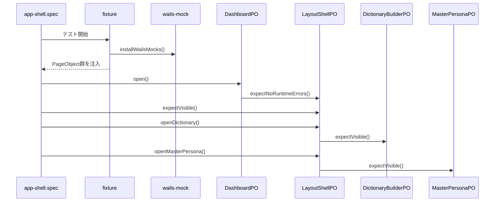

## Context

現在の Playwright E2E は `app.fixture.ts` の単一 `AppHarness` へ、画面遷移・可視確認・例外検知が集中している。シナリオ数が増えるほど fixture が肥大化し、spec から見た責務境界が曖昧になるため、画面追加時の変更波及が大きい。

この change は、既存の最小品質ゲート（4シナリオ）を維持したまま、E2E 実装構造を PageObject パターンへ全面移行する。対象は `frontend/src/e2e` 配下で、fixture は初期化専用に縮小し、画面/部品ごとの UI 操作責務を PageObject へ分離する。

制約:

- Playwright 実行導線（`npm run e2e`）は維持する
- Wails mock は E2E 初期化時に継続利用する
- 既存テストの機能要件（起動表示・主要導線）は後退させない
- 文字列や locator の管理は分散させず、PageObject 内で集約する

## Goals / Non-Goals

**Goals:**

- `fixture + harness` 中心構成を PageObject 中心構成へ置換する
- 画面単位（Dashboard / DictionaryBuilder / MasterPersona）と共通部品単位（Layout / Sidebar / Header）の責務分割を導入する
- spec から直接 locator 参照を排除し、シナリオ手順の可読性を向上する
- runtime error 監視を共通基盤化し、遷移後のクラッシュ検知を維持する

**Non-Goals:**

- 新規シナリオの追加（現行4シナリオ以外）
- Wails 実行方式や mock 方式の全面再設計
- Playwright 設定の大幅変更（project追加、reporter刷新等）
- UI 振る舞いそのものの変更

## Decisions

### 1. 移行方式は一括置換を採用する

`app.fixture.ts` の `AppHarness` を段階維持せず、同一 change で PageObject 構成へ置き換える。

理由:

- 旧実装と新実装の二重管理を避ける
- spec 側の API を早期に統一できる

代替案:

- 並行運用: 互換維持は容易だが、責務の二重化が長期化する

### 2. 分割単位は「画面 + 共通部品」に固定する

`page-objects/components` と `page-objects/pages` を設け、共通UI（Layout/Sidebar/Header）と画面固有操作（Dashboard/Dictionary/MasterPersona）を分離する。

理由:

- 画面固有変更と共通部品変更を分離できる
- 将来のシナリオ追加で再利用しやすい

代替案:

- 画面のみ分割: 初期は簡単だが locator 重複が増える
- 機能細分化: 初期4シナリオには過剰設計

### 3. アサーションは PageObject 内へ保持する

`expectXxxVisible` や遷移成立確認を PageObject API として提供し、spec はシナリオ順序の記述に専念させる。

理由:

- spec 可読性が高い
- locator 変更時の修正点を局所化できる

代替案:

- spec 側アサーション維持: 柔軟だが責務が分散しやすい

### 4. fixture は初期化と注入に限定する

fixture の責務は `installWailsMocks`、`Page` 受け渡し、PageObject インスタンス提供に限定する。runtime error 監視は `BasePO` の共通機能として提供する。

理由:

- fixture の肥大化を防ぐ
- 画面操作ロジックを PageObject 側へ完全移譲できる

### 5. 既存品質ゲート要件は維持する

4シナリオ（起動レイアウト、ダッシュボード、辞書構築遷移、マスターペルソナ遷移）を保持し、内部実装だけを PageObject へ変更する。

理由:

- 品質ゲートの意図を変えずに構造改善できる
- 変更影響を構造面へ限定できる

## クラス図

## シーケンス図

## Risks / Trade-offs

- [PageObjectが肥大化する] → 共通部品POと画面POを分離し、責務を固定する
- [mock不足で黒画面化する] → runtime error 検知を共通化し、初期化失敗を即時失敗にする
- [文字列依存で brittle になる] → locator/表示文言を PageObject 内に集約し、spec 直書きを禁止する
- [一括置換で一時的に壊れやすい] → 4シナリオを維持したまま段階検証（lint:file -> lint:frontend -> e2e）を必須化する

## Migration Plan

1. `src/e2e/page-objects` を新設し、BasePO・共通部品PO・画面POを作成する
2. fixture を PageObject 注入方式に変更し、旧 `AppHarness` を削除する
3. `app-shell.spec.ts` を PageObject API 呼び出しへ置換する
4. 旧 `createHarness` 相当コードを削除し、重複 helper を整理する
5. `npm run lint:file -- src/e2e`、`npm run lint:frontend`、`npm run e2e` で品質ゲートを確認する

ロールバックは、旧 fixture/harness 実装を復元して spec を戻せば成立する。データ移行は発生しない。

## Open Questions

- なし（本 change の実装方針は全面導入・一括置換で確定済み）
