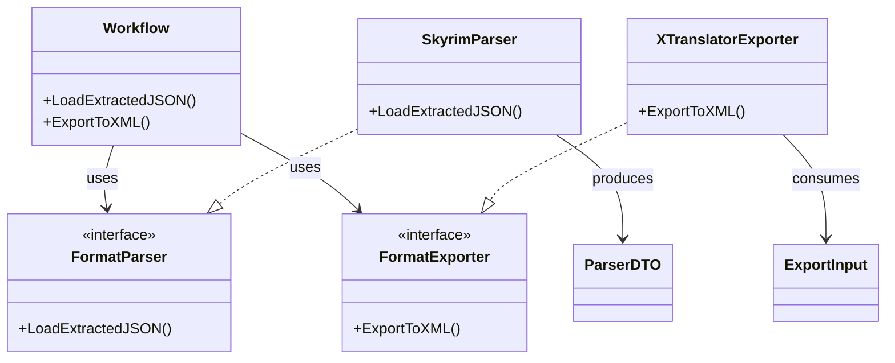
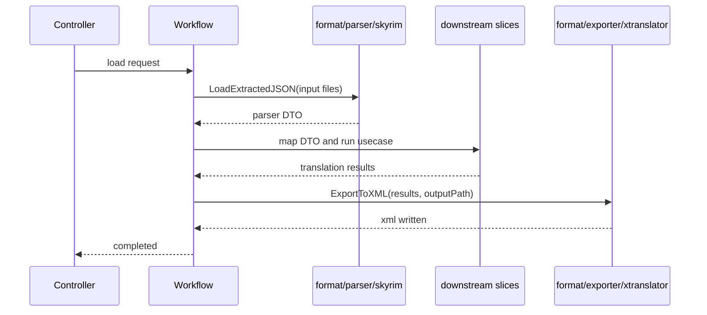

## Context

現行実装では、入力側の parser は [pkg/slice/parser](/F:/ai%20translation%20engine%202/pkg/slice/parser) に、出力側の exporter は [pkg/gateway/export](/F:/ai%20translation%20engine%202/pkg/gateway/export) に存在しており、どちらも Skyrim 抽出 JSON と xTranslator XML という外部フォーマットへの適応を担っている。一方で [architecture.md](/F:/ai%20translation%20engine%202/openspec/specs/architecture.md) には format 専用の責務区分がなく、workflow / slice / gateway のどこに置くのが正しいかがコード上の配置だけでは読み取りにくい。

`PER-32` の狙いは、外部仕様への適応を `pkg/format` へ集約し、Skyrim parser と xTranslator exporter を「ユースケース本体」から切り離した format adapter として再定義することにある。入出力フォーマット自体は変更せず、import パス・DI 配置・OpenSpec 上の capability 境界のみを整理対象とする。

制約:
- `proposal.md` で定義した通り、Skyrim 抽出 JSON と xTranslator XML の仕様互換は維持する。
- 既存の workflow/slice が期待する DTO 契約は、移行期間中に破壊的に変えない。
- 新規ライブラリは導入せず、既存の Go 標準ライブラリと DI 構成を継続利用する。

## Goals / Non-Goals

**Goals:**
- `pkg/format` を外部フォーマット境界として新設し、parser/exporter の責務所属を明確化する。
- Skyrim 向け parser を `pkg/format/parser/skyrim`、xTranslator 向け exporter を `pkg/format/exporter/xtranslator` 相当へ再配置する。
- workflow や他 slice から見える契約を維持しつつ、import / provider / composition root を新しい配置へ揃える。
- OpenSpec 上で `format` 新規 capability と、`slice/parser`・`export` の requirement 変更を説明可能な状態にする。

**Non-Goals:**
- 抽出 JSON スキーマや xTranslator XML スキーマの変更。
- translator / persona / dictionary など他 usecase slice の業務仕様変更。
- 新しい exporter 形式や別ゲーム向け parser の実装追加。
- DB スキーマ変更。

## Decisions

### 1. 外部フォーマット適応は `pkg/format` に集約する
- 決定: Skyrim 抽出 JSON の入力解釈と xTranslator XML の出力生成を `pkg/format` 配下へ集約する。
- 理由: どちらも「外部フォーマットの解釈・生成」であり、slice の業務判断でも gateway の汎用外部依頼口でもないため。
- 代替案A: parser を `pkg/slice/parser` のまま残し、exporter だけ移す。
  - 却下理由: 入出力で判断軸が分かれ、責務整理の基準が一貫しない。
- 代替案B: parser/exporter を `pkg/gateway` に寄せる。
  - 却下理由: gateway は外部 I/O 依頼口の抽象化に寄り、フォーマット固有の DTO 変換・構造解釈まで含めると責務が広すぎる。

### 2. workflow から見える契約は段階的に維持する
- 決定: 既存呼び出し側が使うインターフェースは大きく変えず、実装配置と provider を先に差し替える。
- 理由: 先に import パスと DI を安定させる方が、回帰範囲を限定しやすい。
- 補足: workflow から見える interface 名は `Parser` / `Exporter` のまま維持し、format 境界化は package 配置と実装責務で表現する。
- 代替案A: DTO と interface 名まで同時に全面改名する。
  - 却下理由: 変更面積が広がり、今回の主目的である責務整理の評価が難しくなる。
- 代替案B: 一時的な adapter 層を大量に追加する。
  - 却下理由: 移行期間は楽だが、不要な中継層が残りやすい。

### 3. parser は Skyrim 固有 adapter、exporter は xTranslator 固有 adapter として明示する
- 決定: ディレクトリ名に `skyrim` / `xtranslator` を含め、ゲーム固有・ツール固有の知識を package 境界に表す。
- 理由: 将来的に別ゲーム・別出力形式が増えた場合の拡張点を package 名で示せる。
- 補足: [pkg/gateway/export](/F:/ai%20translation%20engine%202/pkg/gateway/export) の既存テスト資産は単純移設せず、format 配下の責務名に合わせてテスト名と fixture 名も更新する。
- 代替案A: `pkg/format/parser` と `pkg/format/exporter` だけに留める。
  - 却下理由: 固有実装が増えたときに責務分割し直す必要がある。

### 4. OpenSpec の capability は「新規 format」「既存 export」「既存 slice/parser」の3本で整理する
- 決定: 新規 capability `format` を追加し、既存 `export` と `slice/parser` は requirement 更新として扱う。
- 理由: 今回の変更は仕様面でも責務境界の定義が増えるため、新規 capability なしでは変更契約を表現しきれない。
- 代替案A: `format` を作らず、既存 2 spec だけ書き換える。
  - 却下理由: 共通原則が spec 間に分散し、将来の format 追加時に再利用できない。

### クラス図

### シーケンス図

## Risks / Trade-offs

- [import 更新漏れ] → 先に参照箇所を検索し、旧 package を使うコードを段階的に潰してから lint/test を実行する。
- [DI 初期化の破損] → provider / composition root の差し替えを独立コミット粒度で進め、interface は維持して配線変更だけを先に検証する。
- [責務境界の二重管理] → 旧 package を長期間残さず、移行完了後は `pkg/format` を唯一の配置規約として spec に明記する。
- [spec と実装の不一致] → `format` 新規 spec と `export` / `slice/parser` 差分 spec を同一 change 内で先に揃える。

## Migration Plan

1. `format` 境界の spec を追加し、`export` と `slice/parser` の requirement 差分を定義する。
2. 実装側で `pkg/format/parser/skyrim` と `pkg/format/exporter/xtranslator` を追加し、既存コードを移設する。
3. workflow / controller / composition root の import と provider を新 package へ切り替える。
4. 旧 package 参照を除去し、関連テストと `npm run lint:backend` で回帰を確認する。
5. [cmd/parser](/F:/ai%20translation%20engine%202/cmd/parser) のような旧配置前提の補助コマンドは維持せず、互換 import を残さず削除する。
6. 問題があれば import / provider 切り替え前の構成へ戻せるよう、移設と配線変更を段階化して進める。

## Open Questions

- なし
