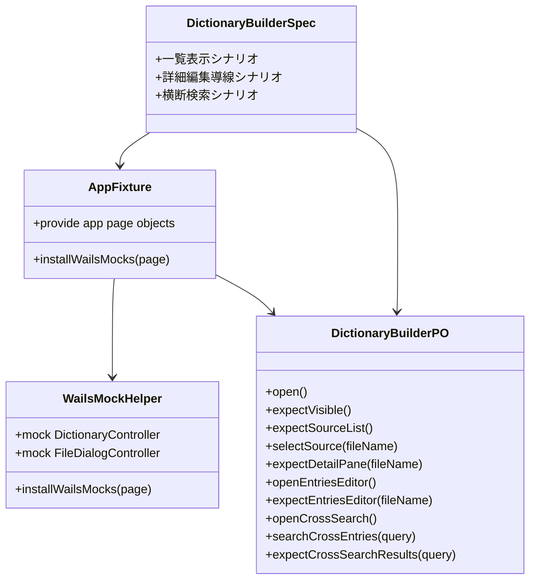
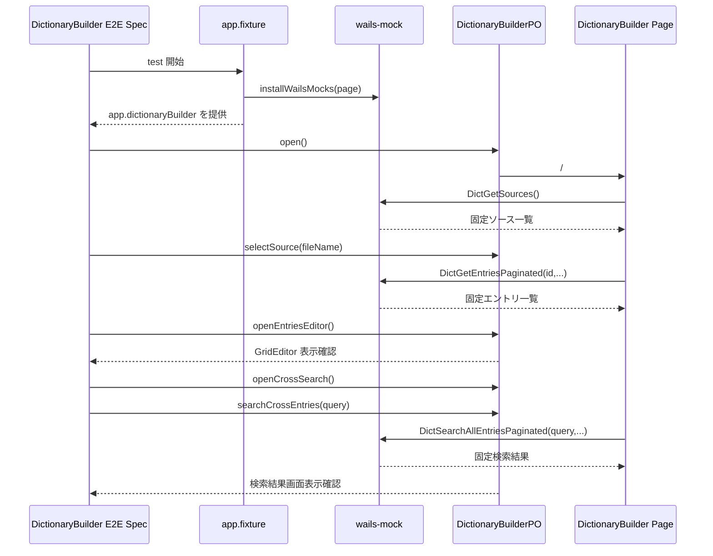

## Context

現状の Playwright E2E は `frontend/src/e2e` に集約され、fixture で Wails binding をモックし、spec から PageObject を呼び出す基本構成は整っている。一方で、品質ゲートとして何を最低限通すべきかは `playwright-quality-gate` に個別画面名ベースで記述されており、ページ単位 E2E のシナリオ粒度や合格条件が標準化されていない。

今回の変更は cross-cutting な品質基準の整理と frontend E2E 実装の両方にまたがるため、共通 spec と画面実装の責務分割を明確にした設計が必要である。既存方針として、E2E は Wails ネイティブ自動化ではなくブラウザベースで実行し、UI 操作は PageObject API 経由で扱う。

## Goals / Non-Goals

**Goals:**
- ページ単位 E2E の合格条件を `必須シナリオ` として共通定義し、画面固有名称に依存しない品質ゲート用語を導入する。
- `playwright-quality-gate` から共通概念を参照できる形にし、既存 spec の責務を「Playwright 基盤とゲート運用」に集中させる。
- `DictionaryBuilder` に対し、ページ単位の必須シナリオを 3 本追加し、一覧表示、選択後の詳細/編集導線、横断検索導線の回帰を検出できるようにする。
- 既存 E2E の page object-centric 構造を維持しつつ、fixture と Wails モックを `DictionaryBuilder` の画面操作に必要な固定データへ拡張する。

**Non-Goals:**
- Wails デスクトップアプリ自体のネイティブ自動化を導入しない。
- `DictionaryBuilder` の保存成功、削除送信、import 進捗イベント完了までを今回の必須シナリオに含めない。
- 全ページに一括で必須シナリオを追加しない。今回は標準化と `DictionaryBuilder` への最初の適用に留める。

## Decisions

### 1. `必須シナリオ` は `e2e-required-scenarios` 配下で標準 spec とページ別 spec に分けて定義する
ページ単位 E2E の粒度や合格条件は `DictionaryBuilder` 固有の spec に埋め込まず、新規 `e2e-required-scenarios` capability に定義する。親の `openspec/specs/e2e-required-scenarios/spec.md` には共通用語、合格条件、シナリオ粒度を置き、各ページ固有の必須シナリオは `openspec/specs/e2e-required-scenarios/<page>/spec.md` に分ける。これにより、「1ページのユーザー目的を完結させるシナリオを最低 N 本持つ」「合格条件はそのページの必須シナリオが全通すること」といった共通ルールと、ページ固有のシナリオ定義を分離して再利用できる。

代替案として `playwright-quality-gate` 内に直接追記する方法もあるが、この方法では Playwright 実行基盤の要件と、ページ単位シナリオ設計の共通概念が混在する。責務境界を保つため、新規 capability と既存 capability の分離を選ぶ。

### 2. `playwright-quality-gate` は「基盤と運用」、`e2e-required-scenarios` は「標準」と「ページ別定義」を担う
`playwright-quality-gate` には以下だけを残す。
- Playwright を frontend ワークスペースで動かすこと
- Browser E2E を採用すること
- PageObject 経由で実装すること
- 品質ゲートが `必須シナリオ` を通過条件に含むこと

ページ単位シナリオの粒度、ページごとに最低何を持つべきか、失敗判定の考え方は `e2e-required-scenarios/spec.md` に寄せる。各ページの具体的な必須シナリオ列挙はその配下ディレクトリの `spec.md` に置く。これにより、今後 `MasterPersona` や別ページへ展開するとき、共通ルールとページ固有定義の両方を同じ capability 配下で管理できる。

### 3. `DictionaryBuilder` の必須シナリオは 3 本で固定する
今回の `DictionaryBuilder` は以下の 3 シナリオを必須とする。
- 一覧表示: 画面初期表示、インポート領域、ソース一覧描画
- 選択後の詳細/編集導線: ソース選択、`DetailPane` 表示、`GridEditor` 遷移
- 横断検索導線: モーダル起動、キーワード入力、検索結果画面遷移

代替案として保存呼び出しまで含める案もあるが、初期の必須シナリオとしては UI 導線回帰の検知を優先する。保存系はモック監視や副作用の扱いが増え、ページ単位 E2E の標準定義までノイズを持ち込むため今回は外す。

### 4. Wails モックは fixture から注入し、`DictionaryBuilder` 用データセットを helpers に閉じ込める
既存の `installWailsMocks(page)` は空配列ベースの簡易モックであり、`DictionaryBuilder` のページ内フローを成立させるには不足している。そこで、`wails-mock.ts` で `DictionaryController` の返却値を `DictionaryBuilder` 用固定データセットに拡張する。

固定データセットには少なくとも以下を含める。
- ソース一覧 1-2 件
- 選択したソースに対応するエントリ一覧
- 横断検索クエリに対応する結果一覧

代替案として spec ごとに `page.route` や `page.evaluate` で都度モックを差し替える方法もあるが、Wails binding モックの責務が spec 側へ漏れる。fixture と helper に寄せる現在の構造を維持する。

### 5. `DictionaryBuilderPO` をページ操作の単一入口にする
`DictionaryBuilderPO` は単なる可視確認だけでなく、以下の API を持つよう拡張する。
- `open()`
- `expectVisible()`
- `expectSourceList()`
- `selectSource(fileName)`
- `expectDetailPane(fileName)`
- `openEntriesEditor()`
- `expectEntriesEditor(fileName)`
- `openCrossSearch()`
- `searchCrossEntries(query)`
- `expectCrossSearchResults(query)`

これにより spec はシナリオ順序だけを記述し、locator は PageObject に閉じ込める。代替案として spec に locator を書く方法は、既存 `e2e-page-object-architecture` の要件に反するため採用しない。

## Class Diagram

## Sequence Diagram

## Risks / Trade-offs

- [Risk] 文言ベース locator が UI 文言変更に弱い → Mitigation: 初期実装は既存文言で進め、必要なら `aria-label` または `data-testid` を追加して PageObject 内でのみ切り替える。
- [Risk] 固定モックが実データ形状と乖離する → Mitigation: `useDictionaryBuilder` の adapter が期待する snake_case/response shape に合わせたモック値を返し、hook テストの既存データ構造も参照する。
- [Risk] 必須シナリオの定義が広すぎると E2E が重くなる → Mitigation: 今回は「1ページのユーザー目的を完結させる最小導線」に限定し、保存や削除は後続段階へ分離する。
- [Risk] 共通 spec と Playwright spec の責務が再び混ざる → Mitigation: `e2e-required-scenarios/spec.md` は標準ルールだけを扱い、ページ固有の必須シナリオは配下ディレクトリへ分離する。Playwright 実行基盤や page object の実装方針は既存 capability に残す。

## Migration Plan

1. 新規 `openspec/specs/e2e-required-scenarios/spec.md` を追加し、ページ単位 E2E の用語、粒度、合格条件を標準として定義する。
2. `openspec/specs/e2e-required-scenarios/dictionary-builder/spec.md` を追加し、`DictionaryBuilder` の 3 本の必須シナリオをページ別定義として記述する。
3. `playwright-quality-gate` spec を更新し、品質ゲートが `必須シナリオ` を通過条件に含むことを明示する。
4. `frontend/src/e2e/helpers/wails-mock.ts` を `DictionaryBuilder` 用固定データセットへ拡張する。
5. `frontend/src/e2e/page-objects/pages/dictionary-builder.po.ts` をシナリオ操作 API まで拡張する。
6. `DictionaryBuilder` 向け spec を追加し、3 本の必須シナリオを実装する。
7. `npm run lint:file -- <変更ファイル>`、`npm run lint:frontend`、`npm run e2e` を順に実行して品質ゲートへ載せる。
8. 問題があれば E2E 追加分だけを巻き戻せばよく、既存 app-shell smoke は独立して維持される。

## Open Questions

- 現時点で追加の未解決事項はない。`DictionaryBuilder` の保存系を必須シナリオへ昇格させるかは、この change の対象外として後続判断に分離する。