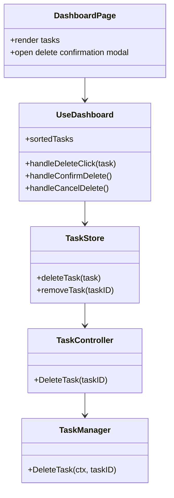
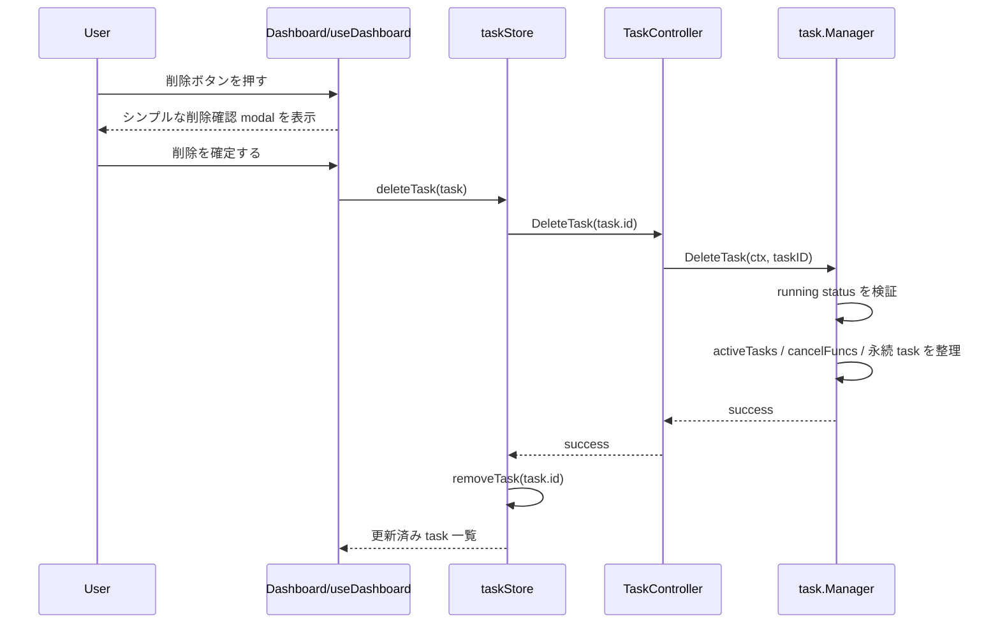

## Context

現在のダッシュボードは `frontend/src/pages/Dashboard.tsx` と `useDashboard` を通じて task 一覧表示、詳細画面遷移、停止、再開を提供している。一方で task 自体を削除する導線は存在せず、`frontend_tasks` に残った停止済み task をユーザーが整理できない。

今回の設計見直しでは、`artifact` にあるデータを削除対象として扱うのは不適切だと整理する。`artifact` は共有される正本を置く境界であり、task 削除に連動して破棄する対象ではない。したがって、この change では task 削除の責務を task manager が持つ管理対象の削除に限定し、artifact 正本や shared handoff には触れない。

また、今回の前提として dictionary build は高速処理であり、将来的にも task delete hook の対象には含めない。削除導線の対象は Dashboard に表示される generic task とし、controller の入口は `TaskController.DeleteTask` に一本化する。

アーキテクチャ上の制約は以下とする。

- UI は `pages` 直書きではなく feature hook と store 経由で操作する
- controller は Wails 入出力の整形に留め、task 削除の orchestration は task 管理層で担う
- task 削除 API の公開入口は `TaskController.DeleteTask` のみとし、`PersonaTaskController` に alias は持たせない
- task 削除は `frontend_tasks` と task manager の管理対象だけを対象とし、artifact 正本は削除しない
- 新規ライブラリは導入せず、既存の Zustand、Wails binding、`database/sql`、SQLite で実装する

## Goals / Non-Goals

**Goals:**
- ダッシュボードから削除可能 status の task を削除できるようにする
- task 削除時に `frontend_tasks` と task manager の管理対象を一貫して整理する
- UI から backend まで責務を分離した delete 導線を追加する
- 実行中 task の削除拒否とシンプルな modal 確認 UI を明確にする

**Non-Goals:**
- task の停止ロジックそのものを作り直すこと
- artifact 正本、final persona、shared handoff を task 削除で破棄すること
- ダッシュボードの一覧仕様を大幅に変更すること
- 新しい DB ファイルやジョブキュー基盤を導入すること
- dictionary build を task delete hook 対象へ広げること

## Decisions

### Decision 1: UI は `useDashboard` と `taskStore` に削除状態を集約し、確認はシンプルな modal で行う
- 決定: `Dashboard.tsx` は削除ボタンと確認 modal の描画だけを持ち、削除対象選択、確認、実行状態、失敗時ハンドリングは `useDashboard` と `taskStore` に寄せる
- 理由: `frontend-architecture` が求める Headless パターンを守りつつ、既存画面のデザインへ自然に載せられる。ブラウザ標準 confirm よりも文言とレイアウトを既存 UI に合わせやすい
- 代替案 A: `Dashboard.tsx` で直接 Wails binding を呼ぶ
  - 却下理由: pages から Wails 直接呼び出しは禁止であり、fat page 化する
- 代替案 B: ブラウザ標準 confirm を使う
  - 却下理由: Wails 画面の見た目と一貫せず、削除対象説明も弱い

### Decision 2: task 削除 orchestration は `pkg/workflow/task.Manager` に集約し、公開 API は `TaskController.DeleteTask` に一本化する
- 決定: Wails binding の公開入口は `TaskController.DeleteTask` のみとし、実処理は `pkg/workflow/task.Manager.DeleteTask(ctx, taskID)` に集約する。`PersonaTaskController` 側には alias を持たせない
- 理由: task の実行状態、永続化、activeTasks / cancelFuncs の整合管理は既に `Manager` が責務を持っている。delete もここへ置くと API を増やさずに一箇所で扱える
- 代替案 A: `PersonaTaskController` にも delete alias を追加する
  - 却下理由: API が重複し、削除入口が分散する
- 代替案 B: store が直接 task レコードを消す
  - 却下理由: 実行中判定や manager 内状態の整理を扱えない

### Decision 3: task 削除は manager 管理対象の整理に限定し、artifact には触れない
- 決定: `DeleteTask` は `frontend_tasks` の永続レコード削除と `activeTasks` / `cancelFuncs` / 関連メモリ状態の整理だけを担当し、artifact 正本や shared handoff cleanup は行わない
- 理由: `artifact` は正本の保存境界であり、task 削除に連動して破棄する対象ではない。task 削除と成果物削除を結びつけると責務が衝突する
- 代替案 A: translationinput や master persona artifact を task 削除で cleanup する
  - 却下理由: artifact 正本の意味付けと矛盾する
- 代替案 B: task type ごとの delete hook を先に追加する
  - 却下理由: 現スコープでは不要であり、誤って artifact 削除に拡張されやすい

### Decision 4: dictionary build は task delete hook 対象にしない
- 決定: dictionary build は高速処理で task 化する意味が薄く、delete hook や専用 cleanup 対象に含めない
- 理由: 実際の運用前提に合わせて不要な分岐を持ち込まない方が実装が明快である
- 代替案 A: dictionary build 用 no-op hook を先に追加する
  - 却下理由: 使わない拡張点を先回りで増やすだけになる
- 代替案 B: dictionary build 専用 cleanup を追加する
  - 却下理由: 現時点で cleanup 対象が存在しない

### Decision 5: 削除順序は「実行中判定 -> manager 内状態整理 -> task record delete -> UI state remove」とする
- 決定: `DeleteTask` は `running` を拒否し、削除対象 task を読み出した後、manager 内状態を整理してから `frontend_tasks` を削除し、フロントは成功応答後に store から該当 task を除去する
- 理由: 実行中 task の不整合を防ぎつつ、UI 側は backend 成功を真実として反映できる
- 代替案 A: task record を先に削除してから manager 状態を整理する
  - 却下理由: 失敗時に UI と manager 内状態がずれやすい
- 代替案 B: フロント先行で optimistic remove する
  - 却下理由: Wails API 失敗時に復元ロジックが増える

## Architecture Details

### Class Diagram

### Sequence Diagram

## Risks / Trade-offs

- [task 削除が artifact を掃除しない] → task に紐づく成果物は残るが、これは artifact 正本を消さないという意味付けを優先した結果である。成果物削除が必要なら別 change で責務境界から再設計する
- [ダッシュボード UI の状態追加] → 確認 modal や削除中 state で hook が少し複雑になる。削除対象 ID と `isDeleting` を専用 state に限定する
- [completed task の扱い差分] → 現行 dashboard は completed を表示しない。delete API は task 一般に対応させつつ、UI は現在表示する status にだけ削除ボタンを出す

## Migration Plan

1. `task.Manager` と `task.Store` に task 削除 API を追加し、`TaskController.DeleteTask` として Wails binding を公開する
2. `taskStore`、`useDashboard`、`Dashboard.tsx` にシンプルな modal 確認 UI と削除 action を追加する
3. `pkg/workflow/task` と Dashboard の削除導線に対する backend / frontend / E2E テストを追加する

## Open Questions

- なし
