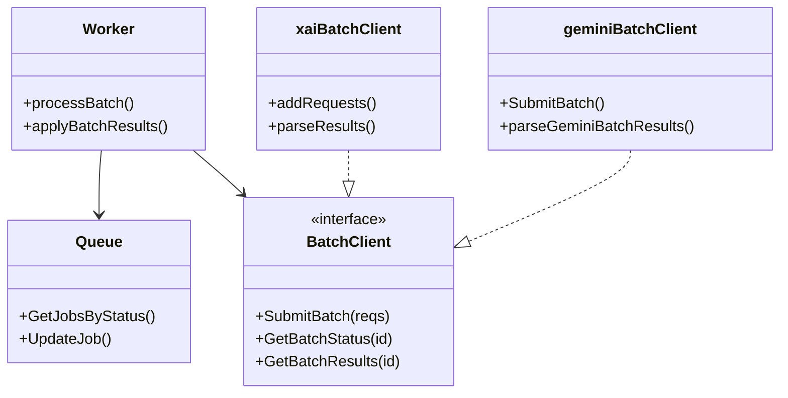
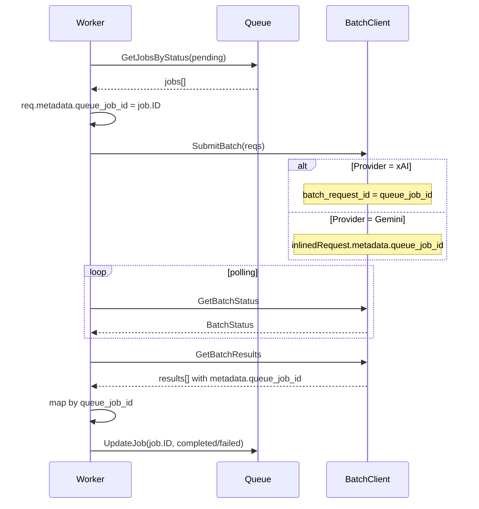

## Context

現在の `runtime/queue` は batch 結果を `results[i] -> jobs[i]` で適用しており、配列順一致を暗黙前提にしている。xAI は結果順が不定になり得るため誤保存が現実に発生し、Gemini は仕様上入力順で返るが index 前提のままだと将来の経路追加や再開時の順序差異に弱い。

本変更では provider 共通で相関 ID ベースに統一し、LLM 出力本文ではなく transport metadata だけで request 対応付けを行う。

責務境界:

- `gateway/llm`: provider 固有 payload で相関 ID を送受信
- `runtime/queue`: 相関 ID で job を特定して保存

前提制約:

- DB スキーマ変更なし
- 外部 API 追加なし
- 既存ジョブとの後方互換を維持

## Goals / Non-Goals

**Goals:**

- xAI / Gemini の batch 結果を順序非依存で正しい job に適用する
- 相関 ID を request metadata に統一し、LLM 本文非依存で復元する
- Resume を含む全経路で同一相関規約を使う
- 相関不能時は誤保存せず failed へ倒す

**Non-Goals:**

- 新規テーブル追加や `llm_jobs` 拡張
- provider-native batch API の全面再設計
- Master Persona 以外の workflow 要件変更

## Decisions

### 1. 相関 ID は `queue_job_id` として request metadata に格納する

- 決定:
  - Queue が batch submit 直前に各 request へ `metadata.queue_job_id = <llm_jobs.id>` を付与する
  - 必要に応じて `metadata.queue_request_seq = <resume_cursor>` を補助値として保持する（診断用途）
- 理由:
  - DB 追加なしで request 単位一意性を担保できる
  - provider 間で同一キー名を使える
- 代替案:
  - index (`req-<n>`) を相関キーにする
  - 却下理由: resume 時の順序差異で破綻する

### 2. Provider ごとの相関 ID 埋め込み経路を固定する

- xAI:
  - 送信: `batch_request_id = metadata.queue_job_id` を優先採用
  - 受信: `result.batch_request_id` を `Response.Metadata.queue_job_id` へ戻す
- Gemini:
  - 送信: `inlinedRequest.metadata.queue_job_id` へ格納（既存 metadata 経路）
  - 受信: `inlinedResponse.metadata.queue_job_id` を `Response.Metadata` から参照
- 理由:
  - xAI は `batch_request_id` が最も直接的な相関キー
  - Gemini は API 仕様で metadata が request/response に往復する
- 代替案:
  - Gemini でも独自 `request_id` フィールド追加を期待する
  - 却下理由: API 非依存でなく、既存仕様外

### 3. `applyBatchResults` は metadata 相関を第一優先にする

- 決定:
  - `Response.Metadata.queue_job_id` がある結果を map 化し、`job.ID` で照合して保存
  - metadata 欠落結果のみ互換 fallback として index 適用
  - `queue_job_id` 重複・未知 ID・期待件数不足は failed 扱いで記録
- 理由:
  - 新経路を安全に有効化しつつ旧データ互換を維持できる
- 代替案:
  - metadata がない結果を即全体失敗
  - 却下理由: 既存データ互換を壊すリスクが高い

### 4. テストは xAI/Gemini の相関経路を明示検証する

- 決定:
  - `xai_batch_client_test`: 順不同結果 + `batch_request_id` 復元を検証
  - `gemini_batch_client_test`: metadata round-trip（request -> response）を検証
  - `job_queue_test`: 結果シャッフル時も `queue_job_id` 基準で正しく保存されることを検証
- 理由:
  - 単体正常系では今回の取り違えが再現しない

### クラス図

### シーケンス図

## Risks / Trade-offs

- [Risk] xAI の `batch_request_id` 制限（文字数/文字種）で `job.ID` が拒否される
  - Mitigation: 仕様制限が判明した場合は短縮IDマッピングを追加し、`metadata.queue_job_id` に元IDを保持する
- [Risk] metadata 欠落時 fallback が残るため厳密性が落ちる
  - Mitigation: warning ログを追加し、後続で strict モードへ移行可能にする
- [Risk] 旧 in-progress batch との混在で相関情報が揃わない
  - Mitigation: fallback で救済しつつ、未知/重複は failed として誤保存を防ぐ

## Migration Plan

1. `worker` で submit 前に `queue_job_id` を request metadata へ注入
2. `xai_client` で `batch_request_id` 採用・復元を実装
3. `gemini_batch_client` の metadata 経路を相関 ID 必須前提で明示化
4. `applyBatchResults` を metadata-first へ変更
5. xAI/Gemini/queue の回帰テストを追加
6. `backend:lint:file -> 修正 -> 再実行 -> lint:backend` で品質確認

ロールバック方針:

- metadata-first 適用ロジックのみ切り戻せるよう変更を分離
- DB 変更がないためデータ移行ロールバックは不要

## Open Questions

- xAI `batch_request_id` の実運用上限（文字長/文字種）の最終確認
- Gemini `responsesFile` 経路を将来実装する際の相関 ID 取り回し
- metadata strict モードを既定化するタイミング