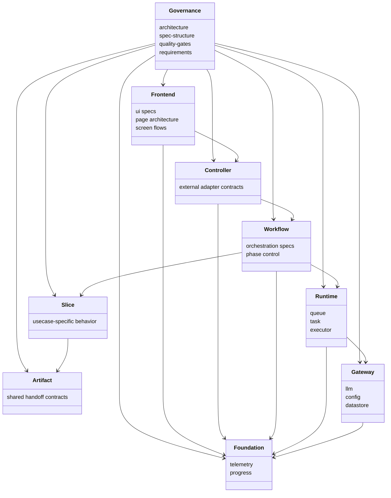
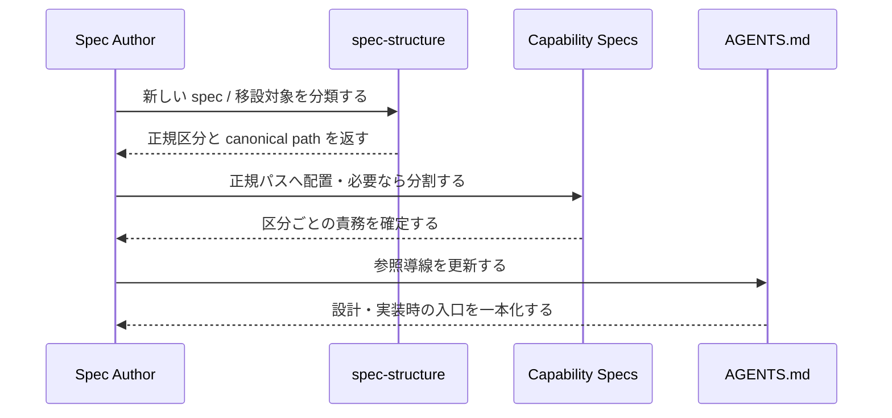

## Context

`openspec/specs` は長期運用の中で、旧来の capability 名と責務区分ベースの新分類が混在している。現状は以下の問題を持つ。

- `architecture.md` は `controller / workflow / slice / runtime / artifact / gateway / foundation` を定義しているが、`spec-structure` は `cross-cutting` 中心の別軸を残している
- root 直下 `.md` と capability ディレクトリが混在し、どれが canonical path か判別しにくい
- `slice/master-persona-ui` のように、spec の中身と置き場が一致していないものがある
- `translation-flow-data-load` のように、UI と workflow の責務が 1 文書へ混在している
- `AGENTS.md` が旧パスを参照しており、AI が同じ主題の spec を複数候補として見る余地がある

この change は実装コードを変えず、OpenSpec 文書群そのものをアーキテクチャ責務区分へ寄せて再配置する。

### クラス図

### シーケンス図

## Goals / Non-Goals

**Goals:**

- `openspec/specs` の正規分類を実装責務区分と一致させる
- root 直下 `.md` を廃止し、canonical path をディレクトリ単位で統一する
- 誤分類 spec を正しい区分へ移動する
- 責務混在 spec を frontend / workflow などへ分割する
- `AGENTS.md` からの参照導線を新構造へ一致させる

**Non-Goals:**

- アプリケーションコードの挙動変更
- 各 spec の文体や粒度の全面統一
- すべての capability の新規要件追加
- OpenSpec CLI 自体の拡張

## Decisions

### 1. 正規分類は 9 区分に固定する

`governance / frontend / controller / workflow / slice / runtime / artifact / gateway / foundation` を `openspec/specs` の唯一の分類軸とする。`cross-cutting` は曖昧で、`artifact` と `foundation` の独立性を覆い隠すため採用しない。

代替案:

- `cross-cutting` を維持する
  - 却下。`progress` と `telemetry` は foundation、`architecture` と品質ゲートは governance であり、同列ではない
- root 直下 `.md` を残して論理分類だけ導入する
  - 却下。canonical path が二重化し、AGENTS と spec-structure がすぐ乖離する

### 2. capability 単位で canonical path を 1 つに絞る

各 spec は `openspec/specs/<zone>/<capability>/...` に置き、旧パスを並存させない。必要な補助文書は capability 配下へ同居させる。

代替案:

- 旧パスに stub 文書を残す
  - 却下。AI と人間の参照先が分散し、二重更新の温床になる

### 3. governance は capability ではなく区分として扱う

`architecture`、`spec-structure`、品質ゲート、テスト標準、ログ標準、全体要件などは実装責務の 1 つではなく、全区分を統制する文書群であるため、`governance` 配下へ集約する。

代替案:

- 既存の root 直下ファイルをそのまま governance 扱いする
  - 却下。物理配置と論理分類のズレが残る

### 4. UI と進行制御が混在した spec は分割を正とする

`translation-flow-data-load` のように UI 要件と工程制御が混在する文書は、frontend と workflow の別 capability へ分割する。もとの capability は削除または委譲に寄せ、混在状態を残さない。

代替案:

- 1 文書内に章を増やして責務を共存させる
  - 却下。配置規則の例外が増え、将来の判断基準が曖昧になる

### 5. AGENTS は区分別入口だけを示す

`AGENTS.md` は具体的な主要 spec の入口を区分ごとに案内し、root 直下前提のパスを持たないようにする。これにより AI が `architecture` へ品質ルールを書き戻す誤りを防ぐ。

## Risks / Trade-offs

- [リネーム量が多い] → 移行マッピングを `spec-structure` と tasks に明示し、最終状態で参照更新を一括確認する
- [OpenSpec capability パス変更で既存 change と衝突する] → 既存 change の対象 capability は変更せず、今回の整理対象を現行 `openspec/specs` の正本に限定する
- [責務分割が過剰になる] → 分割対象は「内容と置き場が一致しないもの」「複数責務が明確に混在しているもの」に限定する
- [AGENTS と spec の整合が崩れる] → 最後に AGENTS 更新を必須 task として扱う

## Migration Plan

1. `spec-structure` の delta で新しい 9 区分、canonical path、移行原則を定義する
2. `architecture` の delta で spec 参照導線を新しい区分へ合わせる
3. `translation-flow-data-load` を frontend / workflow capability に分割する delta spec を追加する
4. 実ファイルを `openspec/specs/<zone>/...` へ移動し、補助文書も同居させる
5. 旧パス参照を `AGENTS.md` と各 spec 本文から新パスへ更新する
6. `openspec status --change "refactor-spec-structure"` と directory tree で最終整合を確認する

ロールバック:

- 文書変更のみのため、問題があれば change 内作業を戻し、物理移動前の tree に戻す

## Open Questions

- `api-test` と `playwright-quality-gate` を governance 配下の独立 capability として扱うか、品質ゲート配下の補助 capability として束ねるか
- `xtranslator_xml_spec.md` を長期的に governance の要件文書として残すか、特定 slice / format capability へ寄せるか
