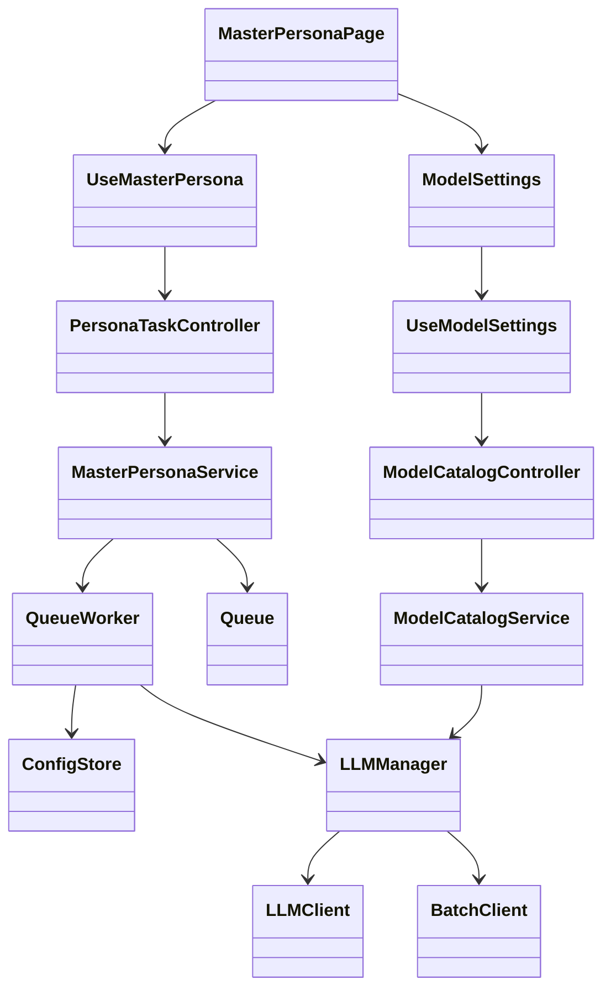
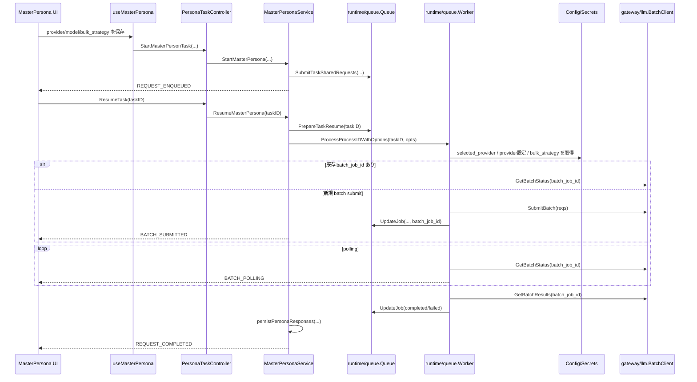

## Context

`support-cloud-llm-across-app-and-batch` は、LM Studio 前提で記述されている現行 spec と、既に一部実装済みのクラウド LLM / batch 抽象を end-to-end で揃えるための変更である。現在のコードでは `pkg/gateway/llm` に `LLMClient` / `BatchClient` / `BulkStrategy` があり、`pkg/runtime/queue.Worker` も `sync` と `batch` を分岐できるが、`workflow/master-persona-execution-flow` と `MasterPersona` の UI / workflow は LM Studio 固定の前提を残している。

今回の対象は、まず Master Persona を具体例として、以下の責務境界を崩さずにクラウド対応を formal にすることにある。

- `frontend`: provider / model / 実行モードの選択 UI
- `controller`: Wails 境界としての入力整形
- `workflow`: request 準備、resume / cancel、phase 管理
- `runtime`: queue worker による sync / batch 実行
- `gateway`: provider ごとの同期 API / batch API 実装
- `config`: provider 別設定と batch strategy の保存

制約は次の通り。

- `architecture.md` に従い、workflow が gateway 具象へ直接依存しない
- `frontend_architecture.md` に従い、`MasterPersona.tsx` は薄い page のままにし、実行モード制御は feature hook に閉じ込める
- 新しい DB テーブル追加は行わず、既存 `config` / `secrets` / `llm_jobs.batch_job_id` / task metadata を活用する
- 後方互換として `local` / `local-llm` は `lmstudio` に正規化する

### クラス図

## Goals / Non-Goals

**Goals:**

- Master Persona で `lmstudio` / `gemini` / `xai` を provider として選択でき、`sync` / `batch` を provider ごとに切り替えられるようにする
- `pkg/runtime/queue` の既存 batch 抽象を正式運用へ引き上げ、batch submit 後の polling、結果回収、resume を仕様化する
- `config`、`modelcatalog`、`workflow`、`llm`、`master-persona-ui` の capability を同じ責務分解で揃える
- unsupported な provider / mode 組み合わせを UI と runtime の両方で防ぐ

**Non-Goals:**

- 全翻訳画面を一度にクラウド batch 対応へ広げること
- 新規の永続化テーブルや専用 batch 履歴テーブルを追加すること
- OpenAI を含む全 provider を今回の Master Persona 実行対象にすること
- provider ごとの課金最適化や自動モデル推薦を導入すること

## Decisions

### 1. batch 対応は新しい slice を増やさず、既存 `llm + runtime/queue + workflow` を拡張する

`pkg/gateway/llm` には既に `BatchClient` と `ResolveBulkStrategy` があり、`pkg/runtime/queue.Worker.ProcessProcessIDWithOptions` も `sync` / `batch` 分岐を持つ。したがって batch を別の専用 slice として新設せず、gateway で provider 差分を吸収し、runtime が実行し、workflow が phase と resume を管理する既存境界を維持する。

代替案:

- `cloud-llm-batch` のような新規 capability / package を作る案
- 却下理由: gateway と runtime の責務をまたぐ共通ロジックを新境界へ逃がすことになり、`architecture.md` の責務分解を崩しやすい

### 2. 実行モードは provider 別設定として保存し、worker は provider namespace 優先で解決する

`master_persona.llm.selected_provider` は維持しつつ、`model`、`endpoint`、`api_key`、`context_length` と同様に `bulk_strategy` も `master_persona.llm.<provider>` 配下へ保存する。runtime 側は `selected_provider` を解決した後、`master_persona.llm.<provider>.bulk_strategy` を最優先で読み、未設定時のみ base namespace の既定値へ fallback する。

これにより provider を切り替えても、`lmstudio=sync`、`gemini=batch` のような最後の選択状態を独立保持できる。

代替案:

- `master_persona.llm.bulk_strategy` を 1 キーだけで持つ案
- 却下理由: provider 切替時に設定が上書きされ、`config` spec の provider 別独立保存に反する

### 3. batch resume は「再投入」ではなく「既存 batch job への再接続」を正とする

現状の `Queue.PrepareTaskResume` は `running` を `pending` に戻し、`Worker.processBatch` は `pending` ジョブを毎回 `SubmitBatch` する。このままでは batch 実行中にアプリを再開した際、同じリクエストをクラウドへ二重投入する危険がある。

そのため batch 実行では次のルールに変更する。

- `batch_job_id` を保持している `running` ジョブがある場合、resume は再 submit せず polling から再開する
- `batch_job_id` がない `pending` ジョブだけが新規 submit 対象になる
- task metadata にも代表 `batch_job_id`、`provider`、`bulk_strategy`、`batch_state` を保存し、UI と workflow が状態表示に利用できるようにする

代替案:

- resume 時は常に unfinished request を再 submit する案
- 却下理由: 重複課金、結果不整合、resume 一貫性違反を招く

### 4. 画面は provider 名や batch 可否を直書きせず、capability DTO だけを消費する

今回の end-to-end 対象は Master Persona だが、page / slice 側が `gemini`、`xai`、`lmstudio` の個別ルールを直接持つ構造にはしない。provider / mode 行列や batch 可否は `modelcatalog` と workflow が capability DTO として返し、`ModelSettings` と feature hook はその DTO を描画と選択制御に使うだけにする。

これにより、将来ほかの画面が同じ LLM 実行系を利用するときも、ページ固有に provider 分岐を書き増やさずに済む。Master Persona 固有なのは「どの execution profile を許可するか」というユースケース境界だけであり、provider 個別知識そのものではない。

代替案:

- page 側へ provider 行列をハードコードする案
- 却下理由: page / slice 単位で LLM 実装知識が増殖し、他画面へ同じ知識が侵食する

### 5. Model Catalog は provider ごとのモデル capability を返し、batch 可否判定を backend 側へ寄せる

現在の `runtime/modelcatalog.ModelOption` は `id/display_name/max_context_length/loaded` のみで、batch 対応モデルかどうかを表現できない。xAI batch のように利用可能モデルが同期 API と一致しない provider があるため、`modelcatalog` は少なくとも以下のどちらかを返す設計にする。

- `supports_batch` を含む拡張 `ModelOption`
- あるいは provider ごとの mode capability を別 DTO で返す

本 change では、Gemini に batch 利用可能モデルの概念がある前提で、`modelcatalog` が provider 由来のモデル capability を返す設計を採用する。UI は `supports_batch` のような正規化済み情報を使って mode 候補を出し分け、provider ごとの batch 対応モデル一覧をフロント側へハードコードしない。

代替案:

- `frontend/src/hooks/features/modelSettings/useModelSettings.ts` に provider ごとの batch 対応モデル一覧をハードコードする案
- 却下理由: gateway 実装と乖離しやすく、spec と実装の二重管理になる

### 6. phase 表示は LM Studio 固有文言から provider 非依存文言へ置き換える

`MasterPersonaService` と `workflow/master-persona-execution-flow` に残る `lmstudio dispatch` のような phase 名を、次のような provider 非依存 phase へ置き換える。

- `REQUEST_ENQUEUED`
- `REQUEST_EXECUTING_SYNC`
- `BATCH_SUBMITTED`
- `BATCH_POLLING`
- `REQUEST_SAVING`
- `REQUEST_COMPLETED`

UI 文言も「LM Studio へ送信中」ではなく、provider 名を埋め込める汎用文言へ変更する。

代替案:

- sync / batch の差を hidden にして従来 phase を流用する案
- 却下理由: batch submit 済みと sync 実行中を UI が区別できず、resume / cancel の挙動説明が不十分になる

### 7. BatchStatus.State は provider 固有状態を共通 6 状態へ正規化する

`BatchClient` は provider 固有の生状態をそのまま上位へ漏らさず、以下の共通状態へ正規化する。

- `queued`: 受付済みだが未実行
- `running`: 実行中
- `completed`: 全件成功で結果取得可能
- `partial_failed`: 結果取得可能だが一部失敗あり
- `failed`: 全体失敗で正常結果として扱えない
- `cancelled`: ユーザーまたは provider 側で取消済み

Gemini / xAI ごとの差異は `BatchClient.GetBatchStatus` 実装で吸収する。部分失敗を provider が別フィールドで返す場合でも、上位には `partial_failed` として返し、workflow は結果保存を続行できる状態として扱う。

正規化方針は以下の通りとする。

- Gemini:
  `BATCH_STATE_PENDING -> queued`
- Gemini:
  `BATCH_STATE_RUNNING -> running`
- Gemini:
  `BATCH_STATE_SUCCEEDED` かつ `failedRequestCount = 0 -> completed`
- Gemini:
  `BATCH_STATE_SUCCEEDED` かつ `failedRequestCount > 0 -> partial_failed`
- Gemini:
  `BATCH_STATE_FAILED` または `BATCH_STATE_EXPIRED -> failed`
- Gemini:
  `BATCH_STATE_CANCELLED -> cancelled`
- xAI:
  `num_pending > 0 -> running`
- xAI:
  `num_pending = 0` かつ `num_success = num_requests -> completed`
- xAI:
  `num_pending = 0` かつ `num_cancelled = num_requests -> cancelled`
- xAI:
  `num_pending = 0` かつ `num_error = num_requests -> failed`
- xAI:
  `num_pending = 0` かつ `num_success > 0` かつ (`num_error > 0` または `num_cancelled > 0`) -> partial_failed`

代替案:

- provider 固有状態名をそのまま UI と workflow に渡す案
- 却下理由: provider ごとに phase 分岐が増え、spec と実装の責務分離が崩れる

### 8. batch 実行の主進捗は remote provider の reported progress を優先する

batch 実行では、ローカル保存進捗は完了直前の短い区間に偏るため、主進捗バーとしての意味が薄い。したがって UI の主進捗は provider が返す batch progress を優先し、結果保存は補助メッセージまたは最終 phase として表現する。

これにより、ユーザーは「クラウド側でどこまで進んでいるか」を一貫して把握できる。保存フェーズが必要な場合でも、主進捗を巻き戻したり二重に見せたりしない。

進捗率の算出は provider ごとに次で正規化する。

- Gemini:
  `batchStats.requestCount`, `successfulRequestCount`, `failedRequestCount`, `pendingRequestCount` から `completed_like = successful + failed` を算出し、`completed_like / requestCount` を主進捗にする
- xAI:
  `num_requests`, `num_pending`, `num_success`, `num_error`, `num_cancelled` から `completed_like = num_success + num_error + num_cancelled` を算出し、`completed_like / num_requests` を主進捗にする
- 共通:
  件数が取得できない provider は不定 progress とし、状態文言だけを更新する

代替案:

- ローカル保存件数を主進捗として表示する案
- 却下理由: batch 実行の大半で進捗が止まって見え、実態を反映しない

### 9. legacy spec 名 `master-persona-lmstudio-resume-flow` は `master-persona-execution-flow` へ改称する

`master-persona-lmstudio-resume-flow` は provider 名（LM Studio）を含んでおり、今回の変更で定義する execution profile ベースの共通実行フローを表せない。よって本 change では、対象 spec の正式名称を `master-persona-execution-flow` とし、以後の参照はこの名前へ統一する。

加えて `spec-structure/spec.md` の責務区分に合わせ、当該 spec は workflow 区分で管理する。移行時の想定パスは次とする。

- main specs: `openspec/specs/workflow/master-persona-execution-flow/spec.md`
- change specs: `openspec/changes/<change>/specs/workflow/master-persona-execution-flow/spec.md`

`workflow/master-persona-execution-flow` を唯一の更新先とし、旧 `slice/master-persona-lmstudio-resume-flow` は新規要件の追加先にしてはならない。

### 10. spec 名変更の影響範囲を main / change / review で固定する

`master-persona-lmstudio-resume-flow` から `master-persona-execution-flow` への改称で影響を受ける対象を次の通り固定する。

- main specs: `openspec/specs/workflow/master-persona-execution-flow/spec.md`, `openspec/specs/spec-structure/spec.md`
- change specs: `openspec/changes/support-cloud-llm-across-app-and-batch/specs/workflow/master-persona-execution-flow/spec.md`
- change artifacts: `proposal.md`, `design.md`, `tasks.md`, `review.md`

review では、次の観点を必須確認とする。

- 旧 spec パス参照が新規要件記述に残っていないこと
- workflow 区分への再配置が `spec-structure` の責務境界と一致すること
- tasks / proposal / design の参照名が `master-persona-execution-flow` に一致すること

### シーケンス図

## Risks / Trade-offs

- [Batch resume の再接続仕様が不十分] → `batch_job_id` を持つ job の再 submit 禁止を runtime 側に明示し、resume テストを追加する
- [Gemini batch API の状態名や結果形式が xAI と異なる] → `BatchClient` 契約で provider ごとの差を吸収し、workflow / UI へは正規化済み state だけを返す
- [Model catalog DTO 拡張が UI 既存コードへ波及する] → Wails controller と feature hook の adapter で吸収し、page / component の props 変更を最小化する
- [未対応 provider が UI から消えることで将来拡張が分かりにくくなる] → provider capability matrix を spec に残し、feature hook 内のフィルタ理由をコメントで明示する
- [DB テーブル追加なしでは batch 状態の表現力が不足する] → まずは `llm_jobs.batch_job_id` と task metadata を使い、追加履歴が必要になった時だけ別 change で拡張する

## Migration Plan

1. `llm`, `config`, `workflow`, `slice/modelcatalog`, `slice/master-persona-ui`, `workflow/master-persona-execution-flow` の delta spec を追加し、provider / mode 行列と batch resume 契約を固める
2. `config` 読み書きを provider 別 `bulk_strategy` 対応へ広げ、未設定時は `sync` を既定値として扱う
3. `modelcatalog` を capability-aware DTO へ更新し、Master Persona UI が未対応 provider / mode を表示しないよう feature hook を調整する
4. `runtime/queue` の batch resume を `batch_job_id` 再接続方式へ変更し、Gemini / xAI の batch client を揃える
5. `MasterPersonaService` の phase と進捗文言を provider 非依存へ置き換え、batch 状態を UI へ通知する
6. ロールバック時は UI で `sync` のみを表示し、runtime で `batch` を `sync` へ強制 fallback する。追加した config key は無視可能なため、DB rollback は不要とする

## Open Questions

- なし
