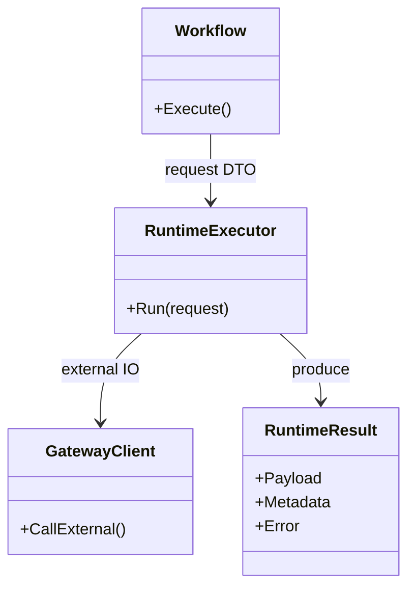
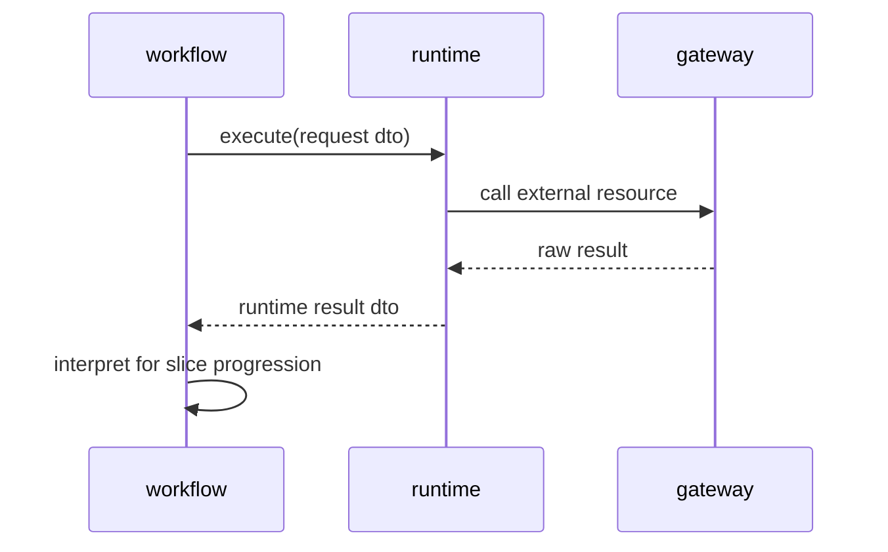

## Context

`pkg/runtime/**` は外部 I/O 実行と実行制御基盤を担う区分だが、現状は `workflow` や `slice` への直接依存が残っている。これにより、runtime がユースケース進行判断や slice 固有解釈を抱え、workflow の orchestration と外部実行基盤の境界が崩れている。runtime 配下の test code にも同種の依存が残っており、責務分離の検証が不安定になっている。

この change では、runtime を外部 I/O 実行と実行制御に絞り、workflow / slice 固有知識を持たない設計へ寄せる。workflow との連携は中立 DTO と、runtime subpackage ごとの executor 契約で行い、runtime からは gateway だけを許可する方針を固定する。

## Goals / Non-Goals

**Goals:**
- runtime から `workflow`、`slice`、`artifact` への直接依存を除去する方針を固定する。
- runtime は subpackage ごとの executor 契約と中立 DTO を介して外部実行を担当する。
- `pkg/runtime/**` の本番コードと test code に同じ depguard 境界を適用できるようにする。
- 既存 runtime 実装の違反を、gateway 利用と結果返却の責務へ再配置する移行順序を整理する。

**Non-Goals:**
- workflow や slice の詳細設計をこの change 単体で完了させない。
- gateway 実装の差し替え方式を全面再設計しない。
- DB スキーマ変更を前提にしない。

## Decisions

### 1. runtime は subpackage ごとの executor 契約で実行要求を受ける
- Decision:
  runtime は workflow から、現在 `pkg/runtime` 配下に分かれて存在している責務単位ごとの executor 契約を通じて実行要求を受け、中立 DTO で結果を返す。
- Rationale:
  既存の runtime package 分割に沿って executor を持たせる方が、責務の見通しがよく、共通 executor を後で分解するより自然である。workflow 直依存を切りつつ、runtime の責務を外部 I/O 実行に限定できる。
- Alternatives Considered:
  - 1 本の共通 executor 契約を先に立てる案
    - 見送り。実際の責務分割とずれやすく、後で再分割する前提が不自然になる。
  - runtime が workflow 型を直接受ける案
    - 却下。責務境界が崩れる。

### 2. runtime は slice 固有判断を持たず技術的結果だけを返し、大きな取得結果は workflow 経由で段階受け渡しする
- Decision:
  runtime は slice 保存判定や UI 状態解釈を行わず、workflow が解釈できる技術的結果だけを返す。取得結果が大きい場合は、runtime が取得責務を持ち、workflow が stream / page / cursor で slice へ段階受け渡しする。
- Rationale:
  `architecture.md` では runtime は進行決定を持たない。結果解釈を runtime に置くと、slice / workflow 境界が崩れる。大容量データも runtime が `artifact` に直接触るのではなく、workflow が進行制御に沿って slice へ渡す方が責務分離に合う。
- Alternatives Considered:
  - runtime が slice 固有の成功/失敗分類まで行う案
    - 却下。ユースケース知識の混入になる。
  - runtime が大容量データを `artifact` に直接保存する案
    - 却下。runtime が handoff 境界を主導する形になり、workflow の orchestration 責務と衝突する。

### 3. runtime 配下の test code も runtime 境界で扱う
- Decision:
  `pkg/runtime/**` 配下の test code にも runtime 境界を適用し、workflow / slice 直接依存は原則禁止する。
- Rationale:
  test だけ例外にすると、runtime の責務外依存が固定化される。結合検証は上位層へ寄せるべきである。
- Alternatives Considered:
  - runtime test だけ workflow / slice を許可する案
    - 却下。実装境界の退行を見逃しやすい。

### 4. depguard は runtime 専用 files ルールで適用する
- Decision:
  `depguard` は `**/pkg/runtime/**/*.go` に対して runtime 専用ルールだけを適用する。
- Rationale:
  全 package への一括適用では誤検知が増えるため、対象区分ごとの files ルールで縛る必要がある。
- Alternatives Considered:
  - runtime ルールを全 package へ適用する案
    - 却下。lint ノイズが増える。

## Class Diagram

## Sequence Diagram

## Risks / Trade-offs

- [Risk] runtime subpackage ごとの executor 契約が似た形で増え、重複が見えにくくなる → Mitigation: 責務単位の分離を優先し、重複は十分に収束してから最小限の共通化だけを検討する。
- [Risk] runtime 結果 DTO が曖昧だと workflow 側で再解釈が乱れる → Mitigation: 技術的メタデータと payload を分離し、slice 固有意味は含めない。大容量データは stream / page / cursor で段階受け渡しする前提を明示する。
- [Risk] runtime test の結合検証を外す過程で回帰を見落とす → Mitigation: 上位 integration test へ移管対象を明示し、runtime 配下には境界内テストだけを残す。

## Migration Plan

1. `backend-quality-gates` に runtime 境界違反検知要件を反映する。
2. `pkg/runtime/**` の depguard 違反を `workflow` / `slice` / `artifact` 依存に分類する。
3. workflow との連携を runtime subpackage ごとの executor 契約と中立 DTO へ寄せる。
4. runtime が持つ slice 固有判断を workflow 側へ戻し、大きな取得結果は workflow 経由の stream / page / cursor 受け渡しへ切り替える。
5. runtime 配下の test code を責務ごとに整理し、必要な結合検証を上位層へ移す。
6. `npm run lint:backend` で runtime 境界違反が想定どおり収束することを確認する。

## Open Questions

- runtime subpackage ごとの executor 契約のうち、どこまでを明示 interface 化し、どこまでを内部実装に留めるか。
- stream / page / cursor 受け渡しの共通形を runtime 側でどこまで揃えるか。
