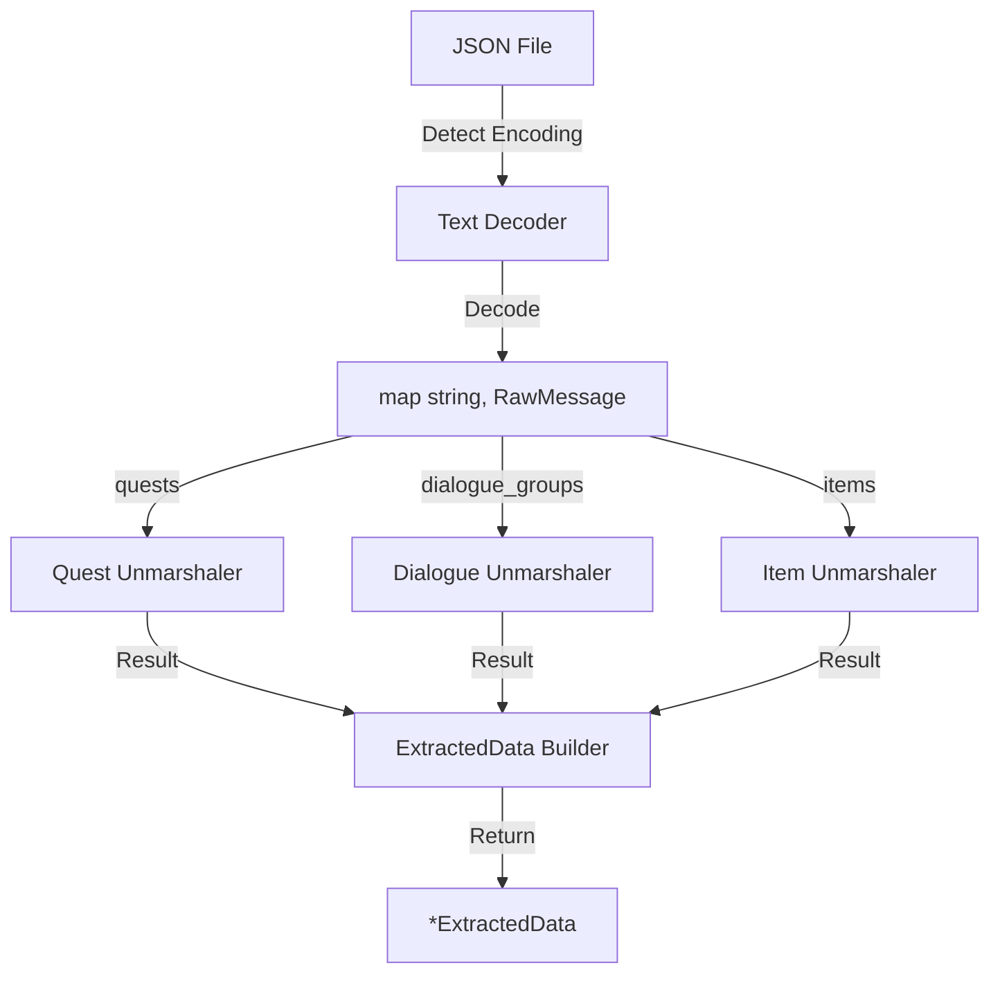

# Data Loader Design

## Context

Skyrimの翻訳作業において、Modから抽出された大量のテキストデータを効率的に処理する必要がある。
現在はPythonスクリプトで処理しているが、パフォーマンスと保守性の課題があるため、Go言語への移行を行う。
本ドキュメントは、その第一歩となる「データローダー」の設計である。

## Goals / Non-Goals

**Goals:**
- 大規模なJSONファイル（数百MB〜数GB）を高速にロードする。
- 破損したデータが含まれていても、読み取れる部分は可能な限りロードする（Partial Loading）。
- 複数の文字コード（UTF-8, SJIS, CP1252）に対応する。

**Non-Goals:**
- データベースへの保存（今回はメモリオンリー）。
- データの編集・保存機能（ロード専用）。

## Decisions

### Decision 1: Two-Phase Load Strategy (Serial Load -> Parallel Map)

ユーザーフィードバックに基づき、純粋なJSONパースの並列化ではなく、**「デコード済みのRawデータのマッピングと正規化」の並列化** を採用する。
`encoding/json` の `Unmarshal` や、その後のバリデーション・データ整形（正規化）はCPUコストがかかるため、項目数が数万件に及ぶ `quests` や `dialogue_groups` を並列処理することで全体のレイテンシを下げる。

**処理フロー:**
1. **Phase 1 (Serial)**: ファイル全体を `map[string]json.RawMessage` にデコードする。入力チェックとトップレベル構造の把握を行う。
2. **Phase 2 (Parallel)**: `quests`, `dialogues`, `items` 等、各キーの `RawMessage` を対象に、個別の Goroutine で `json.Unmarshal` を実行し、ドメインモデルへ変換・正規化する。

**Why?**
- JSONのテキスト解析（I/O含む）の並列化は複雑で効果が限定的。
- 一方で、メモリ上のバイト列から構造体への変換（Reflection含む）と、Business Logic（正規化）は並列化の恩恵を受けやすい。

### Decision 2: エラーハンドリング戦略

`Loader` はエラーを返すが、部分的なデータ欠損（特定のクエストだけ壊れている等）は **Warningログに出力し、該当レコードをスキップ** する方針とする。
これにより、一部のデータ破損で全てのロードが失敗することを防ぐ。

`ExtractedData` 構造体へのマッピング時にバリデーション（必須フィールドチェック等）を行い、不正なレコードは除外する。

### Decision 3: パッケージ構成

Interface-First AIDD に従い、以下のように分割する。

- `pkg/domain/models`: 構造体定義（Contract）。メソッドは持たせても良いが、ロジックは持たない。
- `pkg/contract`: インターフェース定義（`Loader` インターフェース等）。
- `pkg/infrastructure/loader`: 実装。

## Architecture

