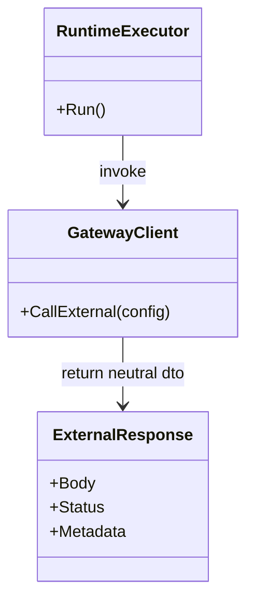
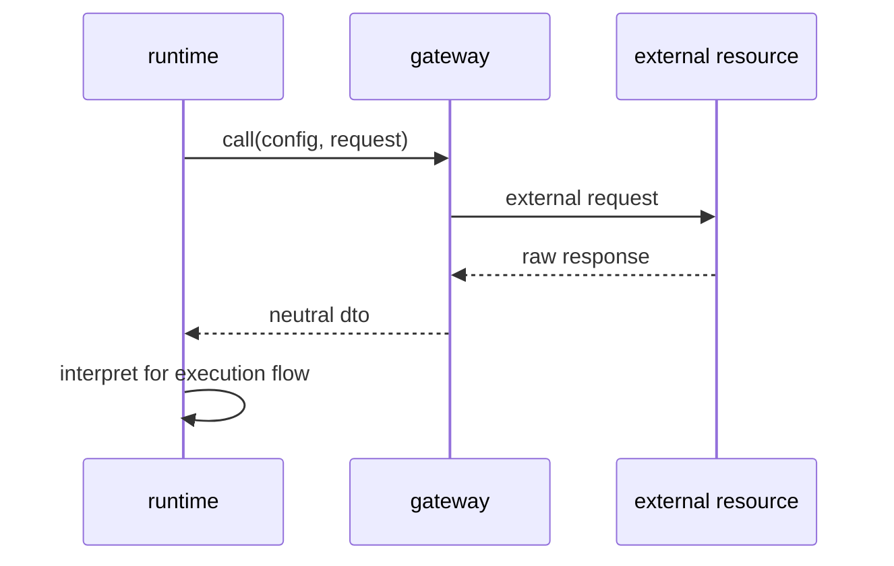

## Context

`pkg/gateway/**` は外部資源への依頼口を担う区分だが、現状は `workflow` や `runtime` への直接依存が残っている。これにより、gateway が進行制御や状態解釈を抱え、runtime からの利用境界が崩れている。gateway 配下の test code にも同種の依存が残っており、技術接続実装としての純度が下がっている。

この change では、gateway を純粋な技術接続実装へ寄せ、返却値も runtime が解釈できる中立 DTO に限定する。gateway は上位層の状態や進行を知らず、外部資源への接続と結果取得だけに責務を絞る。

## Goals / Non-Goals

**Goals:**
- gateway から `controller`、`workflow`、`runtime`、`slice`、`artifact` への直接依存を除去する方針を固定する。
- gateway は外部資源への接続と中立 DTO の返却に専念する。
- `pkg/gateway/**` の本番コードと test code に同じ depguard 境界を適用できるようにする。
- 既存 gateway 実装の違反を、純技術接続責務へ再配置する移行順序を整理する。

**Non-Goals:**
- runtime 側の実行制御設計をこの change 単体で完了させない。
- 外部 API クライアント全体の再実装を一度に行わない。
- DB スキーマ変更を前提にしない。

## Decisions

### 1. gateway は上位層の進行制御知識を持たない
- Decision:
  gateway は workflow 状態、runtime 状態、slice 保存判断を持たず、外部資源との技術接続だけを担当する。
- Rationale:
  `architecture.md` では gateway は外部資源への依頼口であり、進行決定や状態解釈を持たない。上位知識が混ざると差し替えと検証が難しくなる。
- Alternatives Considered:
  - gateway に retry / status 解釈を含めて上位都合を持たせる案
    - 却下。技術接続と業務判断が混ざる。

### 2. gateway の返却値は runtime が解釈する中立 DTO に限定し、workflow が mapper を持つ
- Decision:
  gateway は技術接続結果だけを返し、workflow 状態や slice 向けの意味付け済み型は返さない。provider ごとの差異を含む技術的結果は runtime が受け取り、workflow が mapper を通じて後続処理用 DTO へ変換する。
- Rationale:
  runtime が外部 I/O 実行を担当する前提では、gateway はその下位であるべきで、返却値も技術的結果に留めるのが一貫する。workflow が mapper を持つ形にすると、provider 差分の最終的な利用側都合への変換責務を orchestration 側へ集約できる。
- Alternatives Considered:
  - gateway が workflow 向け DTO を直接返す案
    - 却下。gateway から上位層へ責務漏れが起きる。
  - runtime が最終的な業務 DTO まで組み立てる案
    - 却下。runtime に上位解釈が混入する。

### 3. gateway 配下の integration test は削除し、後続の API テストへ移行する
- Decision:
  `pkg/gateway/**` 配下の test code にも gateway 境界を適用し、workflow / runtime 直接依存は原則禁止する。既存の gateway integration test は、後続で API テスト資産を整備する前提で削除し、gateway 配下には境界内テストだけを残す。
- Rationale:
  test だけ例外にすると gateway の純度が下がり、上位層依存を固定化する。gateway 配下に integration test を残すと、将来の API テストと責務が重複する。
- Alternatives Considered:
  - gateway test だけ runtime / workflow を許可する案
    - 却下。境界退行を見逃しやすい。
  - integration test を gateway 配下に残す案
    - 却下。API テスト移行後に資産が二重化する。

### 4. depguard は gateway 専用 files ルールで適用する
- Decision:
  `depguard` は `**/pkg/gateway/**/*.go` に対して gateway 専用ルールだけを適用する。
- Rationale:
  全 package 一括適用では誤検知が増えるため、対象区分ごとの files ルールが必要である。
- Alternatives Considered:
  - gateway ルールを全 package へ適用する案
    - 却下。lint ノイズが増える。

## Class Diagram

## Sequence Diagram

## Risks / Trade-offs

- [Risk] gateway から上位知識を剥がす過程で既存 helper が分散する → Mitigation: 技術接続 helper と結果整形 helper を gateway 内で整理し、意味解釈は runtime へ寄せる。
- [Risk] 中立 DTO が粗すぎて runtime 側の分岐が過剰になる → Mitigation: provider 横断で共通化する最小構造に留め、workflow が mapper で最終 DTO へ変換する前提を明示する。
- [Risk] gateway integration test を削除する過程で回帰を見落とす → Mitigation: 削除対象を明示し、後続の API テスト整備 change で置き換える前提を tasks に残す。

## Migration Plan

1. `backend-quality-gates` に gateway 境界違反検知要件を反映する。
2. `pkg/gateway/**` の depguard 違反を `workflow` / `runtime` / `slice` / `artifact` 依存に分類する。
3. gateway が持つ上位層知識を runtime または controller 側へ戻す。
4. gateway の返却値を provider 横断の最小中立 DTO へ揃え、workflow が mapper を持つ前提で変換経路を整理する。
5. gateway 配下の integration test を削除し、gateway 配下には境界内テストだけを残す。
6. `npm run lint:backend` で gateway 境界違反が想定どおり収束することを確認する。

## Open Questions

- provider ごとの差分のうち、workflow mapper ではなく runtime 側で吸収すべき技術差異をどこまで許容するか。
