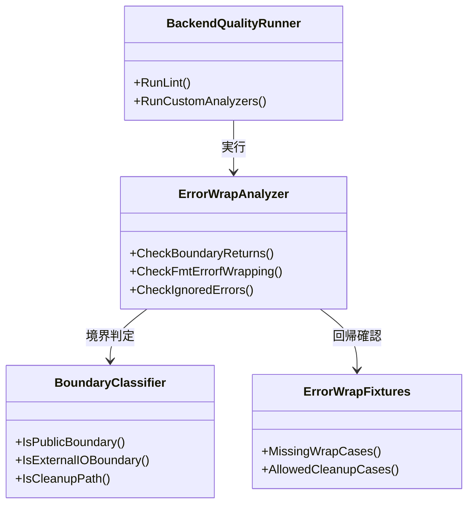
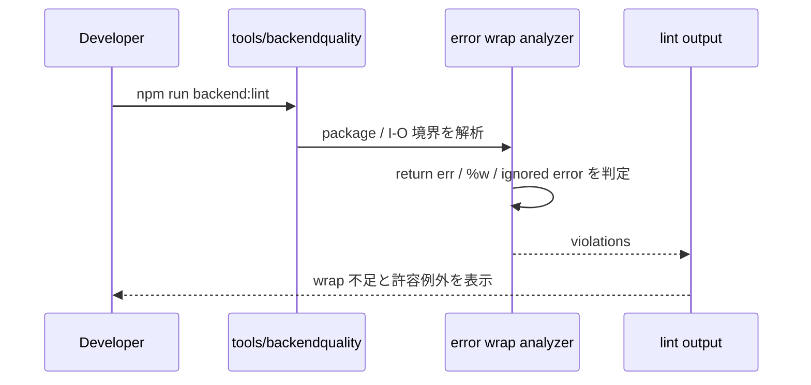

## Context

現行の `tools/backendquality` は `golangci-lint` と `go-cleanarch` による一般 lint を提供しているが、「どの境界で wrap が MUST か」というこのリポジトリ固有ルールは自動化していない。`backend_coding_standards.md` では package 境界や外部 I/O 境界の error wrap を必須にしている一方、`return err`、`fmt.Errorf` での `%w` 欠落、cleanup と本流の区別はレビューに依存している。

この変更では、既存の品質ゲート導線に独自 analyzer を追加し、error path の文脈不足を機械検査できるようにする。誤検知抑制の鍵は「wrap 必須境界の定義」を先に固定し、cleanup 例外や意図的な error 変換を一般違反と分離することにある。

## Goals / Non-Goals

**Goals:**
- `backend:lint` で wrap 必須境界の `return err` と `%w` 欠落を検出できるようにする。
- cleanup と本流の error path を区別し、実運用で使える誤検知率に抑える。
- 代表 fixture により rule の回帰確認を可能にする。

**Non-Goals:**
- すべての `error` 返却に無条件の wrap を強制すること。
- 既存コードの全違反をこの change で一括解消すること。
- ログ出力だけで十分な best-effort cleanup まで blocking にすること。

## Decisions

### 1. error wrap 判定も `go/analysis` ベースの custom analyzer で実装する
- Decision:
  - `golang.org/x/tools/go/analysis` を利用し、`backendquality` ランナーからカスタム analyzer を起動する。
- Rationale:
  - AST と型情報を使って `return err`、`fmt.Errorf`、無視された `error` を個別に識別でき、既存ランナー統合も容易である。
- Alternatives Considered:
  - `errcheck` だけに委ねる: 「未処理」は見えるが、wrap 品質までは判定できない。
  - 正規表現ベース: `%w` 判定や boundary 判定で誤検知が多い。

### 2. wrap 必須境界は「公開境界」と「外部 I/O 境界」に絞る
- Decision:
  - 公開メソッド、gateway 呼び出し、永続化 / 外部 API 依頼の戻り値を上位へ返す箇所を MVP の必須境界にする。
- Rationale:
  - すべてのローカル helper まで強制すると noise が増える。規約本文と一致する境界に絞る方がレビュー観点と整合する。
- Alternatives Considered:
  - 全 `return err` を禁止: 実装負荷と誤検知が高すぎる。

### 3. cleanup 例外は構文と文脈で区別する
- Decision:
  - `defer` 内の close / rollback など best-effort cleanup は、ログ記録または明示コメントがあれば本流違反として扱わない。
- Rationale:
  - cleanup と本流失敗を同じ基準で blocking にすると、必要以上に修正負荷が上がる。
- Alternatives Considered:
  - cleanup も一律 blocking: 規約の意図よりも厳しすぎる。
  - cleanup を完全除外: 本当に重要な rollback 失敗まで見逃す可能性がある。

## クラス図

## シーケンス図

## Risks / Trade-offs

- [Risk] `return err` が実際には十分な文脈を持つ helper 再送出なのに誤検知する
  → Mitigation: 境界判定を公開メソッドと外部 I/O に限定し、ローカル helper は MVP で除外する。
- [Risk] cleanup 例外の扱いが曖昧でルールがぶれる
  → Mitigation: `defer` / close / rollback を中心に許容条件を fixture と spec に固定する。
- [Risk] `%w` だけを見て wrap 品質を過信する
  → Mitigation: `%w` 有無に加えて文脈メッセージの存在もレビュー観点に残す。

## Migration Plan

1. `backend-quality-gates` delta spec に wrap 必須境界と許容例外を追加する。
2. `tools/backendquality` に error wrap analyzer を追加し、`backend:lint` へ統合する。
3. `return err`、`fmt.Errorf` `%w` 欠落、cleanup 例外の fixture を整備する。
4. 既存違反の扱いを整理し、必要なら fail 条件の段階導入を行う。

Rollback Strategy:
- 誤検知が多い場合は warning 相当の任意実行へ戻し、境界定義と fixture を補強してから blocking に戻す。

## Open Questions

- `errors.Join` や sentinel error への変換を MVP でどこまで許容対象にするか。
- cleanup 失敗をログ必須にするか、単に blocking 対象外にするか。
