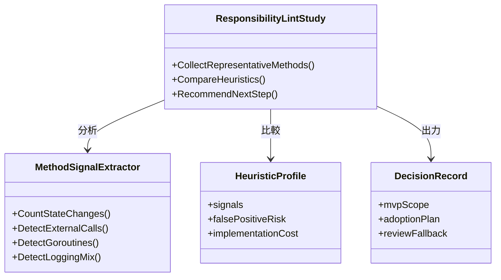
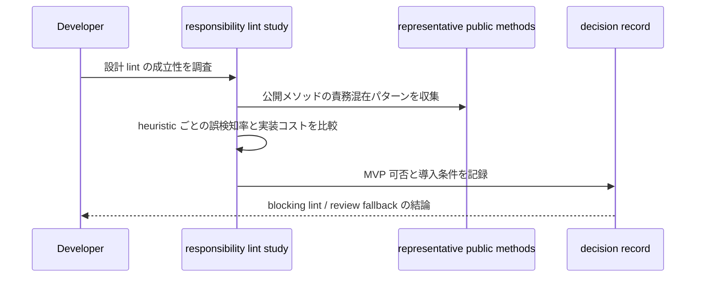

## Context

`backend_coding_standards.md` では「公開メソッドは 1 つの責務に保ち、複雑な分岐や処理列は同一ファイル内のプライベートメソッドへ分割すること」を MUST としている。一方、現行品質ゲートは `golangci-lint` と `go-cleanarch` が中心であり、責務過多のような設計レベル違反は自動化していない。

この change の目的は、直ちに blocking lint を実装することではなく、「どこまでなら機械検査できるか」を整理することにある。責務過多は行数やネスト深度だけで決まらず、状態解決、永続化、ログ、goroutine 起動などの責務混在パターンをどう抽象化するかが鍵になるため、MVP の成立条件を先に定義する。

## Goals / Non-Goals

**Goals:**
- 公開メソッドの責務過多検出について、実装可否・誤検知率・導入コストを比較できる設計をまとめる。
- blocking lint にできる最小 MVP があるかを判断し、ある場合は検出対象と除外境界を明確にする。
- blocking 化が難しい場合に、レビュー運用へ残すべき観点を明文化する。

**Non-Goals:**
- この change で実際の blocking lint を完成させること。
- `pkg/**` の全公開メソッドを一括で是正すること。
- SRP 違反の最終判断を完全自動化すること。

## Decisions

### 1. 調査は「責務シグナル」の組み合わせで MVP を検討する
- Decision:
  - 行数やネスト深度だけでなく、永続化呼び出し、logger 呼び出し、goroutine 起動、複数状態更新などの責務シグナルを組み合わせて MVP を考える。
- Rationale:
  - 単一メトリクスでは責務過多をうまく表せず、誤検知も多い。複数シグナルを限定組み合わせで見る方が実用的である。
- Alternatives Considered:
  - 行数 / cyclomatic complexity だけで判断: 実装量の多い正当メソッドまで違反化しやすい。

### 2. blocking 導入条件は「限定スコープで安定して誤検知が低いこと」に置く
- Decision:
  - まずは公開メソッドだけ、かつ特定の責務混在パターンだけに絞った MVP の成立性を評価する。
- Rationale:
  - ルールを広く取りすぎると設計品質よりノイズが増える。初手は再現性の高い違反に限定すべきである。
- Alternatives Considered:
  - すべての公開メソッドへ一律導入: 導入コストに対して精度が見合わない。

### 3. blocking 不適ならレビュー運用へ戻す判断を明示的に残す
- Decision:
  - 調査結果が不十分なら、「lint 化しない」という判断も成果物として残す。
- Rationale:
  - 高コスト lint を曖昧なまま積み残すと、次の change で同じ検討を繰り返すため。
- Alternatives Considered:
  - 結論を保留して先送り: 進捗が見えず、再検討コストが増える。

## クラス図

## シーケンス図

## Risks / Trade-offs

- [Risk] 調査対象サンプルが偏り、実際のコードベースに合わない結論になる
  → Mitigation: workflow / gateway / slice から代表例を複数選び、責務パターンを分散させる。
- [Risk] 設計 lint を作る前提で議論が固定化し、見送り判断がしづらくなる
  → Mitigation: 「blocking 不適ならレビュー運用に残す」を成功条件に含める。
- [Risk] heuristic の数が増えすぎて MVP が曖昧になる
  → Mitigation: 代表的な責務シグナル 2〜3 個の組み合わせに限定して比較する。

## Migration Plan

1. `backend-quality-gates` delta spec に成立性評価 requirement を追加する。
2. `pkg/**` から代表的な公開メソッドを収集し、責務シグナル候補を比較する。
3. MVP 可否、誤検知率、導入コスト、blocking / review fallback の結論を設計文書へまとめる。
4. MVP が成立する場合のみ、次 change で analyzer 実装へ進む。

Rollback Strategy:
- 調査の結果 blocking lint が不適と分かった場合は、実装へ進まずレビュー観点の強化だけを残して終了する。

## Open Questions

- 責務シグナルとして最も再現性が高い組み合わせは何か。
- logger 呼び出しや metrics 更新を独立責務として扱うべきか。
