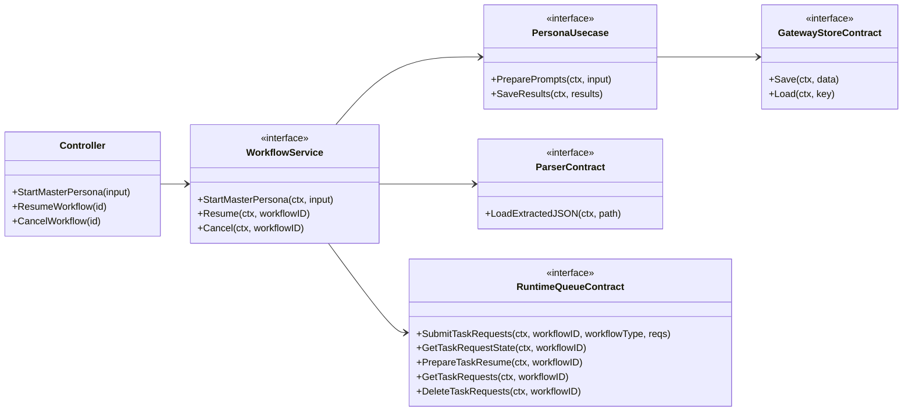
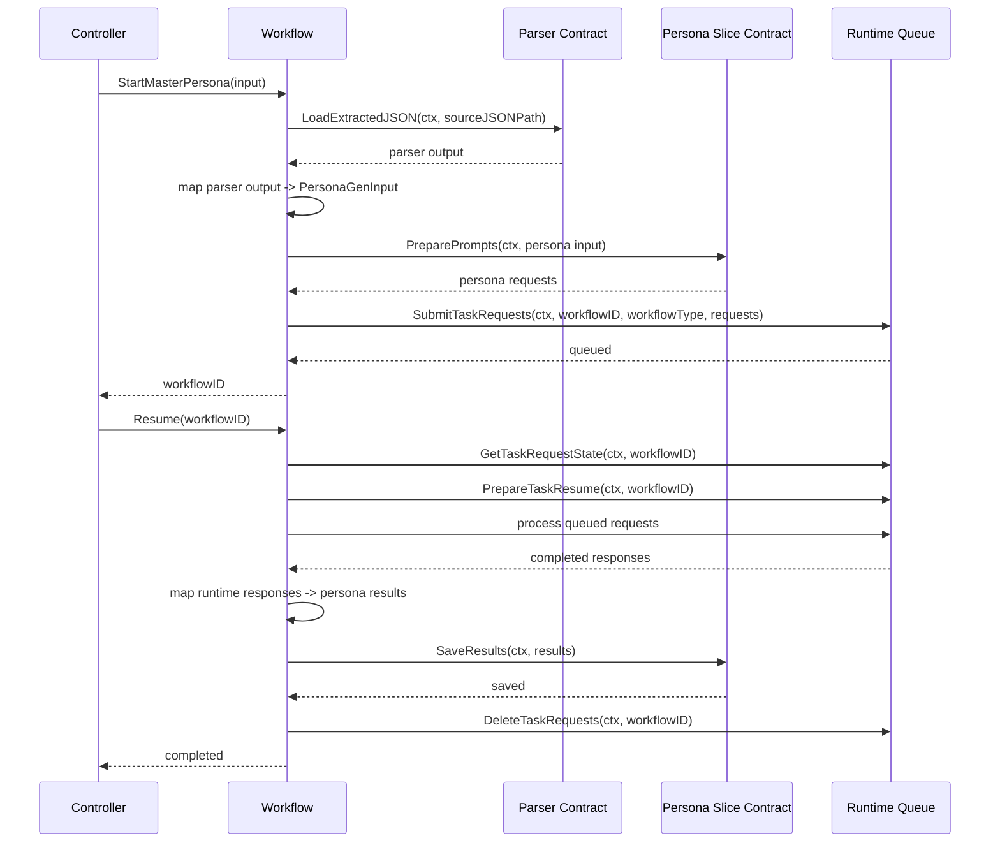

> この change は分割済みの親設計メモとして扱い、実装は以下の 3 change で進める。
> - `reorganize-architecture-spec-boundaries`
> - `introduce-runtime-gateway-boundaries`
> - `migrate-master-persona-to-workflow`

## Context

現行の `pkg/task` は、Wails バインディング、タスク状態永続化、進捗通知、MasterPersona の開始・再開手順、`queue` 復旧、`persona` 保存再実行を同居させている。結果として、安定層が持つべき責務と Vertical Slice が持つべき責務がコード上で混在している。

`architecture.md` はオーケストレーター層での DTO マッピングと Slice の独立性を求めている一方、現行コードでは `task` から `pipeline.ToPersonaGenInput` や `queue.JobRequest -> llm.Response -> persona.SaveResults` のような接続詳細が増殖しており、今後 `persona` 以外の slice を追加した際の接続面が肥大化しやすい。

本変更では、`pkg/controller`、`pkg/workflow`、`pkg/usecase_slice`、`pkg/runtime`、`pkg/gateway` の責務区分を明示し、`controller -> workflow -> usecase slice` を中心とする依存方向を標準化する。加えて、具象型への直接接続を減らし、基本的にすべての接続を DI インターフェース経由に統一する。品質担保には `go-cleanarch` を採用し、依存方向と DI 境界を lint で監視する。

## Goals / Non-Goals

**Goals:**
- `workflow` を Stable Layer として定義し、controller と usecase slice の接続責務を一箇所へ集約する
- `persona` を runtime 非依存の usecase slice として再定義し、workflow から契約経由で利用できるようにする
- `runtime` を workflow 専用の実行制御基盤として切り出す
- `gateway` を slice からの外部資源依頼口として切り出す
- DI は基本的にインターフェース経由とし、配線の規約を `architecture.md` に追加する
- `go-cleanarch` による依存方向 lint を導入し、違反をローカル品質ゲートに組み込む

**Non-Goals:**
- persona/queue/task の永続化スキーマを新規設計し直すこと
- 全バックエンドパッケージを一度に新責務区分へ移動すること
- `google/wire` を直ちに全エントリポイントへ全面適用すること
- MasterPersona 以外のユースケースを同時に刷新すること

## Decisions

### 1. `controller` と `workflow` を別 package として分離する

現行の Wails binding とタスク進行制御は同じ文脈で語られやすいが、UI 入出力の adapter とユースケース進行を担う application service は責務が異なる。この変更では `pkg/controller` を UI/外部入力の adapter 層、`pkg/workflow` を安定した application service 層として明示的に分離する。

`controller` は以下を担う。
- Wails binding や外部入力の受理
- request DTO の整形
- `workflow` 契約の呼び出し

`controller` は以下を担わない。
- phase 管理、resume/cancel の実処理
- slice 間マッピング
- runtime / gateway の直接制御

`workflow` は以下を担う。
- ユースケース進行の制御
- `parser` / `persona` / `runtime` の呼び分け
- 進捗、phase、resume、cancel、state 永続化
- slice 間の DTO マッピング

`workflow` は以下を担わない。
- persona 固有のプロンプト生成ロジック
- persona 固有のレスポンス解釈規則
- runtime 内部の request 状態機械

代替案:
- `controller` を `workflow` に含める
  - 却下理由: UI adapter と application service の責務境界が曖昧になり、Wails binding 変更が workflow の契約設計に混入する
- `job` を採用する
  - 却下理由: `queue` の job と用語衝突し、実行基盤概念との混同が起きる

### 2. 全ての責務区分接続は契約経由とし、具象型は composition root に閉じる

`controller`、`workflow`、`usecase slice`、`runtime`、`gateway` の接続は、各 package が公開する契約に限定する。接続は DI で行い、コンストラクタ引数は原則として interface 型に寄せる。具象型の import を許容するのは composition root のみとする。

具体的には以下を原則とする。
- controller は `workflow` の公開契約のみを呼ぶ
- `workflow` は `persona` の contract、`parser` の contract、`runtime` の contract を利用する
- `usecase slice` は `gateway` の contract を利用してよいが、他 slice や controller / workflow / runtime の具象型を import しない
- `persona` は `queue` を import しない
- `queue` は `persona` を知らない
- `main.go` など composition root だけが具象型を知る

代替案:
- `workflow` から具象型を直接受け取る
  - 却下理由: DI lint の価値が出ず、安定層の差し替え性が失われる
- `persona` が queue を直接使う
  - 却下理由: slice が実行制御を持ち、再開・進捗・状態通知の責務が分散する

### 3. `runtime` は workflow の実行制御基盤とする

`runtime` は queue、progress、workflow state、event、telemetry など、ユースケース進行を支える実行制御基盤を束ねる。MasterPersona の開始、resume、cleanup、request state 集約は `workflow` が主導し、`runtime` はそのための実行時サービスを提供する。`persona` は request を準備し、結果を保存する契約に集中する。

代替案:
- `persona` 内に queue 実行 adapter を同居させる
  - 却下理由: `persona` が usecase slice と runtime orchestration の両方を持つため、slice の自律性よりも接続都合が優先される

### 4. `gateway` は外部資源への依頼口とする

`gateway` は DB、LLM、config、secret、file、外部 API など、外部資源への依頼を担う。slice は自分の業務を成立させるために必要な `gateway` 契約へ依存してよいが、workflow の phase 管理や queue 制御を代替してはならない。

代替案:
- `runtime` と `gateway` をひとつの `infrastructure` にまとめる
  - 却下理由: 実行制御基盤と外部依頼口の意味が混ざり、slice から何へ依存してよいかが曖昧になる

### 5. DTO マッピングは `workflow` に寄せ、slice 契約は slice 自前 DTO に閉じる

`architecture.md` の原則どおり、slice 間のデータ変換は `workflow` の責務とする。`persona` は `PersonaGenInput` など自前 DTO を保持し、外部の parser / runtime DTO を参照しない。`workflow` は parser 出力から persona 入力へのマッピング、および runtime 保存済みレスポンスから persona 保存契約への変換を担う。

代替案:
- `persona` が parser DTO や queue DTO を直接理解する
  - 却下理由: slice 契約が外部都合に汚染され、変更伝播が広がる

### 6. `architecture.md` に責務区分と DI lint の規約を追加する

既存の `architecture.md` は Pipeline / Vertical Slice の考え方を持つが、`pkg/controller` `pkg/workflow` `pkg/usecase_slice` `pkg/runtime` `pkg/gateway` の責務境界が弱い。今回の変更で以下を明文化する。
- `controller` の責務
- Stable Layer (`workflow`) の責務
- `runtime` と `gateway` の責務差
- controller -> workflow -> usecase slice / runtime / gateway の依存方向
- composition root 以外での具象型依存禁止
- DI は interface-first を原則とすること
- `go-cleanarch` を依存方向 lint として導入すること

### 7. `go-cleanarch` を品質ゲートに追加する

`go-cleanarch` はレイヤー間依存の検査に特化しており、今回の `workflow` 導入と相性がよい。`backend` 品質ゲートへ組み込み、少なくとも以下を検査対象にする。
- controller が runtime / gateway 具象へ直接依存していないこと
- workflow が controller へ逆依存していないこと
- slice が runtime 制御を持たないこと
- composition root 以外で具象型 import が増えていないこと

代替案:
- `golangci-lint` の標準ルールだけで運用する
  - 却下理由: 依存方向ルールを明示しにくく、今回の設計意図を機械的に守りにくい

## クラス図

## シーケンス図

## Risks / Trade-offs

- [責務の再配置で package 名と実責務が一時的にズレる] → `workflow` 導入を段階移行とし、旧 `task` からの互換 adapter を短期間だけ許容する
- [インターフェース化しすぎて契約が細分化される] → workflow が本当に必要とする操作単位で contract を設計し、1 メソッド単位の過剰分割を避ける
- [go-cleanarch のルール定義が厳しすぎて既存コードが大量に違反する] → 初回は workflow 周辺 package に対象を限定し、段階的に対象範囲を広げる
- [既存 Wails binding の互換性が揺れる] → controller 公開 API のシグネチャは維持し、内部接続先だけを workflow へ差し替える
- [MasterPersona 以外のフローへ拡張する際に workflow が肥大化する] → workflow 直下ではユースケース単位ファイルに分け、共通処理は state 管理と orchestration 補助に限定する

## Migration Plan

1. `architecture.md` に `controller` / `workflow` / `usecase slice` / `runtime` / `gateway` の責務区分と DI lint 規約を追加する
2. `workflow` capability と `task` `persona` `queue` の差分 spec を作成する
3. 現行 `task` の公開責務を棚卸しし、controller 契約、workflow 契約、state 管理契約へ再配置する
4. MasterPersona だけを対象に controller -> workflow -> persona / runtime の経路へ移行する
5. `main.go` の composition root で interface 配線に寄せる
6. `go-cleanarch` を品質ゲートへ組み込み、workflow 周辺 package を lint 対象にする
7. 互換 API が保たれていることを確認したうえで、旧 `task` 由来の命名・残骸を整理する

ロールバック方針:
- 互換 adapter を残した段階では、controller の接続先を旧 `task` 実装へ戻す
- `go-cleanarch` は初期段階では警告運用にし、段階移行完了後に必須化する

## Open Questions

- `workflow` パッケージへ既存 `task` の DB スキーマ命名をどこまで追随させるか
- `persona` の契約から `llm.Request` / `llm.Response` を今回の change で外すか、後続 change に分けるか
- `google/wire` を workflow 周辺だけ先行導入するか、composition root の手組み配線を当面維持するか
- `go-cleanarch` のルール設定をどの単位で持つか（専用設定ファイル、Make/npm ラッパー、CI オプション）
