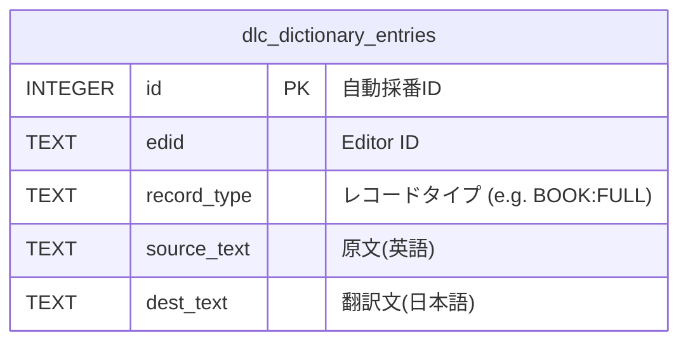
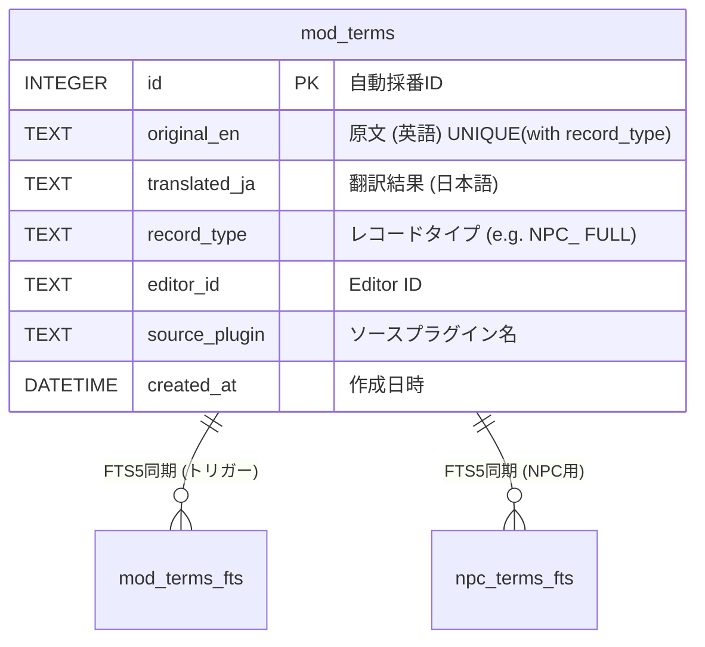

## MODIFIED Requirements

### Dictionary Slice (旧 Dictionary Builder)

公式DLCや基本辞書など、xTranslatorフォーマットから構築される汎用辞書データのコンテキストです。
**データベース名:** `dictionary.db`

### Terminology Slice (旧 Term Translator)

対象Mod固有の固有名詞翻訳結果と、その部分一致検索用のFTS（全文検索）テーブルを管理するコンテキストです。
**データベース名:** `{PluginName}_terms.db`

### Pipeline Slice (旧 Process Manager)

各スライスの実行状態やJobQueueとの紐付けを管理し、プロセスのレジューム（再開）を可能にするコンテキストです。
**データベース名:** `pipeline.db`

#### Scenario: パイプラインのレジューム
- **WHEN** 処理が途中で中断され、再起動される
- **THEN** `pipeline` スライスがDBから前回の到達フェーズを読み取り、実行を再開する。

### 補足事項
- **Vertical Slice Architecture の原則**: VSAの原則（`specs/architecture.md` 参照）に基づき、各テーブルは独立して管理されます。各Sliceは自身が必要とするテーブルのみに依存し、他Sliceのテーブルに直接クエリを発行することはありません。
