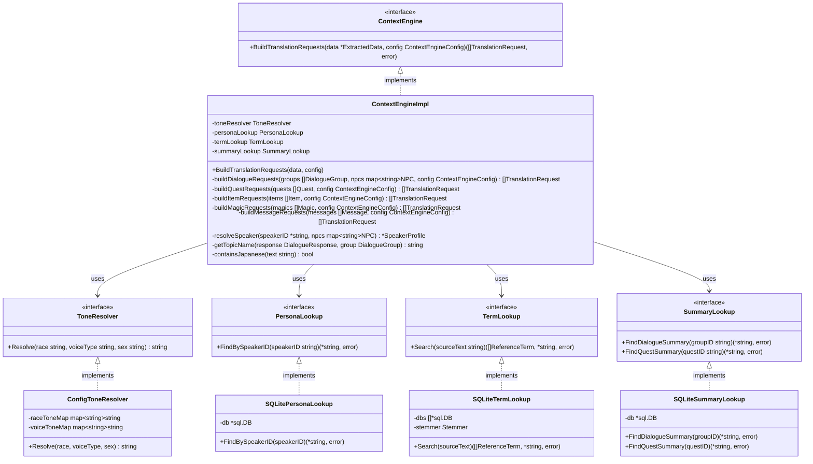
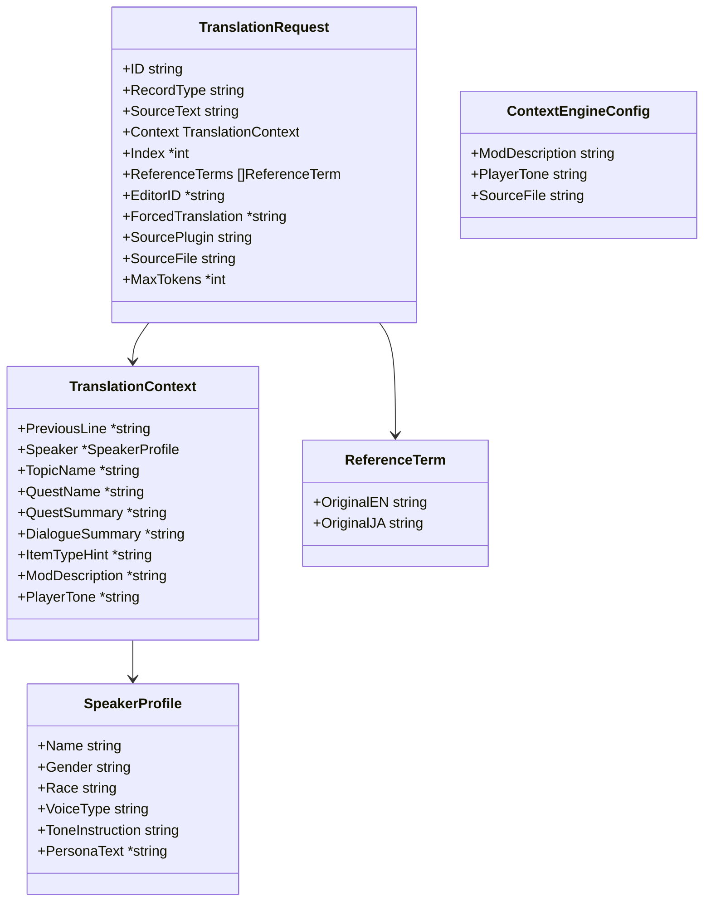

# コンテキストエンジン クラス図

## クラス構成

## DTO定義

## 依存関係

- `ContextEngineImpl` → `ToneResolver`: 口調指示文の生成
- `ContextEngineImpl` → `PersonaLookup`: NPCペルソナの参照
- `ContextEngineImpl` → `TermLookup`: 参照用語の検索・強制翻訳判定
- `ContextEngineImpl` → `SummaryLookup`: 会話要約・クエスト要約の参照
- `ConfigToneResolver` → Config Store: 種族・ボイスタイプの口調マッピング取得
- `SQLitePersonaLookup` → `*sql.DB` (DI): ペルソナDBへの読み取りアクセス
- `SQLiteTermLookup` → `[]*sql.DB` (DI): 辞書DB・Mod用語DBへの読み取りアクセス
- `SQLiteSummaryLookup` → `*sql.DB` (DI): 要約キャッシュDBへの読み取りアクセス
- Process Manager → `ContextEngine`: 翻訳リクエスト構築の起動
