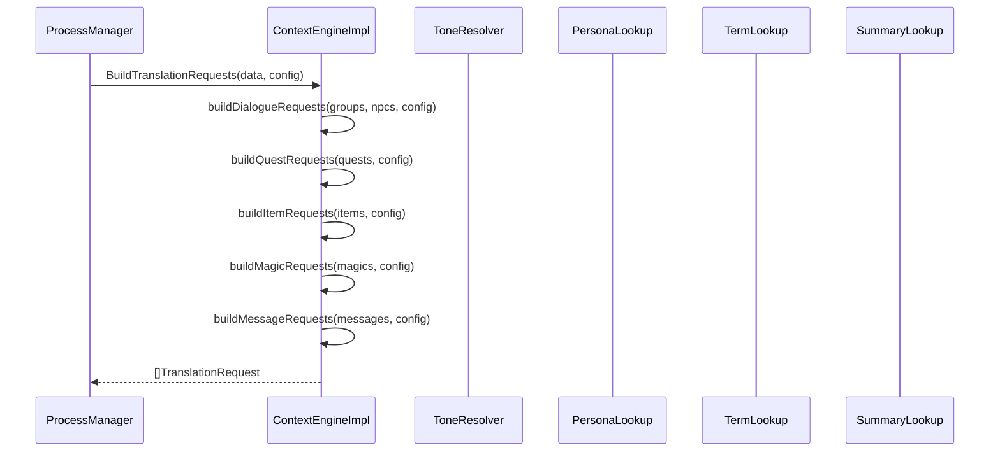
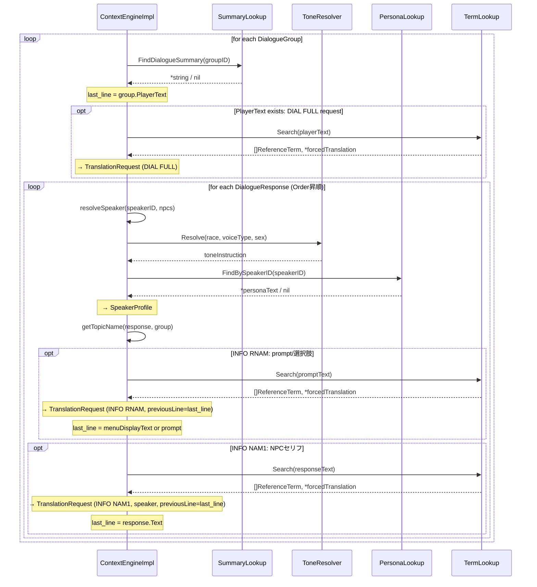
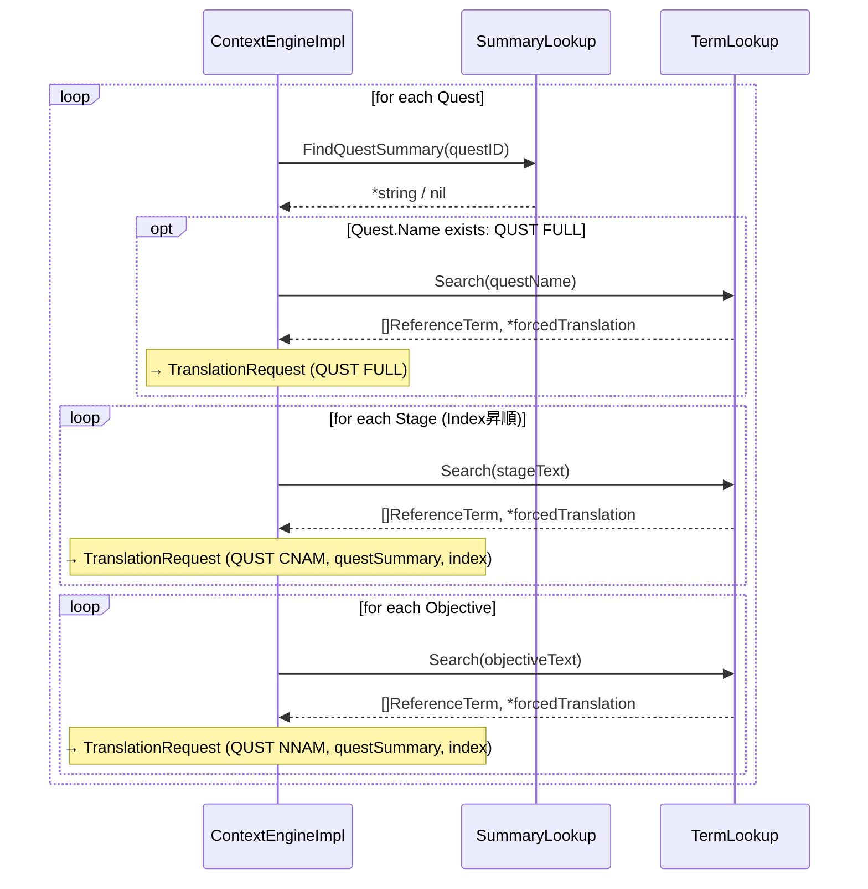
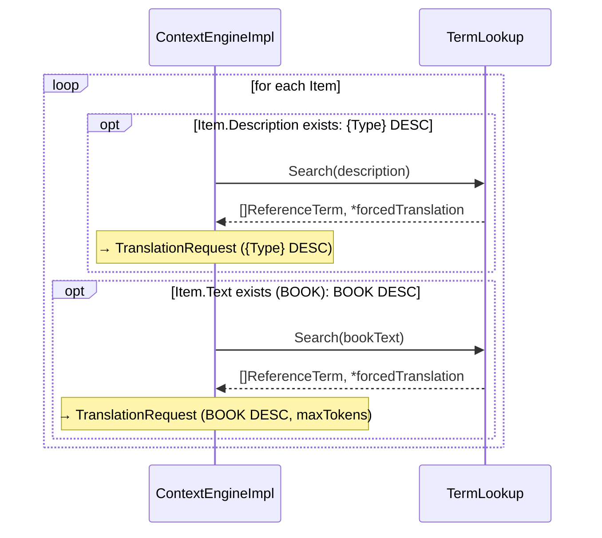
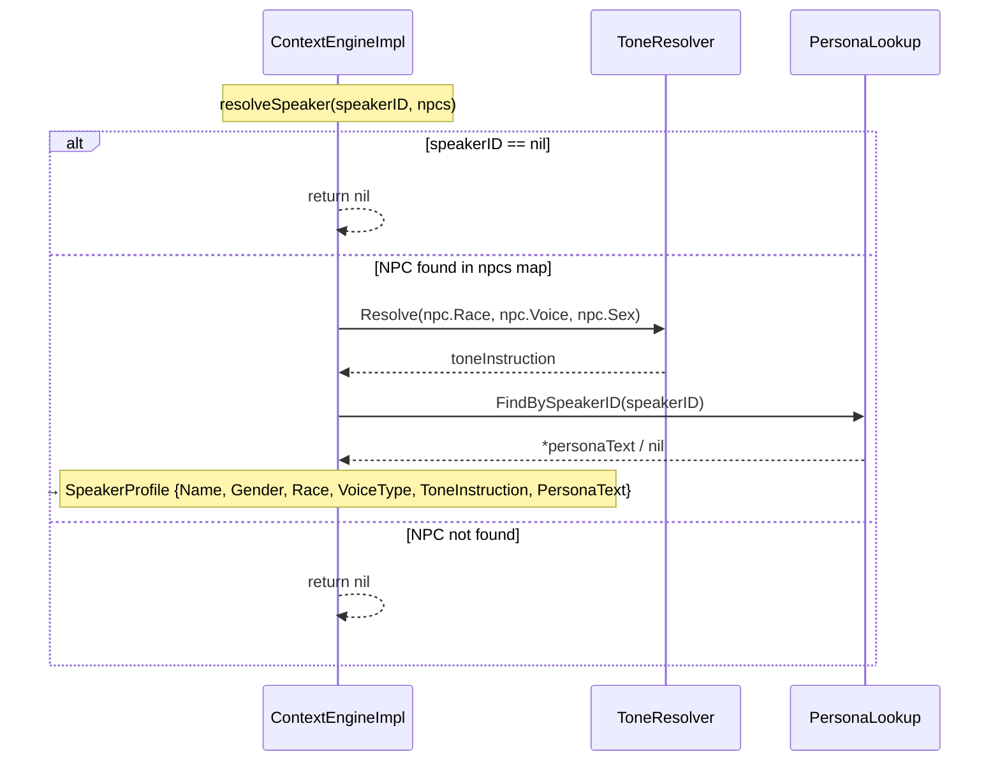

# コンテキストエンジン シーケンス図

## 1. 全体フロー（BuildTranslationRequests）

## 2. 会話リクエスト構築フロー（buildDialogueRequests）

## 3. クエストリクエスト構築フロー（buildQuestRequests）

## 4. アイテム・書籍リクエスト構築フロー（buildItemRequests）

## 5. 話者解決フロー（resolveSpeaker）

