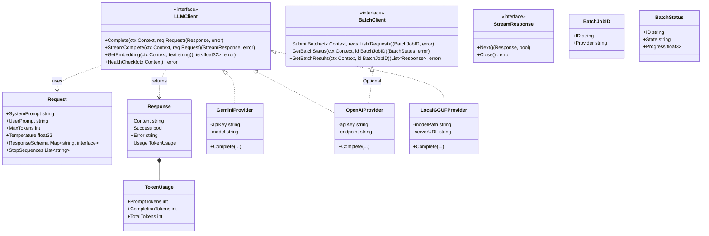

# LLMクライアント クラス図 (LLM Client Class Diagram)

## 主要エンティティの説明

### LLMClient (Interface)
全てのLLMプロバイダーが実装すべき基本インターフェース。同期的なリクエストと埋め込みベクトルの取得を定義する。

### BatchClient (Interface)
xAIやOpenAIのBatch APIのように、非同期で大量のリクエストを処理するプロバイダー向けのインターフェース。

### Request / Response (Structs)
リクエストパラメータとレスポンスデータをカプセル化する。`ResponseSchema`はJSON Schemaを保持し、モデルに構造化出力を強制するために使用する。

### Providers (Implementations)
各外部サービスやローカル実行エンジン（LM Studio等）への具体的な接続ロジックを持つ。これらは`LLMClient`インターフェースを満たすように実装される。
