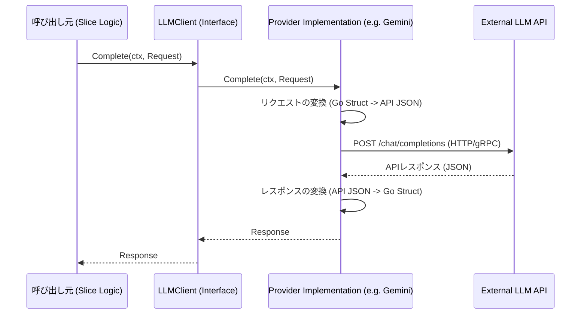
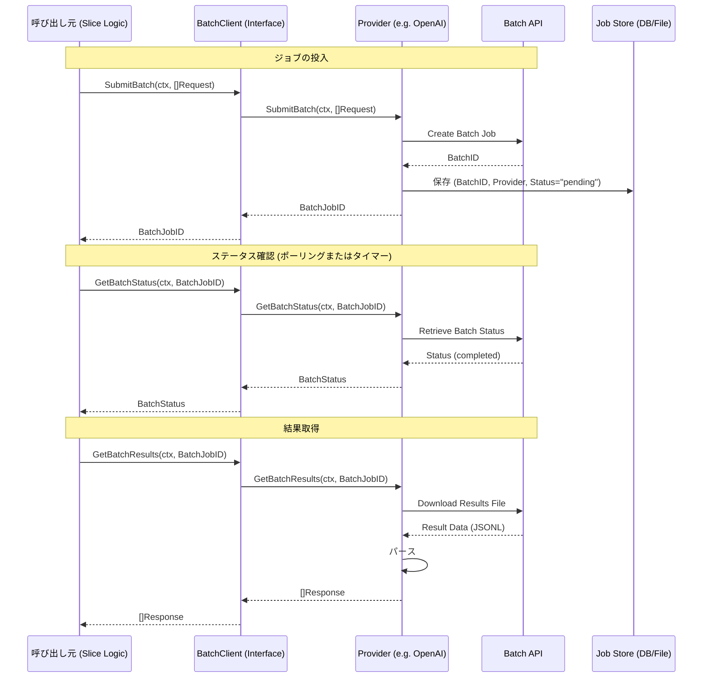
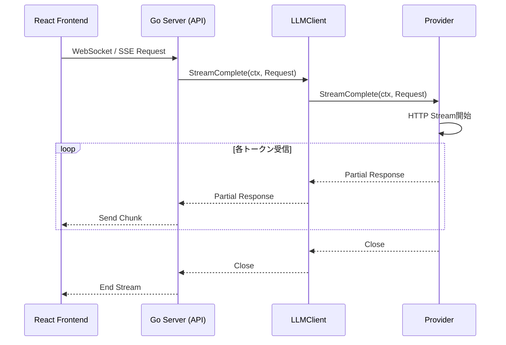

# LLMクライアント シーケンス図 (LLM Client Sequence Diagram)

## 1. 同期リクエスト (Complete)
通常の翻訳処理などで使用される。

## 2. 非同期バッチリクエスト (Batch API)
大規模な初期翻訳や、コスト削減のために非同期処理を行う場合に使用される。

## 3. ストリーミングリクエスト (StreamComplete)
UIでリアルタイムに生成過程を表示する場合に使用される。

