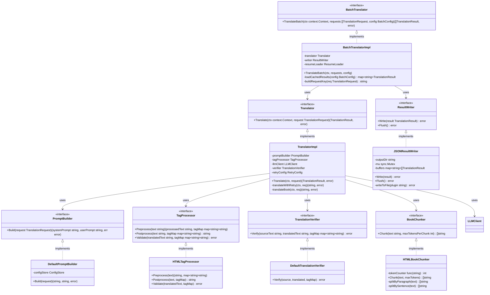
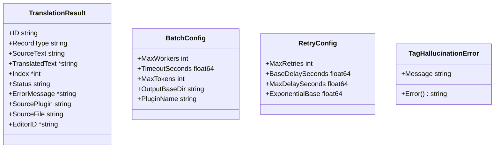

# 本文翻訳 クラス図

## クラス構成

## DTO定義

## 依存関係

- `BatchTranslatorImpl` → `Translator`: 単一リクエストの翻訳実行
- `BatchTranslatorImpl` → `ResultWriter`: 翻訳結果の逐次保存
- `BatchTranslatorImpl` → `ResumeLoader`: 既存翻訳結果の読み込み（差分更新）
- `TranslatorImpl` → `PromptBuilder`: プロンプト構築
- `TranslatorImpl` → `TagProcessor`: HTMLタグ前処理/後処理
- `TranslatorImpl` → `LLMClient` (共通インフラ): LLM呼び出し
- `TranslatorImpl` → `TranslationVerifier`: 翻訳結果の品質検証
- `TranslatorImpl` → `BookChunker`: 書籍長文分割
- `DefaultPromptBuilder` → Config Store: プロンプトテンプレートの取得
- `JSONResultWriter` → ファイルシステム: JSON出力
- Process Manager → `BatchTranslator`: バッチ翻訳の起動
