# 用語翻訳・Mod用語DB保存 クラス図

```mermaid
classDiagram
    class TermTranslationRequest {
        +String FormID
        +String EditorID
        +String RecordType
        +String SourceText
        +String ShortName
        +String SourcePlugin
        +String SourceFile
        +[]ReferenceTerm ReferenceTerms
    }

    class ReferenceTerm {
        +String Source
        +String Translation
    }

    class TermTranslationResult {
        +String FormID
        +String EditorID
        +String RecordType
        +String SourceText
        +String TranslatedText
        +String SourcePlugin
        +String SourceFile
        +String Status
        +String ErrorMessage
    }

    class TermTranslator {
        <<Interface>>
        +TranslateTerms(ctx context.Context, data ExtractedData) ([]TermTranslationResult, error)
    }

    class TermRequestBuilder {
        <<Interface>>
        +BuildRequests(ctx context.Context, data ExtractedData) ([]TermTranslationRequest, error)
        -pairNPCRecords(npcs []NPC) []NPCPair
    }

    class NPCPair {
        +NPC Full
        +NPC Short
    }

    class TermDictionarySearcher {
        <<Interface>>
        +SearchExact(ctx context.Context, text string) ([]ReferenceTerm, error)
        +SearchKeywords(ctx context.Context, keywords []string) ([]ReferenceTerm, error)
        +SearchNPCPartial(ctx context.Context, keywords []string, consumedKeywords []string, isNPC bool) ([]ReferenceTerm, error)
        +SearchBatch(ctx context.Context, texts []string) (map[string][]ReferenceTerm, error)
    }

    class ModTermStore {
        <<Interface>>
        +InitSchema(ctx context.Context) error
        +SaveTerms(ctx context.Context, results []TermTranslationResult) error
        +GetTerm(ctx context.Context, originalEN string) (string, error)
        +Clear(ctx context.Context) error
    }

    class TermTranslatorImpl {
        -TermRequestBuilder requestBuilder
        -TermDictionarySearcher dictSearcher
        -LLMClient llmClient
        -ModTermStore modTermStore
        -ProgressNotifier notifier
        -int maxWorkers
        +TranslateTerms(ctx context.Context, data ExtractedData) ([]TermTranslationResult, error)
    }

    class TermRequestBuilderImpl {
        -TermRecordConfig config
        +BuildRequests(ctx context.Context, data ExtractedData) ([]TermTranslationRequest, error)
    }

    class TermRecordConfig {
        +[]string TargetRecordTypes
        +IsTarget(recordType string) bool
    }

    class SQLiteTermDictionarySearcher {
        -db *sql.DB
        -[]string additionalDBPaths
        +SearchExact(ctx context.Context, text string) ([]ReferenceTerm, error)
        +SearchKeywords(ctx context.Context, keywords []string) ([]ReferenceTerm, error)
        +SearchNPCPartial(ctx context.Context, keywords []string, consumedKeywords []string, isNPC bool) ([]ReferenceTerm, error)
        +SearchBatch(ctx context.Context, texts []string) (map[string][]ReferenceTerm, error)
    }

    class GreedyLongestMatcher {
        +Filter(sourceText string, candidates map[string]string) map[string]string
    }

    class KeywordStemmer {
        +Stem(word string) string
        +StripPossessive(word string) string
        +StemKeywords(keywords []string) map[string]string
    }

    class SQLiteModTermStore {
        -db *sql.DB
        +InitSchema(ctx context.Context) error
        +SaveTerms(ctx context.Context, results []TermTranslationResult) error
        +GetTerm(ctx context.Context, originalEN string) (string, error)
        +Clear(ctx context.Context) error
    }

    class TermPromptBuilder {
        +BuildSystemPrompt(recordType string) string
        +BuildUserPrompt(request TermTranslationRequest) string
    }

    class ProgressNotifier {
        <<Interface>>
        +OnProgress(completed int, total int)
    }

    class ProcessManager {
        -TermTranslator termTranslator
        +HandleTermTranslation(w http.ResponseWriter, r *http.Request)
    }

    ProcessManager --> TermTranslator : uses
    TermTranslator <|.. TermTranslatorImpl : implements
    TermTranslatorImpl --> TermRequestBuilder : uses
    TermTranslatorImpl --> TermDictionarySearcher : uses
    TermTranslatorImpl --> ModTermStore : uses
    TermTranslatorImpl --> TermPromptBuilder : uses
    TermTranslatorImpl --> ProgressNotifier : notifies
    TermTranslatorImpl --> LLMClient : uses
    TermRequestBuilder <|.. TermRequestBuilderImpl : implements
    TermRequestBuilderImpl --> TermRecordConfig : uses
    TermDictionarySearcher <|.. SQLiteTermDictionarySearcher : implements
    TermTranslatorImpl --> GreedyLongestMatcher : uses
    SQLiteTermDictionarySearcher --> KeywordStemmer : uses
    ModTermStore <|.. SQLiteModTermStore : implements
    TermTranslatorImpl ..> TermTranslationRequest : creates
    TermTranslatorImpl ..> TermTranslationResult : creates
    ModTermStore ..> TermTranslationResult : stores
```

## アーキテクチャの補足：基本インフラの注入による純粋な Vertical Slicing
本コンテキスト（Term Translator Slice）は、**「用語翻訳リクエスト生成」から「辞書検索」「LLM翻訳実行」「Mod用語DBスキーマ(DTO)定義」「SQL永続化」までの全責務をこのスライス単体で負う**。
AIDDにおいてAIが変更範囲を迷わず限定・自己完結させて決定的にコードを生成できるよう、あえて全体での「DRY」は捨て、他のコンテキスト（例：Dictionary Builder Sliceの辞書テーブル定義や、Pass 2翻訳時のデータモデル等）とはStoreやモデルを共有しない。
外部（プロセスマネージャー等）からは、以下のインフラモジュールのみをDIで注入する形とする：
- `*sql.DB` コネクションプール（辞書DB参照用・Mod用語DB書き込み用）
- `LLMClient` インターフェース（翻訳実行用）
- `TermRecordConfig`（用語翻訳対象レコードタイプ定義、Config Store経由）

## 推奨ライブラリ (Go Backend)
*   **LLM クライアント**: `infrastructure/llm_client` インターフェース（プロジェクト共通）
*   **DB アクセス**: `github.com/mattn/go-sqlite3` または `modernc.org/sqlite`
*   **依存性注入**: `github.com/google/wire` (プロジェクト標準)
*   **並行処理**: Go標準 `sync`, `context`, `golang.org/x/sync/errgroup`
*   **ステミング**: `github.com/kljensen/snowball` (Snowball English Stemmer)
*   **ルーティング**: 標準 `net/http`
