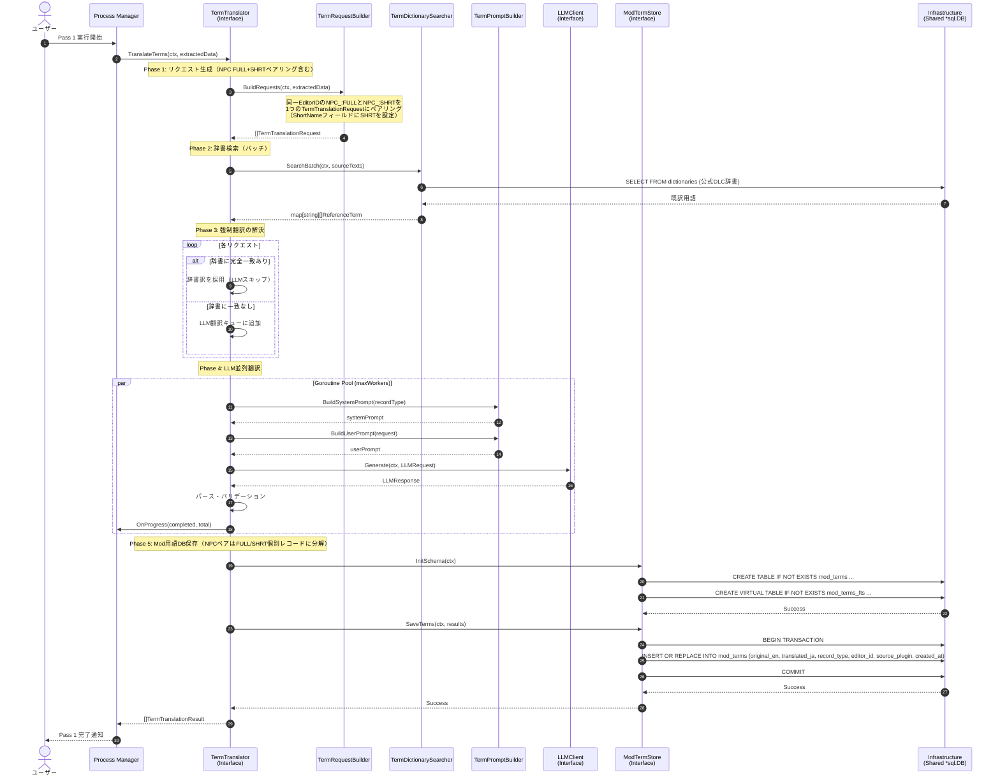
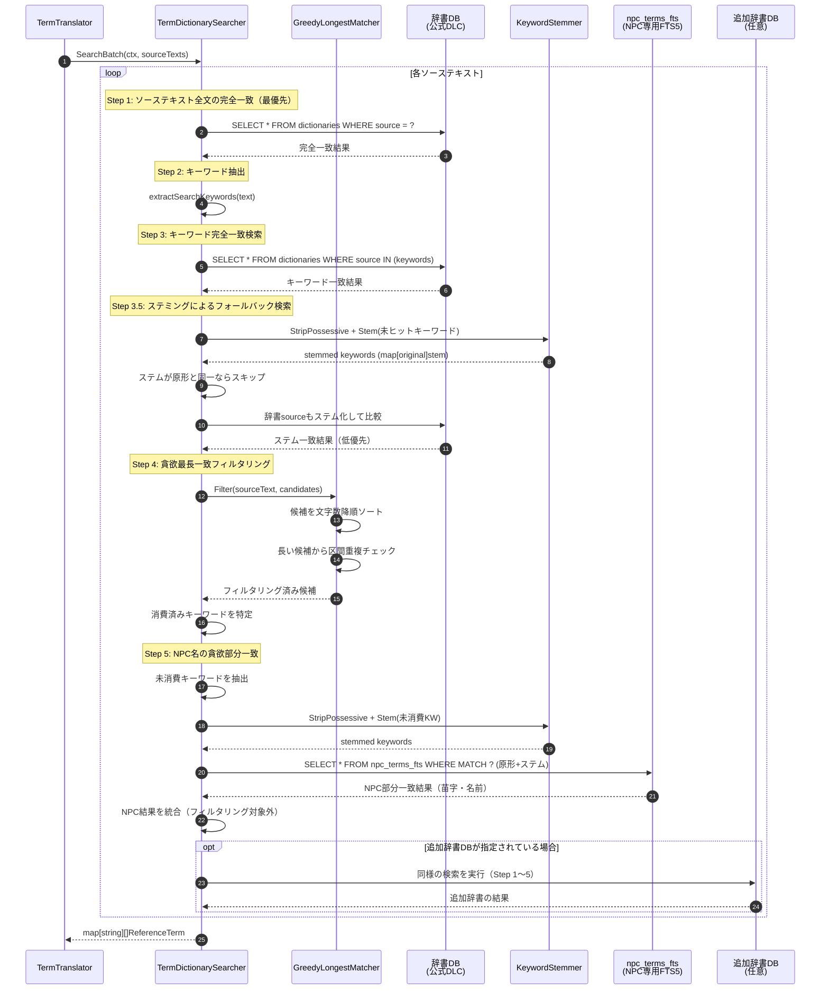
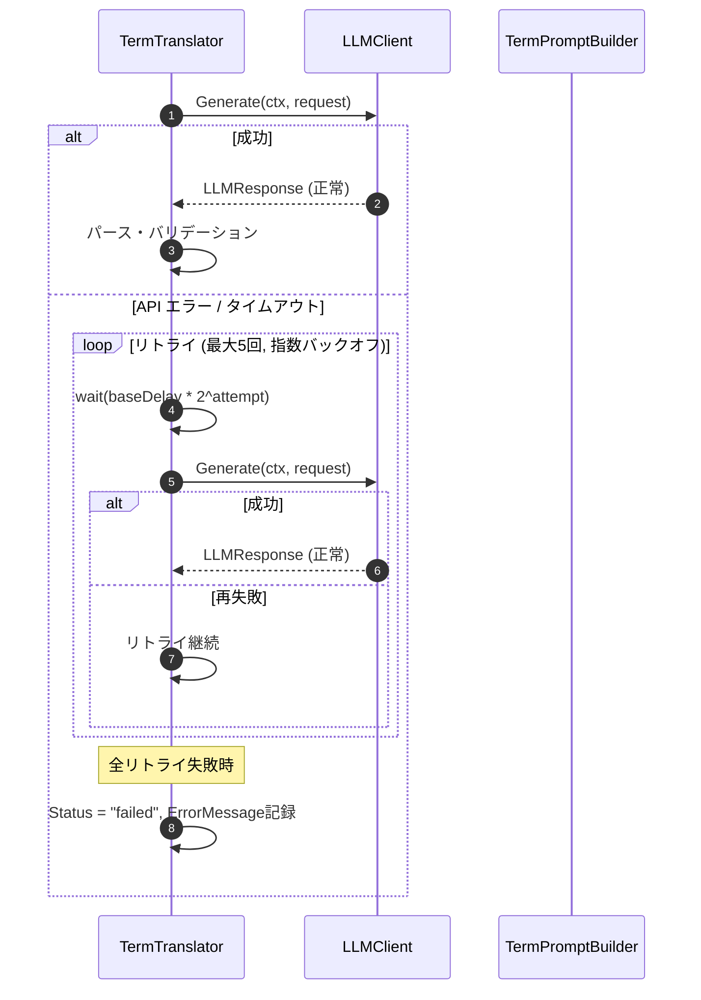

# 用語翻訳・Mod用語DB保存 シーケンス図

## 1. 用語翻訳メインフロー

```mermaid
sequenceDiagram
    autonumber
    actor User as ユーザー
    participant PM as Process Manager
    participant TT as TermTranslator<br/>(Interface)
    participant RB as TermRequestBuilder
    participant DS as TermDictionarySearcher
    participant PB as TermPromptBuilder
    participant LLM as LLMClient<br/>(Interface)
    participant MS as ModTermStore<br/>(Interface)
    participant DB as Infrastructure<br/>(Shared *sql.DB)

    User->>PM: Pass 1 実行開始
    PM->>TT: TranslateTerms(ctx, extractedData)

    Note over TT: Phase 1: リクエスト生成（NPC FULL+SHRTペアリング含む）
    TT->>RB: BuildRequests(ctx, extractedData)
    Note over RB: 同一EditorIDのNPC_:FULLとNPC_:SHRTを<br/>1つのTermTranslationRequestにペアリング<br/>（ShortNameフィールドにSHRTを設定）
    RB-->>TT: []TermTranslationRequest

    Note over TT: Phase 2: 辞書検索（バッチ）
    TT->>DS: SearchBatch(ctx, sourceTexts)
    DS->>DB: SELECT FROM dictionaries (公式DLC辞書)
    DB-->>DS: 既訳用語
    DS-->>TT: map[string][]ReferenceTerm

    Note over TT: Phase 3: 強制翻訳の解決
    loop 各リクエスト
        alt 辞書に完全一致あり
            TT->>TT: 辞書訳を採用（LLMスキップ）
        else 辞書に一致なし
            TT->>TT: LLM翻訳キューに追加
        end
    end

    Note over TT: Phase 4: LLM並列翻訳
    par Goroutine Pool (maxWorkers)
        TT->>PB: BuildSystemPrompt(recordType)
        PB-->>TT: systemPrompt
        TT->>PB: BuildUserPrompt(request)
        PB-->>TT: userPrompt
        TT->>LLM: Generate(ctx, LLMRequest)
        LLM-->>TT: LLMResponse
        TT->>TT: パース・バリデーション
        TT->>PM: OnProgress(completed, total)
    end

    Note over TT: Phase 5: Mod用語DB保存（NPCペアはFULL/SHRT個別レコードに分解）
    TT->>MS: InitSchema(ctx)
    MS->>DB: CREATE TABLE IF NOT EXISTS mod_terms ...
    MS->>DB: CREATE VIRTUAL TABLE IF NOT EXISTS mod_terms_fts ...
    DB-->>MS: Success

    TT->>MS: SaveTerms(ctx, results)
    MS->>DB: BEGIN TRANSACTION
    MS->>DB: INSERT OR REPLACE INTO mod_terms (original_en, translated_ja, record_type, editor_id, source_plugin, created_at)
    MS->>DB: COMMIT
    DB-->>MS: Success
    MS-->>TT: Success

    TT-->>PM: []TermTranslationResult
    PM-->>User: Pass 1 完了通知
```

## 2. 辞書検索の詳細フロー（貪欲部分一致）

```mermaid
sequenceDiagram
    autonumber
    participant TT as TermTranslator
    participant DS as TermDictionarySearcher
    participant GM as GreedyLongestMatcher
    participant DictDB as 辞書DB<br/>(公式DLC)
    participant KS as KeywordStemmer
    participant NPCFTS as npc_terms_fts<br/>(NPC専用FTS5)
    participant AddDB as 追加辞書DB<br/>(任意)

    TT->>DS: SearchBatch(ctx, sourceTexts)

    loop 各ソーステキスト
        Note over DS: Step 1: ソーステキスト全文の完全一致（最優先）
        DS->>DictDB: SELECT * FROM dictionaries WHERE source = ?
        DictDB-->>DS: 完全一致結果

        Note over DS: Step 2: キーワード抽出
        DS->>DS: extractSearchKeywords(text)

        Note over DS: Step 3: キーワード完全一致検索
        DS->>DictDB: SELECT * FROM dictionaries WHERE source IN (keywords)
        DictDB-->>DS: キーワード一致結果

        Note over DS: Step 3.5: ステミングによるフォールバック検索
        DS->>KS: StripPossessive + Stem(未ヒットキーワード)
        KS-->>DS: stemmed keywords (map[original]stem)
        DS->>DS: ステムが原形と同一ならスキップ
        DS->>DictDB: 辞書sourceもステム化して比較
        DictDB-->>DS: ステム一致結果（低優先）

        Note over DS: Step 4: 貪欲最長一致フィルタリング
        DS->>GM: Filter(sourceText, candidates)
        GM->>GM: 候補を文字数降順ソート
        GM->>GM: 長い候補から区間重複チェック
        GM-->>DS: フィルタリング済み候補
        DS->>DS: 消費済みキーワードを特定

        Note over DS: Step 5: NPC名の貪欲部分一致
        DS->>DS: 未消費キーワードを抽出
        DS->>KS: StripPossessive + Stem(未消費KW)
        KS-->>DS: stemmed keywords
        DS->>NPCFTS: SELECT * FROM npc_terms_fts WHERE MATCH ? (原形+ステム)
        NPCFTS-->>DS: NPC部分一致結果（苗字・名前）
        DS->>DS: NPC結果を統合（フィルタリング対象外）

        opt 追加辞書DBが指定されている場合
            DS->>AddDB: 同様の検索を実行（Step 1〜5）
            AddDB-->>DS: 追加辞書の結果
        end
    end

    DS-->>TT: map[string][]ReferenceTerm
```

## 3. リトライフロー

```mermaid
sequenceDiagram
    autonumber
    participant TT as TermTranslator
    participant LLM as LLMClient
    participant PB as TermPromptBuilder

    TT->>LLM: Generate(ctx, request)

    alt 成功
        LLM-->>TT: LLMResponse (正常)
        TT->>TT: パース・バリデーション
    else API エラー / タイムアウト
        loop リトライ (最大5回, 指数バックオフ)
            TT->>TT: wait(baseDelay * 2^attempt)
            TT->>LLM: Generate(ctx, request)
            alt 成功
                LLM-->>TT: LLMResponse (正常)
            else 再失敗
                TT->>TT: リトライ継続
            end
        end
        Note over TT: 全リトライ失敗時
        TT->>TT: Status = "failed", ErrorMessage記録
    end
```
