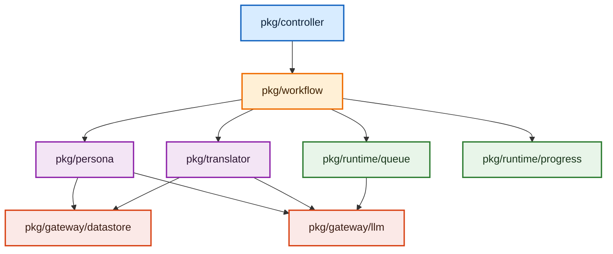

# アーキテクチャ概要

本ドキュメントは、このリポジトリのバックエンドをどの責務区分に分け、どの方向に依存させるかを定義する純粋なアーキテクチャ文書である。

この文書が扱うのは以下だけとする。

- パッケージの責務境界
- 依存方向
- DTO / Contract / DI の原則
- Composition Root の責務

この文書が扱わないものは、専用 spec に委譲する。

- バックエンドの実装規約: `openspec/specs/backend_coding_standards.md`
- 品質ゲートと lint 導線: `openspec/specs/backend-quality-gates/spec.md`
- テスト設計標準: `openspec/specs/standard_test_spec.md`
- ログ設計詳細: `openspec/specs/log-guide.md`
- フロントエンド構造: `openspec/specs/frontend_architecture.md`

---

## 1. 目的

このプロジェクトは Interface-First AIDD を前提に、変更時の影響範囲を局所化し、AI と人間の両方が責務境界を読み取りやすい構造を維持することを目的とする。

そのために、以下を守る。

- 接続は契約から考える
- 具象実装の知識は composition root に閉じ込める
- usecase slice は自分の業務ロジックと DTO に集中する
- UI 入出力とユースケース進行を分離する
- 実行制御基盤と外部依頼口を分離する

---

## 2. 基本原則

### 2.1 Contract First

- モジュール間連携は interface を契約として定義する
- 具象型への直接依存を標準形にしない
- コンストラクタは可能な限り interface を受け取る

### 2.2 Composition Root Only Concrete

- 具象型を知ってよいのは composition root のみとする
- `main.go`、Wire injector、初期化専用 provider 以外が他区分の具象型を `new` してはならない
- 通常の package は他区分の contract だけを知る

### 2.3 Slice Autonomy

- usecase slice は自分の DTO、業務ロジック、永続化ルールに集中する
- slice は他 slice の DTO や具象実装を参照しない
- slice 間のデータ変換は呼び出し側が担う

### 2.4 Explicit Orchestration

- 複数 contract を束ねる責務は `workflow` に集約する
- controller は orchestration しない
- runtime はユースケース進行を決定しない
- gateway はユースケース進行を決定しない

---

## 3. システムの責務区分

このプロジェクトは、厳密な直列レイヤーではなく、責務を 5 区分に分ける。

1. `pkg/controller`
2. `pkg/workflow`
3. `pkg/<usecase-slice>`
4. `pkg/runtime`
5. `pkg/gateway`

### 3.1 `pkg/controller`

役割:

- Wails binding、HTTP、CLI など外部入力の受け口
- request/response の境界整形
- `workflow` 契約の呼び出し

持ってはいけない責務:

- ユースケース進行
- phase / progress / resume / cancel の決定
- slice 間 DTO 変換
- runtime / gateway の直接制御

### 3.2 `pkg/workflow`

役割:

- application service / orchestrator
- ユースケース進行の制御
- phase / progress / resume / cancel / state の管理
- controller から slice への DTO マッピング
- runtime の利用
- slice の呼び分け

持ってはいけない責務:

- slice 固有の業務ロジック本体
- UI の描画都合
- runtime 内部の状態機械
- gateway 実装の詳細

### 3.3 `pkg/<usecase-slice>`

役割:

- 個別ユースケースの業務ロジック
- 自前 DTO / contract の定義
- 自分の永続化ルール
- 自分に必要な gateway 契約の利用

持ってはいけない責務:

- 他 slice の都合に合わせた DTO 参照
- controller 依存
- workflow 依存
- runtime の主導

### 3.4 `pkg/runtime`

役割:

- queue、progress、workflow state、event、telemetry など実行制御の基盤
- workflow がユースケース進行を実現するための実行時サービス
- queue worker など、実行器が外部依頼を委譲するための gateway 呼び出し

持ってはいけない責務:

- 特定ユースケースの進行決定
- UI 状態の意味解釈
- slice 固有ロジックの内包
- slice 保存判定や slice 固有 DTO の解釈

### 3.5 `pkg/gateway`

役割:

- DB、LLM、config、secret、file、外部 API など外部資源への依頼口
- usecase slice が必要とする技術接続の具象実装
- runtime の executor が外部依頼を委譲する先

持ってはいけない責務:

- ユースケース進行の決定
- phase / progress / resume / cancel の管理
- 特定 workflow の状態解釈

---

## 4. 依存方向ルール

許可する依存:

- `controller -> workflow`
- `workflow -> usecase slice`
- `workflow -> runtime`
- `workflow -> gateway` の最小限依存
- `runtime -> gateway` の限定依存
- `usecase slice -> gateway`

禁止する依存:

- `controller -> usecase slice`
- `controller -> runtime`
- `controller -> gateway`
- `usecase slice -> controller`
- `usecase slice -> workflow`
- `usecase slice -> runtime`
- `runtime -> controller`
- `runtime -> workflow`
- `runtime -> usecase slice`
- `gateway -> controller`
- `gateway -> workflow`
- `gateway -> usecase slice`
- `usecase slice -> usecase slice` の具象依存

補足:

- usecase slice 同士の連携が必要な場合は workflow で両者を束ねる
- `workflow -> gateway` は workflow 自身の永続状態管理や初期化のように、slice に属さない外部依頼に限定する
- `runtime -> gateway` は queue worker や executor が外部資源へ request を委譲する場合に限定する
- `runtime -> gateway` を許可しても、runtime が slice 固有の保存処理や業務判断を持ってはならない
- 共通化は技術的関心事に限定し、業務ロジックの安易な shared kernel 化を避ける

---

## 5. DTO と Contract の原則

### 5.1 DTO は消費側基準で定義する

- 各 slice は自身が必要とする入力 DTO / 出力 DTO を自前で持つ
- `pkg/domain` のような横断共有 DTO を基本形にしない
- parser の出力を persona が直接読む、といった構造を避ける

### 5.2 マッピングは workflow が担う

- controller 入力 -> slice 入力 DTO の変換は workflow が行う
- slice A 出力 -> slice B 入力 DTO の変換も workflow が行う
- runtime や gateway の返却値を slice 保存 DTO へ変換するのも workflow の責務とする
- runtime が gateway を使う場合でも、gateway の返却値を slice 保存 DTO や UI 状態へ解釈する責務は workflow が持つ

### 5.3 Contract は振る舞い単位で設計する

- interface は役割ごとに分ける
- ただし 1 メソッドごとに過剰分割しない
- workflow や slice が必要とする操作単位で contract を切る

---

## 6. DI と Composition Root

依存注入の原則:

- 依存解決は `google/wire` を第一候補とする
- 手組み DI を行う場合も、ルールは同じとする
- contract を受ける側が、他区分の具象型 import に引きずられないことを優先する

composition root の責務:

- 具象実装の生成
- interface への束縛
- 初期化順序の制御
- 環境依存値の注入

composition root の責務外:

- 業務ロジック
- DTO 変換
- phase / progress の決定

---

## 7. 判断基準

新しいコードや package を追加する際は、まず以下で判断する。

1. これは外部入出力の adapter か
2. これはユースケース進行の制御か
3. これは slice 固有の業務ロジックか
4. これは実行制御基盤か
5. これは外部資源への依頼口か

対応先:

- 1 は `controller`
- 2 は `workflow`
- 3 は usecase slice
- 4 は `runtime`
- 5 は `gateway`

曖昧な場合の原則:

- UI 都合があるなら controller
- 複数 contract を束ねるなら workflow
- ドメイン知識が強いなら slice
- 実行制御なら runtime
- 外部資源への依頼なら gateway

---

## 8. 関連文書の責務分担

- `architecture.md`
  - 構造、責務、依存方向、DI 原則
- `backend_coding_standards.md`
  - Go 実装時のコーディング規約
- `backend-quality-gates/spec.md`
  - lint / check / test の実行導線
- `standard_test_spec.md`
  - テスト設計書の書式と原則
- `log-guide.md`
  - ログ設計と AI デバッグ向け運用
- `spec-structure/spec.md`
  - OpenSpec 文書の責務境界と配置ルール
- `frontend_architecture.md`
  - フロントエンド専用構造

この分担を崩して重複を書かないこと。
