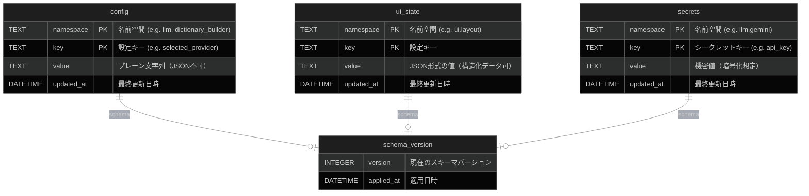
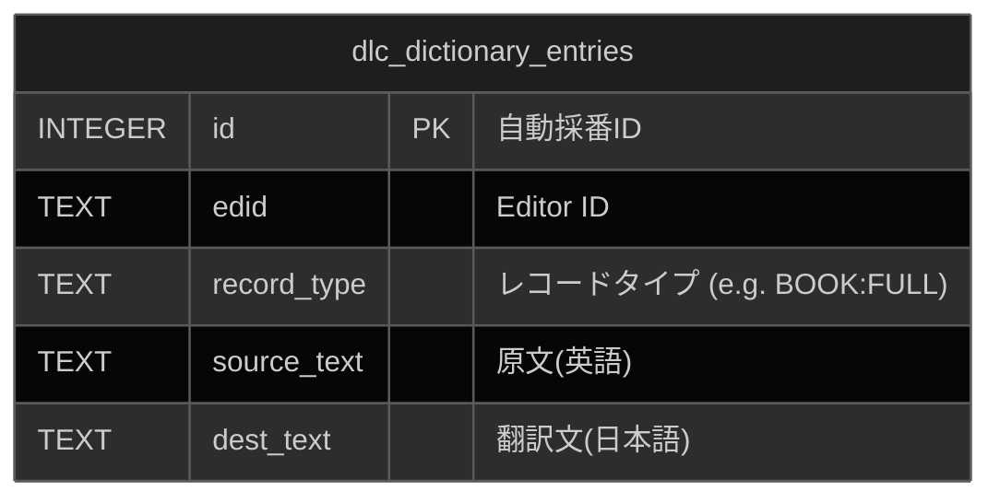
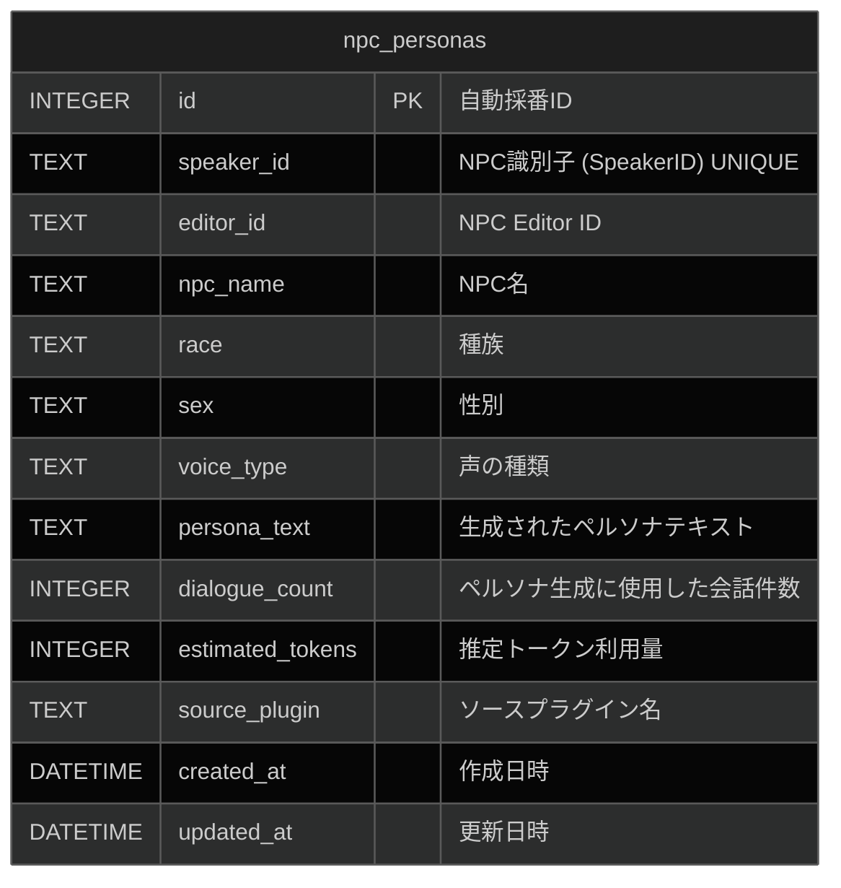
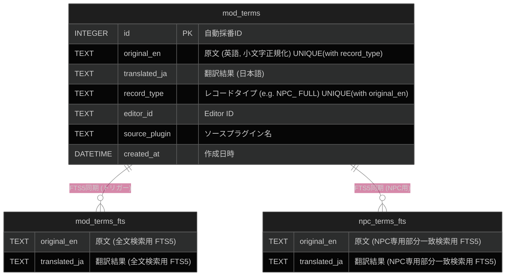

# データベースER図

Interface-First AIDD v2アーキテクチャおよびVertical Slice Architecture (VSA)に従った、各Sliceのデータベース設計を以下に示します。各Sliceは独自の責務範囲に応じて、独立したコンテキスト（ファイル・テーブル群）として管理されます。

## Config Store Slice (設定・レイアウト保存)

共通の設定やUI状態を永続化するインフラストラクチャ層のコンテキストです。
**データベース名:** `config.db` (システム設定・全Mod共通)

## Dictionary Builder Slice (辞書構築)

公式DLCや基本辞書など、xTranslatorフォーマットから構築される汎用辞書データのコンテキストです。
**データベース名:** `dictionary.db` (システム辞書・全Mod共通)

## NPC Persona Gen Slice (ペルソナ生成)

NPCの会話履歴から生成された性格や口調のペルソナ情報を管理するコンテキストです。
**データベース名:** `{PluginName}_terms.db` (生成元Mod専用データベース・テーブル同居)

## Term Translator Slice (Mod用語翻訳)

対象Mod固有の固有名詞翻訳結果と、その部分一致検索用のFTS（全文検索）テーブルを管理するコンテキストです。
**データベース名:** `{PluginName}_terms.db` (翻訳対象Mod専用データベース)

## 補足事項
- **Vertical Slice Architecture の原則**: VSAの原則（Refactoring Strategy Section 5）に基づき、上記テーブルはDRY原則を避け「あえて分断」されています。各Slice（`ConfigStoreSlice`, `DictionaryBuilderSlice`, `PersonaGenSlice`, `TermTranslatorSlice`）は自身が必要とするテーブルのみに依存し、他Sliceのテーブルに直接クエリを発行することはありません。
