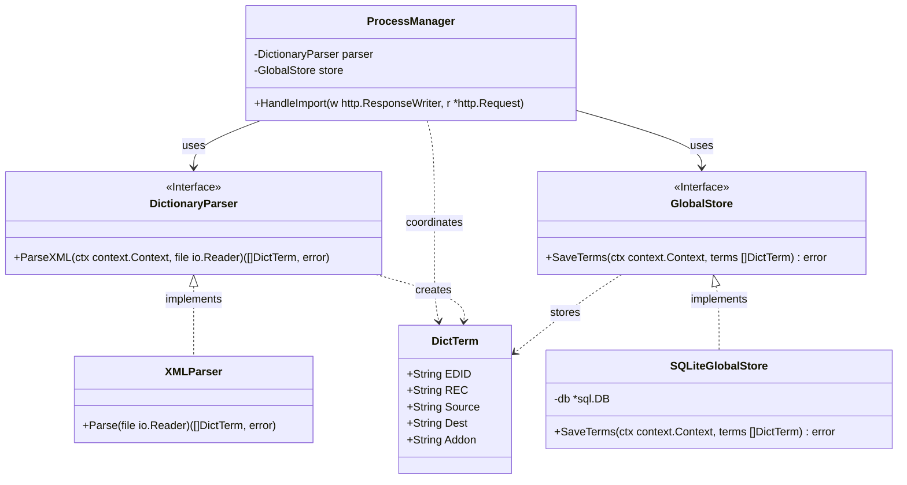

# 辞書DB作成 クラス図

## アーキテクチャの補足：永続化の委譲
本コンテキスト（Dictionary Builder Slice）では**データの抽出とパースのみ**に責務を持ち、`DictionaryParser` は `[]DictTerm` を返却するだけにとどめる。
抽出されたデータは、全体の制御を司る `ProcessManager`（またはHTTPハンドラー）が受け取り、アプリケーション共通の永続化インターフェースである `GlobalStore` を介して1つのSQLite DBファイルに保存する。これにより、各フローごとに類似のDB保存処理を重複して記述する（COBOL的な）設計を防ぐ。

## 推奨ライブラリ (Go Backend)
*   **XML 解析**: `encoding/xml` (標準ライブラリ)
*   **DB アクセス**: `github.com/mattn/go-sqlite3` (デファクトスタンダード、ただしCGO有効化が必要) または `modernc.org/sqlite` (CGO不要な代替品)
*   **依存性注入**: `github.com/google/wire` (プロジェクト標準)
*   **ルーティング**: 標準 `net/http` 
