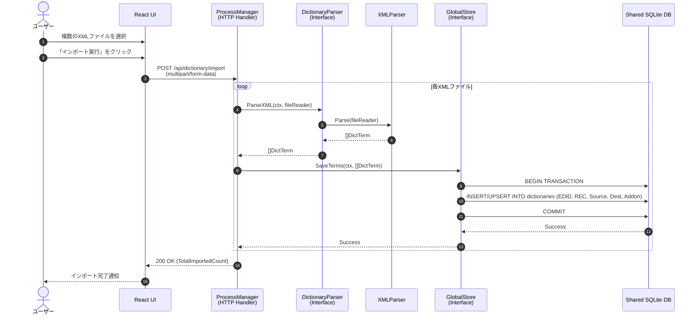

# 辞書DB作成 シーケンス図

```mermaid
sequenceDiagram
    autonumber
    actor User as ユーザー
    participant UI as React UI
    participant Handler as ProcessManager<br/>(HTTP Handler)
    participant Importer as DictionaryParser<br/>(Interface)
    participant Parser as XMLParser
    participant Store as GlobalStore<br/>(Interface)
    participant DB as Shared SQLite DB

    User->>UI: 複数のXMLファイルを選択
    User->>UI: 「インポート実行」をクリック
    UI->>Handler: POST /api/dictionary/import<br/>(multipart/form-data)
    
    loop 各XMLファイル
        Handler->>Importer: ParseXML(ctx, fileReader)
        Importer->>Parser: Parse(fileReader)
        Parser-->>Importer: []DictTerm
        Importer-->>Handler: []DictTerm
        
        Handler->>Store: SaveTerms(ctx, []DictTerm)
        Store->>DB: BEGIN TRANSACTION
        Store->>DB: INSERT/UPSERT INTO dictionaries (EDID, REC, Source, Dest, Addon)
        Store->>DB: COMMIT
        DB-->>Store: Success
        Store-->>Handler: Success
    end
    
    Handler-->>UI: 200 OK (TotalImportedCount)
    UI-->>User: インポート完了通知
```
