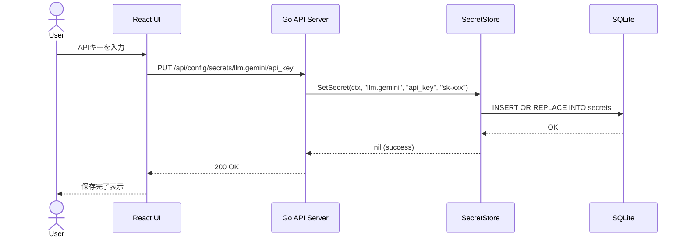
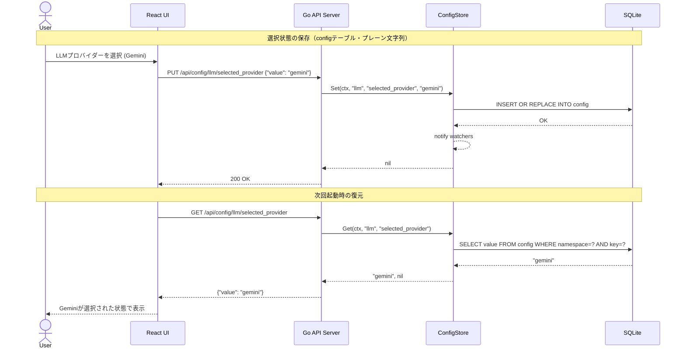
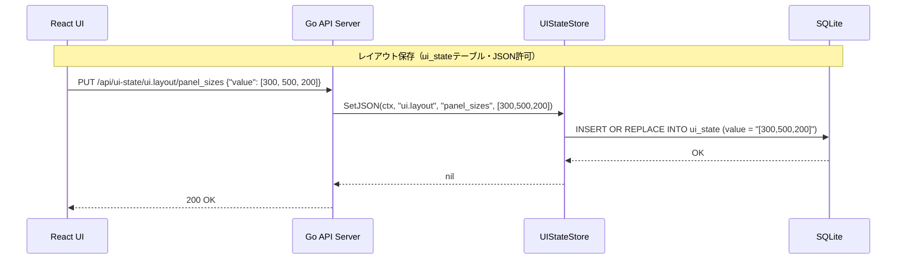
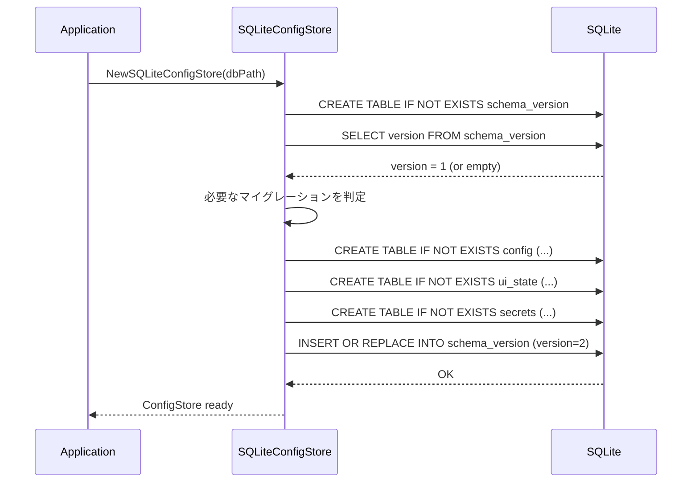

# 設定・レイアウト保存インフラ シーケンス図 (Config Store Sequence Diagram)

## 1. APIキー設定フロー

```mermaid
sequenceDiagram
    actor User
    participant UI as React UI
    participant API as Go API Server
    participant SS as SecretStore
    participant DB as SQLite

    User->>UI: APIキーを入力
    UI->>API: PUT /api/config/secrets/llm.gemini/api_key
    API->>SS: SetSecret(ctx, "llm.gemini", "api_key", "sk-xxx")
    SS->>DB: INSERT OR REPLACE INTO secrets
    DB-->>SS: OK
    SS-->>API: nil (success)
    API-->>UI: 200 OK
    UI-->>User: 保存完了表示
```

## 2. LLM選択状態の保存・復元フロー

```mermaid
sequenceDiagram
    actor User
    participant UI as React UI
    participant API as Go API Server
    participant CS as ConfigStore
    participant DB as SQLite

    Note over User,DB: 選択状態の保存（configテーブル・プレーン文字列）
    User->>UI: LLMプロバイダーを選択 (Gemini)
    UI->>API: PUT /api/config/llm/selected_provider {"value": "gemini"}
    API->>CS: Set(ctx, "llm", "selected_provider", "gemini")
    CS->>DB: INSERT OR REPLACE INTO config
    DB-->>CS: OK
    CS-->>CS: notify watchers
    CS-->>API: nil
    API-->>UI: 200 OK

    Note over User,DB: 次回起動時の復元
    UI->>API: GET /api/config/llm/selected_provider
    API->>CS: Get(ctx, "llm", "selected_provider")
    CS->>DB: SELECT value FROM config WHERE namespace=? AND key=?
    DB-->>CS: "gemini"
    CS-->>API: "gemini", nil
    API-->>UI: {"value": "gemini"}
    UI-->>User: Geminiが選択された状態で表示
```

## 3. UIレイアウト保存フロー

```mermaid
sequenceDiagram
    participant UI as React UI
    participant API as Go API Server
    participant US as UIStateStore
    participant DB as SQLite

    Note over UI,DB: レイアウト保存（ui_stateテーブル・JSON許可）
    UI->>API: PUT /api/ui-state/ui.layout/panel_sizes {"value": [300, 500, 200]}
    API->>US: SetJSON(ctx, "ui.layout", "panel_sizes", [300,500,200])
    US->>DB: INSERT OR REPLACE INTO ui_state (value = "[300,500,200]")
    DB-->>US: OK
    US-->>API: nil
    API-->>UI: 200 OK
```

## 4. 起動時マイグレーションフロー

```mermaid
sequenceDiagram
    participant App as Application
    participant CS as SQLiteConfigStore
    participant DB as SQLite

    App->>CS: NewSQLiteConfigStore(dbPath)
    CS->>DB: CREATE TABLE IF NOT EXISTS schema_version
    CS->>DB: SELECT version FROM schema_version
    DB-->>CS: version = 1 (or empty)
    CS->>CS: 必要なマイグレーションを判定
    CS->>DB: CREATE TABLE IF NOT EXISTS config (...)
    CS->>DB: CREATE TABLE IF NOT EXISTS ui_state (...)
    CS->>DB: CREATE TABLE IF NOT EXISTS secrets (...)
    CS->>DB: INSERT OR REPLACE INTO schema_version (version=2)
    DB-->>CS: OK
    CS-->>App: ConfigStore ready
```
