# NPCペルソナ生成 クラス図

```mermaid
classDiagram
    class NPCDialogueData {
        +String SpeakerID
        +String EditorID
        +String NPCName
        +String Race
        +String Sex
        +String VoiceType
        +[]DialogueEntry Dialogues
    }

    class DialogueEntry {
        +String Text
        +String EnglishText
        +String QuestID
        +Bool IsServicesBranch
        +Int Order
    }

    class ScoredDialogueEntry {
        +DialogueEntry Entry
        +Int ImportanceScore
        +Int ProperNounHits
        +Int EmotionIndicators
        +Int BasePriority
    }

    class ImportanceScorer {
        <<Interface>>
        +Score(englishText string, questID *string, isServicesBranch bool) int
    }

    class ImportanceScorerImpl {
        -[]string knownNouns
        -[]string strongWordsList
        -Int nounWeight
        -Int emotionWeight
        +Score(englishText string, questID *string, isServicesBranch bool) int
        -countProperNounHits(text string) int
        -countEmotionIndicators(text string) int
    }

    class ScoringConfig {
        +Int NounWeight
        +Int EmotionWeight
        +[]String StrongWordsList
    }

    class PersonaResult {
        +String SpeakerID
        +String EditorID
        +String NPCName
        +String Race
        +String Sex
        +String VoiceType
        +String PersonaText
        +Int DialogueCount
        +Int EstimatedTokens
        +String SourcePlugin
        +String Status
        +String ErrorMessage
    }

    class TokenEstimator {
        <<Interface>>
        +Estimate(text string) int
    }

    class SimpleTokenEstimator {
        +Estimate(text string) int
    }

    class TokenEstimation {
        +Int InputTokens
        +Int OutputTokens
        +Int TotalTokens
        +Bool ExceedsLimit
    }

    class NPCPersonaGenerator {
        <<Interface>>
        +GeneratePersonas(ctx context.Context, data ExtractedData) ([]PersonaResult, error)
    }

    class DialogueCollector {
        <<Interface>>
        +CollectByNPC(ctx context.Context, data ExtractedData) ([]NPCDialogueData, error)
    }

    class ContextEvaluator {
        <<Interface>>
        +Evaluate(dialogueData NPCDialogueData, config PersonaConfig) (TokenEstimation, []DialogueEntry)
    }

    class PersonaStore {
        <<Interface>>
        +InitSchema(ctx context.Context) error
        +SavePersona(ctx context.Context, result PersonaResult) error
        +GetPersona(ctx context.Context, speakerID string) (string, error)
        +Clear(ctx context.Context) error
    }

    class NPCPersonaGeneratorImpl {
        -DialogueCollector collector
        -ContextEvaluator evaluator
        -TokenEstimator tokenEstimator
        -LLMClient llmClient
        -PersonaStore personaStore
        -PersonaPromptBuilder promptBuilder
        -ProgressNotifier notifier
        -PersonaConfig config
        +GeneratePersonas(ctx context.Context, data ExtractedData) ([]PersonaResult, error)
    }

    class DialogueCollectorImpl {
        -Int maxDialoguesPerNPC
        -ImportanceScorer scorer
        +CollectByNPC(ctx context.Context, data ExtractedData) ([]NPCDialogueData, error)
        -groupBySpeaker(groups []DialogueGroup) map[string][]DialogueEntry
        -selectTopDialogues(entries []DialogueEntry) []DialogueEntry
        -resolveNPCAttributes(speakerID string, npcs []NPC) (string, string, string, string)
    }

    class ContextEvaluatorImpl {
        -TokenEstimator tokenEstimator
        +Evaluate(dialogueData NPCDialogueData, config PersonaConfig) (TokenEstimation, []DialogueEntry)
        -trimDialogues(entries []DialogueEntry, maxTokens int) []DialogueEntry
    }

    class SQLitePersonaStore {
        -db *sql.DB
        +InitSchema(ctx context.Context) error
        +SavePersona(ctx context.Context, result PersonaResult) error
        +GetPersona(ctx context.Context, speakerID string) (string, error)
        +Clear(ctx context.Context) error
    }

    class PersonaPromptBuilder {
        +BuildSystemPrompt() string
        +BuildUserPrompt(data NPCDialogueData) string
    }

    class PersonaConfig {
        +Int MaxDialoguesPerNPC
        +Int ContextWindowLimit
        +Int SystemPromptOverhead
        +Int MaxOutputTokens
        +Int MinDialogueThreshold
        +Int MaxWorkers
    }

    class ProgressNotifier {
        <<Interface>>
        +OnProgress(completed int, total int)
    }

    class ProcessManager {
        -NPCPersonaGenerator personaGenerator
        +HandlePersonaGeneration(w http.ResponseWriter, r *http.Request)
    }

    ProcessManager --> NPCPersonaGenerator : uses
    NPCPersonaGenerator <|.. NPCPersonaGeneratorImpl : implements
    NPCPersonaGeneratorImpl --> DialogueCollector : uses
    NPCPersonaGeneratorImpl --> ContextEvaluator : uses
    NPCPersonaGeneratorImpl --> TokenEstimator : uses
    NPCPersonaGeneratorImpl --> PersonaStore : uses
    NPCPersonaGeneratorImpl --> PersonaPromptBuilder : uses
    NPCPersonaGeneratorImpl --> ProgressNotifier : notifies
    NPCPersonaGeneratorImpl --> LLMClient : uses
    NPCPersonaGeneratorImpl --> PersonaConfig : uses
    DialogueCollector <|.. DialogueCollectorImpl : implements
    DialogueCollectorImpl --> ImportanceScorer : uses
    ImportanceScorer <|.. ImportanceScorerImpl : implements
    ImportanceScorerImpl --> ScoringConfig : uses
    DialogueCollectorImpl ..> ScoredDialogueEntry : creates
    ContextEvaluator <|.. ContextEvaluatorImpl : implements
    ContextEvaluatorImpl --> TokenEstimator : uses
    TokenEstimator <|.. SimpleTokenEstimator : implements
    PersonaStore <|.. SQLitePersonaStore : implements
    NPCPersonaGeneratorImpl ..> NPCDialogueData : creates
    NPCPersonaGeneratorImpl ..> PersonaResult : creates
    PersonaStore ..> PersonaResult : stores
    ContextEvaluatorImpl ..> TokenEstimation : creates
```

## アーキテクチャの補足：基本インフラの注入による純粋な Vertical Slicing
本コンテキスト（NPC Persona Generator Slice）は、**「NPC会話データ収集」から「トークン利用量の事前計算」「コンテキスト長評価」「LLMペルソナ生成」「ペルソナDBスキーマ(DTO)定義」「SQL永続化」までの全責務をこのスライス単体で負う**。
AIDDにおいてAIが変更範囲を迷わず限定・自己完結させて決定的にコードを生成できるよう、あえて全体での「DRY」は捨て、他のコンテキスト（例：Term Translator SliceのMod用語テーブル定義や、Pass 2翻訳時のデータモデル等）とはStoreやモデルを共有しない。
外部（プロセスマネージャー等）からは、以下のインフラモジュールのみをDIで注入する形とする：
- `*sql.DB` コネクションプール（Mod用語DB同一ファイル内のペルソナテーブル書き込み用）
- `LLMClient` インターフェース（ペルソナ生成用）
- `PersonaConfig`（最大会話件数・コンテキストウィンドウ上限・並列度等、Config Store経由）
- `ScoringConfig`（重要度スコアリングの重み係数・強い単語リスト、Config Store経由）
- Mod用語DB（固有名詞リスト参照用、`ImportanceScorer` が Word Boundary マッチに使用）

## 推奨ライブラリ (Go Backend)
*   **LLM クライアント**: `infrastructure/llm_client` インターフェース（プロジェクト共通）
*   **DB アクセス**: `github.com/mattn/go-sqlite3` または `modernc.org/sqlite`
*   **依存性注入**: `github.com/google/wire` (プロジェクト標準)
*   **並行処理**: Go標準 `sync`, `context`, `golang.org/x/sync/errgroup`
*   **ルーティング**: 標準 `net/http`
