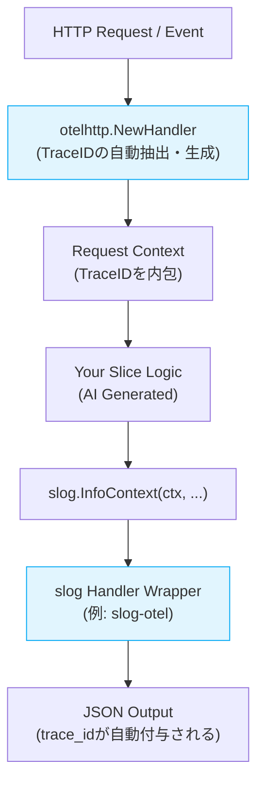
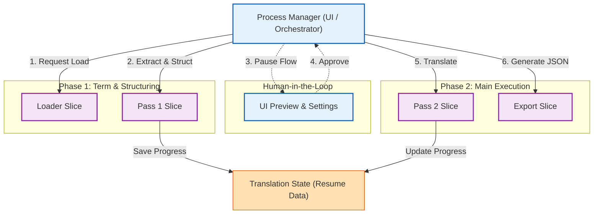

# リファクタリング戦略 (Refactoring Strategy)

> **Interface-First AIDD (AI-Driven Development) Architecture v2 準拠**
> 現行 Python ツールから Go/React 新アーキテクチャへの移行方針

---

## 1. 移行の目的 (Objectives)

### 1.1 パフォーマンス向上
*   **現状**: Pythonのシングルスレッド処理により、大量レコード処理に時間を要する。
*   **目標**: Go言語の並行処理（Goroutines）を活用し、データロード・用語抽出・コンテキスト構築を高速化する。

### 1.2 保守性と型安全性
*   **現状**: 動的型付け言語（Python）のため、複雑なデータ構造変更時にバグが混入しやすい。
*   **目標**: Goの静的型付けと構造体により、コンパイル時に整合性を保証する。

### 1.3 ユーザー体験 (UX) の改善
*   **現状**: CLIベースで、進捗やエラー確認が困難。また、LLMの切り替えが煩雑。
*   **目標**: ReactベースのSPAを提供し、リアルタイム進捗可視化とGUI設定を実現する。
*   **LLM選択の統合**: 全てのLLM利用ユースケースにおいて、同じモーダルUIからローカル、Gemini、xAI、バッチAPIモードなどをシームレスに選択できるようにする。

---

## 2. Interface-First AIDD 原則 (Core Principles)

本リファクタリングは、**「実装（Implementation）を入力せず、インターフェース（Contract）のみをコンテキストとして扱う」** Interface-First AIDD 手法に厳密に従う。

### ① Interface as the Contract (契約としてのインターフェース)
*   全てのモジュール間連携は抽象的な **Contract (Interface)** を介して定義する。
*   具象実装（Struct/Method Body）への直接依存を禁止する（DIP: Dependency Inversion Principle）。
*   **依存性の注入 (DI) を原則** とし、`google/wire` を使用して依存解決コードを自動生成する。コンストラクタはインターフェースを返すか、具象型を返す場合はWire Providerとして機能させる。

### ② Code is an Artifact (コードは生成物)
*   実装コードは人間が書くものではなく、仕様とContractから生成される **ビルド中間生成物** とみなす。
*   **実装コードへの手修正は禁止**。変更は必ず「Interface Definition」または「Implementation Plan」に対して行う。

### ③ Separation of Contract & Logic (契約とロジックの分離)
*   **Contract 層**: 型定義、インターフェース、ドキュメントコメント。人間の管理対象。
*   **Implementation 層**: ロジックの実体。AIによるブラックボックス生成対象。

---

## 3. アーキテクチャ変更 (Architecture Shift)

| 特徴           | 旧システム (v1.x)     | 新システム (v2.0)                              |
| :------------- | :-------------------- | :--------------------------------------------- |
| **開発手法**   | コードベース実装      | **Interface-First AIDD** (Contract駆動)        |
| **言語**       | Python 3.x            | Go (Backend) + TypeScript/React (Frontend)     |
| **依存関係**   | 実装詳細への密結合    | **Interfaceのみへの疎結合**                    |
| **起動形態**   | スクリプト実行        | シングルバイナリ（サーバー内蔵）               |
| **データ保持** | メモリ上の辞書/リスト | メモリ上の構造体 (Translatable Contract非依存) |
| **翻訳フロー** | 直列処理              | パイプライン並列処理                           |

---

## 4. 段階的移行計画 (Phased Migration)

各フェーズは **「まずインターフェース（Contract）を定義し、次にAIに実装させる」** 手順で進行する。

### Phase 1: データ基盤 (Data Foundation)
*   **Goal**: `extractData.pas` 出力のJSONをロードし、構造化データとしてメモリに保持する。
*   **Contract**: `ExtractedData` 構造体および各ドメインモデルの定義。
*   **Artifacts**: `Data Loader` / `Extracted Models`

### Phase 2: 用語処理 (Term Translation)
*   **Goal**: xTranslator XML等からの辞書DB構築 (Dictionary Builder)、固有名詞の抽出と、辞書ベースの翻訳適用。
*   **Contract**: `TermExtractor` / `TermDictionary` インターフェース。
*   **Artifacts**: `Dictionary Builder` / `Term Extractor` / `SQLite Adapter`

### Phase 3: 文脈エンジン (Context Engine)
*   **Goal**: 会話ツリー解析とLLMプロンプト生成。
*   **Contract**: `ContextBuilder` / `PromptGenerator` インターフェース。
*   **Artifacts**: `Context Engine` / `LLM Client`

### Phase 4: UI統合 (Web Interface)
*   **Goal**: ブラウザからのジョブ制御と可視化。
*   **Contract**: Web API Definition (OpenAPI/Swagger).
*   **Artifacts**: UI Server / React Client

---

## 5. データフローの刷新 (Vertical Slice Architecture & Process Manager)

単一の複雑なパイプラインではなく、**「完全な自律性を持つ Vertical Slice（縦のコンテキスト）」**を構築し、**「Process Manager（UI/オーケストレーター）」**がそれらを順次呼び出すアーキテクチャを採用する。

**Vertical Slice の絶対原則**:
*   **DRY原則の放棄による自律性の担保**: AIDDにおける決定的なコード再生成の確実性を担保するため、あえてDRY原則（データ構造やDB操作の複数Slice間での共通化）を捨てる。
*   **責務の自己完結**: 各Slice自身が「DBテーブルのスキーマ定義」「DTO」「SQL発行・永続化ロジック」の全ての責務を負う。外部機能のデータモデルへは依存せず、単一の明確なコンテキストとして自己完結する。
*   **カプセル化された永続化**: 各インフラストラクチャへの接続（例: `*sql.DB` などのプーリング・接続管理モジュール）のみを外部からDIで受け取り、データ操作そのものはSlice内にカプセル化する。

**WET (Write Everything Twice) vs Shared Kernel (共通化) の判断基準**:
*   重複しているコードを発見した場合、以下のフローに従って共通化の可否を判断する。
    1.  それが**技術的関心事（Infrastructure/Utilityレベル: DB接続, 日付操作, 認証等）**の場合:
        *   -> `Shared/Coreレイヤーへ「DRYに集約」する`
    2.  それが**ドメインロジック（業務ルールや計算式）**の場合:
        *   将来的に、スライスごとに**変化する可能性が「ある（または不明）」**場合:
            *   -> **`「WETを貫く（コピペを許容する）」`** (Slice間の自律性を優先)
        *   将来的に**「不変の真理である（確実に変化しない）」**場合:
            *   -> `「Domain Service等として共通化する」`

各Slice内では「Contract（インターフェース）」と「Implementation（実装）」が厳格に分離されており、AIは他Sliceの実装詳細を知ることなく、Contractのみをコンテキストとして実装を生成する。

---

## 6. テスト戦略 (Testing Strategy)

### 6.1 スライス単位の網羅的パラメタライズドテスト

*   **原則**: テストは各 Vertical Slice に対する **網羅的なパラメタライズドテスト（Table-Driven Test）** で行う。
*   **テスト用DBの利用**: データベースにアクセスするスライスのテストにおいては、本番環境や開発環境のデータを汚染しないよう、**必ずテスト専用のDB（インメモリSQLite `:memory:` または テスト実行ごとに初期化・破棄される独立したファイルDB）** を作成して使用すること。
*   **ユニットテストの排除**: 個別関数に対する細粒度のユニットテストは作成しない。ユニットテストはAIの機動力（コード再生成の自由度）を低下させるため、仕様書やユースケースが実現できていればそれで十分とする。
*   **根拠**: コードは再生成可能な使い捨ての生成物（Artifact）であり、ユニットテストは人間の意図表明に過ぎない。Contract と仕様に対するスライスレベルの検証が品質保証の主軸となる。

### 6.2 構造化デバッグログによるユニットテスト代替

ユニットテストを排除する代わりに、**セクション 7 の構造化ログ基盤（OpenTelemetry + slog）** を活用した以下のデバッグログ戦略を全スライスに義務付け、デバッグ容易性を確保する。

#### ① Entry/Exit ログの強制（slog + TraceID 自動付与）
*   すべての重要関数（Contract メソッド、主要な内部関数）の入り口と出口で、**引数と戻り値を `slog.DebugContext(ctx, ...)` で記録** する。
*   `context.Context` を伝播させることで、OpenTelemetry の **TraceID / SpanID が自動付与** される（セクション 7.3 参照）。
*   ログレベルは `debug` とし、本番環境ではハンドラ設定で `info` 以上に制限する。
*   例（JSON 出力）:
    ```json
    {"time":"2026-02-21T21:30:00Z","level":"DEBUG","msg":"ENTER BuildTranslationRequests","trace_id":"4bf92f3577b34da6a3ce929d0e0e4736","span_id":"00f067aa0ba902b7","slice":"ContextEngine","args":{"dataRecords":1523,"config":{"mod":"Skyrim.esm"}}}
    {"time":"2026-02-21T21:30:00.045Z","level":"DEBUG","msg":"EXIT BuildTranslationRequests","trace_id":"4bf92f3577b34da6a3ce929d0e0e4736","span_id":"00f067aa0ba902b7","slice":"ContextEngine","result":{"requestCount":1523,"elapsed":"45ms"}}
    ```

#### ② トレースIDによる横断追跡（相関IDの代替）
*   旧来の独自相関ID（Correlation ID）は廃止し、**OpenTelemetry の TraceID に統一** する。
*   Process Manager が HTTP リクエスト / イベントを発行する際に `otelhttp` が TraceID を自動生成し、`context.Context` 経由でスライス内の全ログに伝播する。
*   同一 TraceID でフィルタリングすることで、スライスを横断した処理の全ログを時系列で追跡できる。

#### ③ 実行単位のログファイル出力
*   デバッグ容易性のため、**実行開始単位（ジョブ / セッション）ごとに独立したログファイル** を出力する。
*   ファイル名規約: `logs/{timestamp}_{slice_or_job_name}.jsonl`（例: `logs/20260221_213000_ContextEngine.jsonl`）
*   `slog.Handler` をマルチ出力（stdout + ファイル）に構成し、ファイル側は常に `debug` レベルで全量記録する。
*   これにより、障害発生時に該当ジョブのログファイルをそのままAIに渡してデバッグ指示が可能となる。

#### ④ AI用デバッグプロンプトの定型化
*   障害発生時、該当ジョブのログファイル（③）を以下の定型プロンプトでAIに渡し、仕様との乖離を自動修正させる:

    ```
    以下はスライス「{SliceName}」の実行ログファイル（{LogFilePath}）の内容である。
    仕様書（{SpecFilePath}）の期待動作と比較し、乖離がある箇所を特定して修正コードを生成せよ。

    --- 実行ログ ---
    {ログファイル内容}

    --- 期待される仕様 ---
    {仕様書の該当セクション}
    ```

*   このプロンプトテンプレートを各スライスの仕様書（`spec.md`）に付記し、再現可能なデバッグフローを確立する。

---

## 7. 構造化ログ基盤 (Structured Logging with OpenTelemetry + slog)

### 7.1 アーキテクチャ概要

OpenTelemetry と Go 標準の `log/slog` を組み合わせ、全スライスで統一的な構造化ログを出力する。



### 7.2 技術スタック

| レイヤー         | 技術                                    | 役割                                                              |
| :--------------- | :-------------------------------------- | :---------------------------------------------------------------- |
| **トレース生成** | `go.opentelemetry.io/otel` + `otelhttp` | HTTP リクエストから TraceID / SpanID を自動抽出・生成             |
| **ログ出力**     | `log/slog` (Go 標準)                    | 構造化ログの統一 API                                              |
| **TraceID 連携** | `slog-otel` 等の Handler Wrapper        | `context.Context` から TraceID を抽出し、ログフィールドに自動付与 |
| **出力形式**     | `slog.JSONHandler`                      | JSON 形式でのログ出力（`trace_id`, `span_id` フィールド含む）     |

### 7.3 実装規約

*   **`context.Context` の伝播**: 全スライスの公開メソッドは第一引数に `ctx context.Context` を受け取り、内部関数にも伝播させる。
*   **`slog.InfoContext(ctx, ...)` の使用**: ログ出力時は必ず `ctx` を渡す `*Context` 系メソッドを使用し、TraceID の自動付与を保証する。
*   **セクション 6.2 との統合**: Entry/Exit ログおよび相関ID（セクション 6.2 ①②）は、OpenTelemetry の TraceID/SpanID で代替する。Process Manager が生成していた相関IDは TraceID に統一される。
*   **ログレベル制御**: 開発時は `debug` レベルで Entry/Exit ログを出力し、本番環境では `info` 以上に制限する。`slog.SetLogLoggerLevel()` またはハンドラ設定で制御する。

### 7.4 JSON ログ出力例

```json
{
  "time": "2026-02-21T21:30:00.000Z",
  "level": "INFO",
  "msg": "ENTER BuildTranslationRequests",
  "trace_id": "4bf92f3577b34da6a3ce929d0e0e4736",
  "span_id": "00f067aa0ba902b7",
  "slice": "ContextEngine",
  "args": {
    "dataRecords": 1523,
    "config": {"mod": "Skyrim.esm"}
  }
}
```

### 7.5 UI ログ表示 (Human-Readable Log Viewer)

*   **React UI にログ表示パネルを設置**: Process Manager の Web UI 上に、リアルタイムでログを閲覧できる専用パネルを提供する。
*   **表示要件**:
    *   JSON ログを人間が読みやすい形式にフォーマットして表示（タイムスタンプ、レベル、メッセージ、TraceID のカラーコード表示）
    *   TraceID によるフィルタリング: 特定のリクエスト/スライス実行に関連するログのみを抽出表示
    *   ログレベルによるフィルタリング（DEBUG / INFO / WARN / ERROR）
    *   自動スクロール（テール表示）と一時停止機能
*   **データ取得方式**: バックエンドから WebSocket または SSE (Server-Sent Events) でリアルタイムにログをストリーミングする。

---


