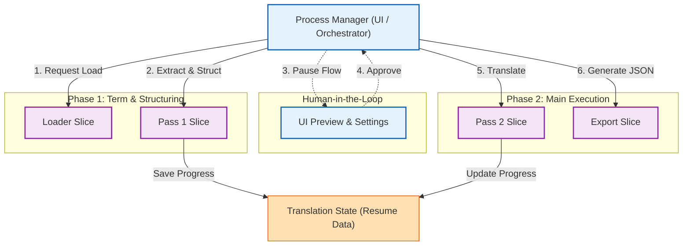

# リファクタリング戦略 (Refactoring Strategy)

> **Interface-First AIDD (AI-Driven Development) Architecture v2 準拠**
> 現行 Python ツールから Go/React 新アーキテクチャへの移行方針

---

## 1. 移行の目的 (Objectives)

### 1.1 パフォーマンス向上
*   **現状**: Pythonのシングルスレッド処理により、大量レコード処理に時間を要する。
*   **目標**: Go言語の並行処理（Goroutines）を活用し、データロード・用語抽出・コンテキスト構築を高速化する。

### 1.2 保守性と型安全性
*   **現状**: 動的型付け言語（Python）のため、複雑なデータ構造変更時にバグが混入しやすい。
*   **目標**: Goの静的型付けと構造体により、コンパイル時に整合性を保証する。

### 1.3 ユーザー体験 (UX) の改善
*   **現状**: CLIベースで、進捗やエラー確認が困難。
*   **目標**: ReactベースのSPAを提供し、リアルタイム進捗可視化とGUI設定を実現する。

---

## 2. Interface-First AIDD 原則 (Core Principles)

本リファクタリングは、**「実装（Implementation）を入力せず、インターフェース（Contract）のみをコンテキストとして扱う」** Interface-First AIDD 手法に厳密に従う。

### ① Interface as the Contract (契約としてのインターフェース)
*   全てのモジュール間連携は抽象的な **Contract (Interface)** を介して定義する。
*   具象実装（Struct/Method Body）への直接依存を禁止する（DIP: Dependency Inversion Principle）。
*   **依存性の注入 (DI) を原則** とし、`google/wire` を使用して依存解決コードを自動生成する。コンストラクタはインターフェースを返すか、具象型を返す場合はWire Providerとして機能させる。

### ② Code is an Artifact (コードは生成物)
*   実装コードは人間が書くものではなく、仕様とContractから生成される **ビルド中間生成物** とみなす。
*   **実装コードへの手修正は禁止**。変更は必ず「Interface Definition」または「Implementation Plan」に対して行う。

### ③ Separation of Contract & Logic (契約とロジックの分離)
*   **Contract 層**: 型定義、インターフェース、ドキュメントコメント。人間の管理対象。
*   **Implementation 層**: ロジックの実体。AIによるブラックボックス生成対象。

---

## 3. アーキテクチャ変更 (Architecture Shift)

| 特徴           | 旧システム (v1.x)     | 新システム (v2.0)                              |
| :------------- | :-------------------- | :--------------------------------------------- |
| **開発手法**   | コードベース実装      | **Interface-First AIDD** (Contract駆動)        |
| **言語**       | Python 3.x            | Go (Backend) + TypeScript/React (Frontend)     |
| **依存関係**   | 実装詳細への密結合    | **Interfaceのみへの疎結合**                    |
| **起動形態**   | スクリプト実行        | シングルバイナリ（サーバー内蔵）               |
| **データ保持** | メモリ上の辞書/リスト | メモリ上の構造体 (Translatable Contract非依存) |
| **翻訳フロー** | 直列処理              | パイプライン並列処理                           |

---

## 4. 段階的移行計画 (Phased Migration)

各フェーズは **「まずインターフェース（Contract）を定義し、次にAIに実装させる」** 手順で進行する。

### Phase 1: データ基盤 (Data Foundation)
*   **Goal**: `extractData.pas` 出力のJSONをロードし、構造化データとしてメモリに保持する。
*   **Contract**: `ExtractedData` 構造体および各ドメインモデルの定義。
*   **Artifacts**: `Data Loader` / `Extracted Models`

### Phase 2: 用語処理 (Term Translation)
*   **Goal**: 固有名詞の抽出と、辞書ベースの翻訳適用。
*   **Contract**: `TermExtractor` / `TermDictionary` インターフェース。
*   **Artifacts**: `Term Extractor` / `SQLite Adapter`

### Phase 3: 文脈エンジン (Context Engine)
*   **Goal**: 会話ツリー解析とLLMプロンプト生成。
*   **Contract**: `ContextBuilder` / `PromptGenerator` インターフェース。
*   **Artifacts**: `Context Engine` / `LLM Client`

### Phase 4: UI統合 (Web Interface)
*   **Goal**: ブラウザからのジョブ制御と可視化。
*   **Contract**: Web API Definition (OpenAPI/Swagger).
*   **Artifacts**: UI Server / React Client

---

## 5. データフローの刷新 (Vertical Slice & Process Manager)

単一の複雑なパイプラインではなく、**「自律したVertical Slice（縦のコンテキスト）」**を構築し、**「Process Manager（UI/オーケストレーター）」**がそれらを順次呼び出すアーキテクチャを採用する。

各Slice内では「Contract（インターフェース）」と「Implementation（実装）」が厳格に分離されており、AIは他Sliceの実装詳細を知ることなく、Contractのみをコンテキストとして実装を生成する。

