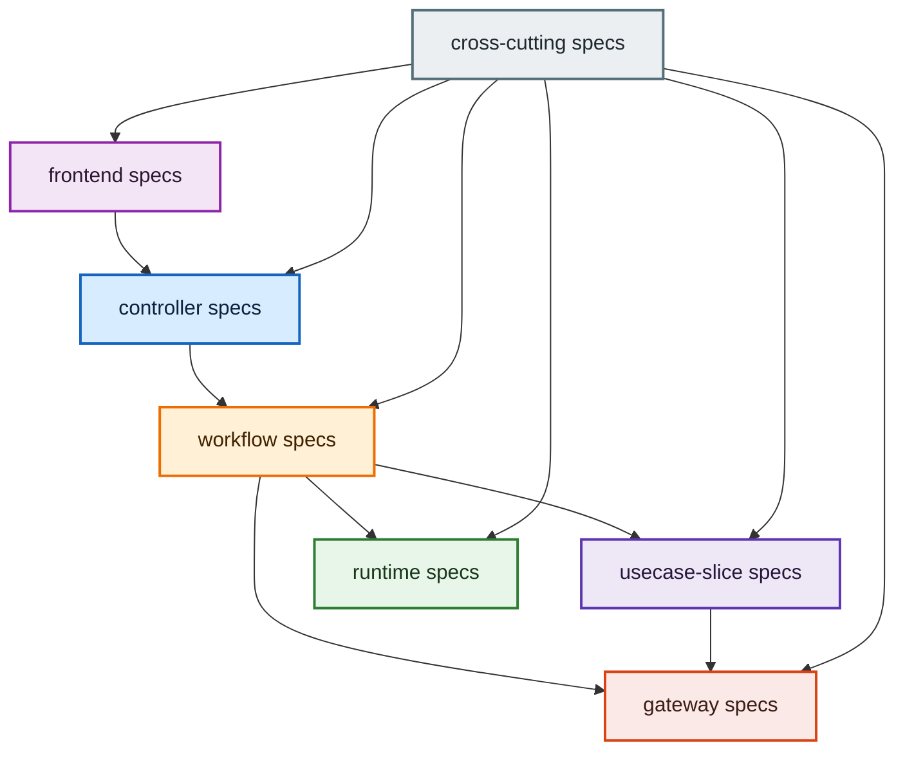

# Spec: spec-structure

## Overview

OpenSpec 文書群の責務境界と配置ルールを定義する共通 spec である。`architecture.md` を構造文書へ限定し、UI / workflow / runtime / gateway の共通要件をユースケース spec から分離するための配置基準を固定する。

## Document Boundaries

`architecture.md` の責務区分に合わせ、spec もまず以下の区分で整理する。

1. `frontend`
2. `controller`
3. `workflow`
4. `usecase-slice`
5. `runtime`
6. `gateway`
7. `cross-cutting`

### 1. `frontend`

役割:

- React 画面、ページ構造、UI レイアウト、画面遷移、フロント専用設計を定義する
- Go バインディングや workflow 呼び出しの手前にある画面責務を記述する

現在の spec:

- `frontend_architecture.md`
- `frontend_coding_standards.md`
- `ui_rules.md`
- `ui_screen_list.md`
- `core-layout/spec.md`
- `dashboard/spec.md`
- `dictionary-builder-ui/spec.md`
- `master-persona-ui/spec.md`
- `log-viewer/spec.md`
- `frontend-headless-architecture/spec.md`
- `frontend-code-quality-guardrails/spec.md`
- `wails-frontend-placeholder/spec.md`
- `persona-request-preview/spec.md`

### 2. `controller`

役割:

- Wails binding、HTTP、CLI など外部入力の受け口を定義する
- request/response の境界整形と workflow 呼び出しの入口契約を定義する

現在の spec:

- `wails-app-shell/spec.md`

### 3. `workflow`

役割:

- 複数 slice の呼び分け、phase 管理、resume / cancel、進行制御を定義する
- controller 入力を usecase slice 入力へ変換する責務を定義する

現在の spec:

- `pipeline/spec.md`
- `workflow/master-persona-execution-flow/spec.md`

### 4. `usecase-slice`

役割:

- 個別ユースケース固有の振る舞い、DTO、契約、補助図を定義する
- 他 slice でも再利用される共通運用ルールは抱え込まない

現在の spec:

- `format/parser/spec.md`
- `format/parser/parser_test_spec.md`
- `format/parser/EncodingDetection/spec.md`
- `format/parser/LoadExtractedJSON/spec.md`
- `format/parser/ParallelParsing/spec.md`
- `format/parser/data_loader/spec.md`
- `format/parser/data_loader/data_schema_test_spec.md`
- `dictionary/spec.md`
- `dictionary/dictionary_test_spec.md`
- `dictionary/cross-source-search.md`
- `persona/spec.md`
- `persona/npc_personaerator_test_spec.md`
- `summary/spec.md`
- `summary/summary_test_spec.md`
- `terminology/spec.md`
- `terminology/terminology_test_spec.md`
- `translator/spec.md`
- `translator/main_translator_test_spec.md`
- `format/export/spec.md`
- `format/export/export_test_spec.md`
- `modelcatalog/spec.md`

### 5. `runtime`

役割:

- queue、progress、task、telemetry など実行制御基盤を定義する
- 特定ユースケースに閉じない phase 進行・状態通知・実行器の基盤を扱う

現在の spec:

- `queue/spec.md`
- `progress/spec.md`
- `task/spec.md`
- `telemetry/spec.md`

### 6. `gateway`

役割:

- 外部資源への接続、永続化、設定、LLM 接続など技術依存の入口を定義する
- slice や runtime が使う外部依頼口の契約と実装方針を扱う

現在の spec:

- `datastore/spec.md`
- `config/spec.md`
- `config/config_test_spec.md`
- `llm/spec.md`
- `llm/llm_interface.md`
- `llm/llm_test_spec.md`

### 7. `cross-cutting`

役割:

- どの責務区分にも横断する共通基準を定義する
- 文書の配置ルール、品質ゲート、テスト標準、ログ標準、全体要求を扱う

現在の spec:

- `architecture.md`
- `backend_coding_standards.md`
- `backend-coding-standards/spec.md`
- `backend-quality-gates/spec.md`
- `standard_test_spec.md`
- `log-guide.md`
- `requirements.md`
- `database_erd.md`
- `xtranslator_xml_spec.md`
- `spec-structure/spec.md`

## Current Layout

物理配置は当面 `openspec/specs` 直下および既存 capability ディレクトリを維持し、判断の基準だけを上記区分へ合わせる。OpenSpec の `specs/<capability>/spec.md` 前提を崩す移動は、CLI 運用影響を確認するまでは行わない。

## Inventory

現状の棚卸しでは、以下の混在を解消対象とする。

- `dictionary/spec.md`, `persona/spec.md`, `summary/spec.md`, `terminology/spec.md`, `translator/spec.md`, `format/export/spec.md`, `format/parser/spec.md` および派生 spec に、テスト設計とログ運用の共通規約が重複している
- `queue/spec.md`, `progress/spec.md`, `telemetry/spec.md` など runtime 系 spec に、ユースケース非依存の運用規約が散在している
- `master-persona-ui/spec.md`, `dictionary-builder-ui/spec.md`, `wails-app-shell/spec.md`, `frontend-headless-architecture/spec.md` など UI / フロント構造の要件と、ユースケース固有要件の参照境界が不明瞭である
- `architecture.md` を品質ゲートやログ規約の参照元として扱う記述が残り、構造文書としての責務が曖昧になっている

## Requirements

### Requirement: architecture.md は構造責務だけを保持しなければならない
`architecture.md` は、責務区分、依存方向、DTO / Contract / DI 原則、composition root の責務だけを保持しなければならない。品質ゲート、テスト設計、ログ運用、フロント構造の詳細を内包してはならない。

#### Scenario: 品質ゲートやログ規約が別 spec へ委譲される
- **WHEN** 開発者が品質ゲート、テスト設計、ログ運用、フロント構造を確認したい
- **THEN** `architecture.md` は専用 spec を参照するだけに留まらなければならない
- **AND** 具体的な運用ルールは `backend-quality-gates/spec.md`, `standard_test_spec.md`, `log-guide.md`, `frontend_architecture.md` に置かれなければならない

### Requirement: 共通要件の配置先は責務ごとに固定されなければならない
複数ユースケースで共有される要件は、以下の配置基準に従って共通 spec へ配置しなければならない。

- frontend の画面構造は `frontend_architecture.md` と各 UI spec
- controller の入口契約は `wails-app-shell/spec.md` などの adapter spec
- workflow の進行制御は `pipeline/spec.md` などの orchestration spec
- usecase-slice の固有要件は各 slice の `spec.md`
- runtime の実行制御は `queue/spec.md`, `progress/spec.md`, `task/spec.md`, `telemetry/spec.md`
- gateway の外部依頼口は `datastore/spec.md`, `config/spec.md`, `llm/spec.md`
- cross-cutting の共通基準は `architecture.md`, `backend_coding_standards.md`, `backend-quality-gates/spec.md`, `standard_test_spec.md`, `log-guide.md`, `spec-structure/spec.md`

#### Scenario: ユースケース spec に共通要件を書こうとする
- **WHEN** 開発者が UI / workflow / runtime / gateway の共通ルールをユースケース spec に追加しようとする
- **THEN** システムはその要件を責務に応じた共通 spec へ移す前提で整理しなければならない
- **AND** ユースケース spec には、そのユースケース固有の振る舞いと契約だけを残さなければならない

### Requirement: spec の分類は実装責務に最も近い区分へ合わせなければならない
spec の置き場は、機能名や画面名ではなく、最終的にどの責務区分の判断材料として使う文書かで決めなければならない。

#### Scenario: Wails 画面の見た目ではなく Go バインディング契約を定義する
- **WHEN** 文書が Wails binding の公開メソッドや request/response 契約を扱う
- **THEN** その文書は frontend ではなく controller 区分へ置かなければならない

#### Scenario: UI から開始されるが本質は phase 進行を定義する
- **WHEN** 文書がボタン押下後の enqueue / dispatch / save / resume の進行規則を扱う
- **THEN** その文書は frontend や controller ではなく workflow または runtime 区分へ置かなければならない

### Requirement: ユースケース spec は固有要件に集中しなければならない
ユースケース単位 spec は、その機能固有の振る舞い、シナリオ、DTO 契約、補助図だけを扱い、他ユースケースでも再利用される共通運用ルールを重複記述してはならない。

#### Scenario: スライス spec の末尾に共通テスト・ログ章がある
- **WHEN** スライス spec にテスト方針やログ方針の共通章を追加する
- **THEN** 当該 spec は `standard_test_spec.md` と `log-guide.md` への参照に留めなければならない
- **AND** 共通ルールの本文を複数 spec へ再掲してはならない

### Requirement: runtime / gateway / UI の共通 spec はユースケース spec と分離されなければならない
`queue`, `progress`, `telemetry`, `config`, `datastore`, `frontend-headless-architecture`, `wails-app-shell` などの基盤 spec は、特定ユースケースに閉じない共通機能として扱わなければならない。

#### Scenario: 基盤要件が特定ユースケース spec に埋め込まれている
- **WHEN** resume, progress, queue, gateway, Wails binding などの共通要件がユースケース spec へ追加される
- **THEN** システムはそれを共通 spec へ移し、ユースケース spec からは参照で接続しなければならない

### Requirement: AGENTS.md は spec 選択の入口を示さなければならない
`AGENTS.md` は、設計・提案・実装時に参照すべき spec を責務ごとに案内しなければならない。AI が `architecture.md` に品質ルールやログ規約を書き戻さない構成でなければならない。

#### Scenario: AI が文書責務に応じて参照先を決める
- **WHEN** AI がアーキテクチャ、品質ゲート、テスト設計、ログ設計、spec 配置方針を検討する
- **THEN** `AGENTS.md` から該当 spec を一意に辿れなければならない
