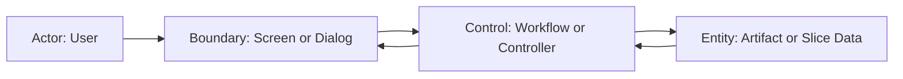

# AITE2 Scenario Design

この skill はシナリオ設計用。
目的は、UI と内部実装の間にあるユーザー体験の流れを固定し、受け入れ条件のぶれを減らすこと。

## 使う場面
- 新機能の操作フローを決める
- 正常系だけでなく異常系も整理したい
- E2E や受け入れ条件の起点を作りたい
- resume / cancel / retry を含む変更を扱う

## 入力
- `changes/<id>/summary.md`
- 必要なら `changes/<id>/ui.md`
- 既存の関連機能の振る舞い

## 出力
- `changes/<id>/scenarios.md`
- Mermaid のロバストネス図
- 受け入れ条件
- E2E 観点の候補
- 必要なら `references/scenario-template.md` を元にしたシナリオ文書

## 最低限含めること
- Robustness Diagram
- Trigger
- Preconditions
- Main Flow
- Alternate Flow
- Error Flow
- Empty State Flow
- Resume / Retry / Cancel
- Acceptance Criteria
- Out of Scope

## 原則
- 作業は対話内でタスク化し、常に 1 ステップずつ進める
- 一度に複数シナリオを同時確定しようとしない
- 各ステップで確定した flow、残課題、次の 1 手を明確にする
- シナリオは UI レイアウトではなく行動の流れとして書く
- 主要異常系を省略しない
- システム都合ではなくユーザーから見た結果で書く
- 受け入れ条件まで落とし切る
- Mermaid のロバストネス図を必須にする
- シナリオ文書の雛形は `references/scenario-template.md` を使う

## ロバストネス図
シナリオ設計では Mermaid でロバストネス図を書く。
少なくとも次を分ける。
- Actor
- Boundary
- Control
- Entity

図は詳細実装ではなく責務の受け渡しを示す。
UI の操作起点、制御の判断点、永続化や既存データの参照先が見えることを優先する。

## ロバストネス図の規約
- 1 図 1 シナリオを原則にする
- Main Flow を中心に描き、Alternate / Error / Resume は必要なら別図または注記で足す
- Actor は人間または外部起点だけを書く。内部コンポーネントを Actor にしない
- Boundary は画面、ダイアログ、入力フォームなどの UI 境界を書く
- Control は判断や進行制御を担う要素を書く。workflow、controller、page hook 相当を置いてよい
- Entity は永続化対象、共有成果物、既存データ、業務的な入力出力を置く
- 矢印は「誰が誰に依頼し、何が戻るか」が読める向きで書く
- 名称は実装クラス名ではなく役割名を優先する
- UI の見た目詳細は書かない
- アルゴリズム詳細、if 分岐の全列挙、低レベル API 呼び出しは書かない
- DB テーブル名や JSON フィールド名をそのまま Entity 名にしない
- 図が横に長くなりすぎる場合は、前半と後半に分ける

## このPJでの割り当て基準
- `Boundary`
  - Screen
  - Page section
  - Dialog
  - Form
- `Control`
  - Frontend page hook
  - Controller
  - Workflow
  - 画面遷移や再試行判断を持つ調停役
- `Entity`
  - Slice data
  - Artifact
  - Config
  - 共有成果物
  - 業務上意味のある request / response

runtime / gateway の詳細呼び出しは通常ロバストネス図に展開しすぎない。
それが必要な段階なら `logic.md` へ送る。

## 境界
ロバストネス図は「何が起きるか」と「どこが受け持つか」を表す。
「どう実装するか」まで書き始めたら `logic.md` の責務である。

## Mermaid テンプレート

## テンプレート
`changes/<id>/scenarios.md` は `references/scenario-template.md` を元に作る。
必要に応じて項目を追加してよいが、Robustness Diagram と Acceptance Criteria は省略しない。
