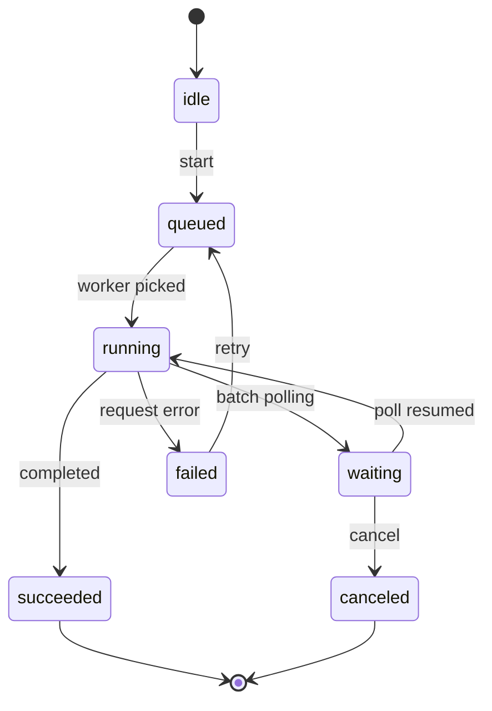
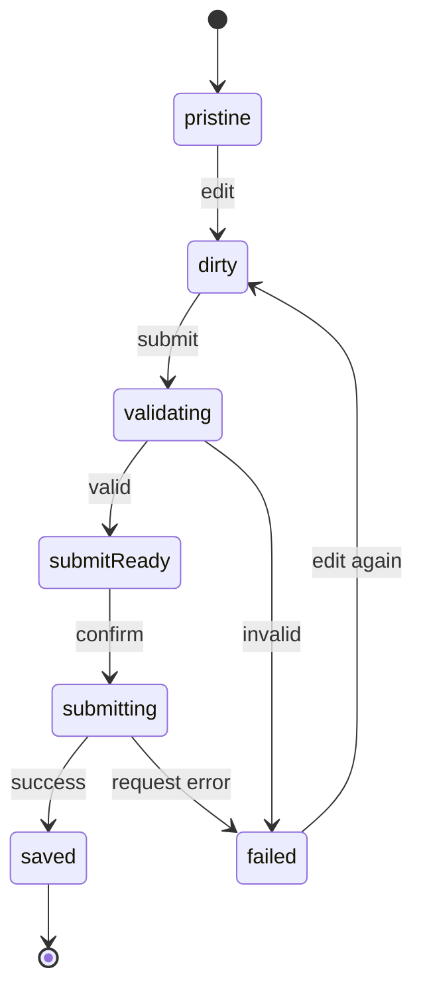
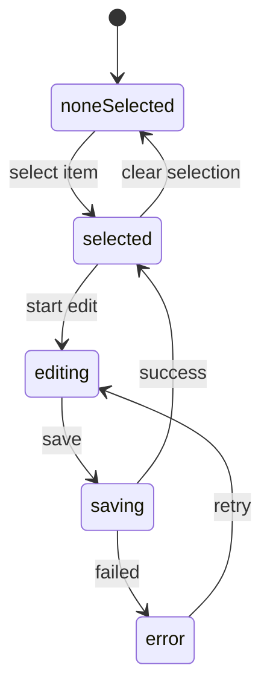
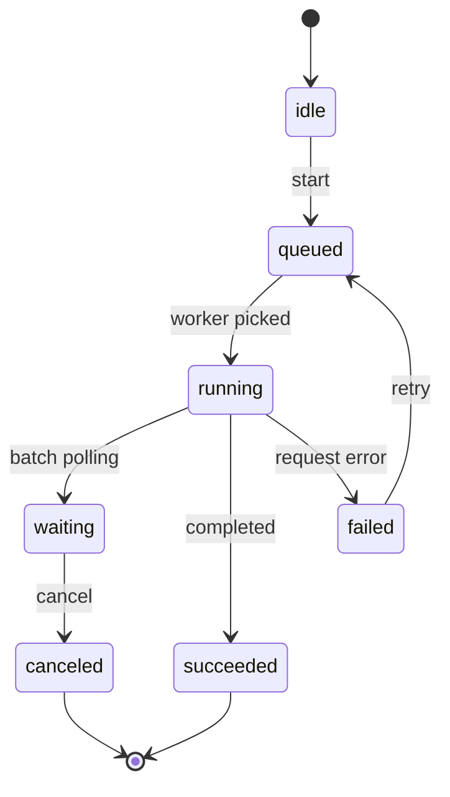

# AITE2 UI Design

この skill は UI 実装前の設計用。
目的は、画面仕様をロジック仕様から分離し、見た目より先に画面責務、状態、導線、検証観点を固めること。

## 使う場面
- 新しい画面やダイアログを追加する
- 既存 UI の状態や導線が曖昧
- 複数画面で統一感が崩れそう
- 実装前に UI Contract を固めたい
- Playwright E2E や手動確認の前に state を定義したい

## 入力
- 変更対象の `changes/<id>/summary.md`
- 関連する既存画面
- 必要なら `changes/<id>/scenarios.md`
- 参考になる既存コンポーネントや E2E

## 出力
- `changes/<id>/ui.md`
- Mermaid の state machine
- 必要なら ASCII wireframe
- Playwright MCP で確認すべき観点
- 必要なら `references/ui-contract-template.md` を元にした UI Contract

## 原則
- 作業は対話内でタスク化し、常に 1 ステップずつ進める
- 一度に複数の設計判断を確定しようとしない
- 各ステップで決めたこと、未確定事項、次の 1 手を明確にする
- UI はロジック詳細を持たない
- 状態を先に固定し、コンポーネント分割は後に考える
- 画面ごとの差より共通パターンを優先する
- 未確定事項は曖昧なまま実装へ流さない
- state は Mermaid の state machine で定義する
- state 名だけでなく、各 state で観測可能な UI 事実を書く
- Playwright MCP は実装後テストだけでなく設計ハーネスとして使う
- UI Contract の雛形は `references/ui-contract-template.md` を使う

## 最初に決めること
1. この画面の Purpose は何か
2. Primary Action は何か
3. 主要 state は何か
4. state ごとに何が見えて、何が操作不能になるか
5. 成功、失敗、空、待機、再試行をどう扱うか
6. 一覧、詳細、ダイアログ、進捗表示のどれが必要か

## State の書き方
state は Mermaid で書く。
各 state には次を対応付ける。
- 表示される主要要素
- 無効化される操作
- 遷移トリガー
- 成功時に消える要素
- 異常時に残る要素

## Mermaid テンプレート

### 非同期実行画面の例

### フォーム画面の例

### 一覧詳細画面の例

## Playwright MCP の使い方
Playwright MCP は E2E 実装だけではなく、UI 設計のハーネスとして使う。
目的は、Mermaid で定義した state が実画面で観測可能か確認すること。

### 主にできること
- 画面を開く
- クリック、入力、選択、ホバー
- スナップショット取得
- スクリーンショット取得
- コンソールログ確認
- ネットワークリクエスト確認
- JavaScript 評価
- テキスト出現待ち

### 設計ハーネスとしての使い方
1. Mermaid で state を定義する
2. 各 state で見えるべき UI 事実を書く
3. Playwright MCP でその state を発火させる
4. snapshot と screenshot で構造と見た目を確認する
5. console と network で異常系の出方を確認する

### よく使う操作
- `browser_navigate`
  - 対象画面を開く
- `browser_click`
  - 操作トリガーを発火する
- `browser_fill_form`
  - フォーム入力を作る
- `browser_wait_for`
  - 状態遷移後の文言や要素出現を待つ
- `browser_snapshot`
  - accessibility tree で状態を確認する
- `browser_take_screenshot`
  - 見た目を確認する
- `browser_console_messages`
  - JS エラーを確認する
- `browser_network_requests`
  - API 呼び出しや失敗を確認する
- `browser_evaluate`
  - DOM 状態や disabled 属性などを確認する

## Playwright MCP 利用例

### 非同期実行画面の例
Mermaid:

state ごとの観測事実:
- `idle`: Start が有効、進捗表示なし、結果表示なし
- `queued`: 開始操作は無効、待機文言あり、キャンセル可否が見える
- `running`: 進捗またはスピナー表示、編集操作は無効
- `waiting`: ポーリング中の文言あり
- `failed`: エラー文言あり、Retry が有効
- `succeeded`: 結果表示あり、実行中 UI が消える

MCP 操作例:
- `browser_navigate`
  - Master Persona 画面を開く
- `browser_click`
  - Start を押して `idle -> queued`
- `browser_wait_for`
  - 待機文言または `Queued` を待つ
- `browser_snapshot`
  - queued 状態でボタン状態を確認する
- `browser_wait_for`
  - `Running` 相当の文言や progress を待つ
- `browser_take_screenshot`
  - running 状態を記録する
- `browser_console_messages`
  - 実行中のエラー有無を確認する
- `browser_click`
  - Retry を押して `failed -> queued` を確認する

## テンプレート
`changes/<id>/ui.md` は `references/ui-contract-template.md` を元に作る。
必要に応じて項目を追加してよいが、State Machine と State Facts は省略しない。

## 禁止
- state を文章だけで済ませる
- loading / error / empty を省略する
- UI state と内部処理状態を無造作に混ぜる
- 画面構造を定義せずに場当たりで組み立てる
- Playwright MCP を locator 集めだけに使う
