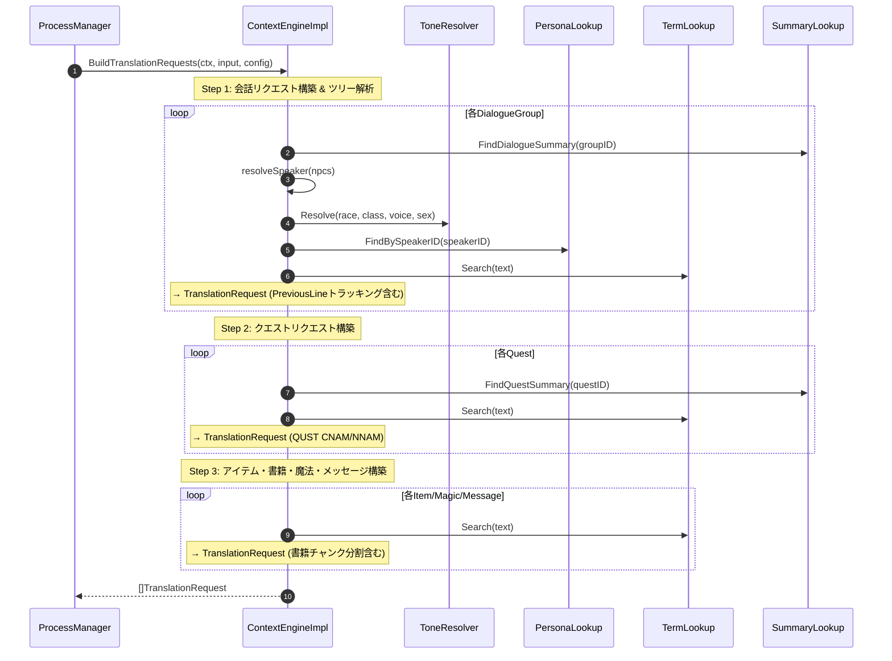
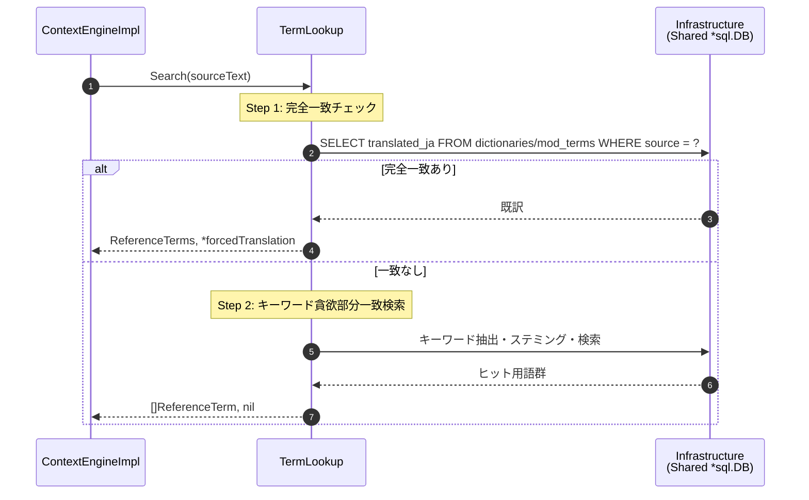

# コンテキストエンジン シーケンス図

## 1. 全体フロー（BuildTranslationRequests）

JobQueue連携モデルでは、ContextEngineは入力データを解析し、コンテキスト情報を付与した `TranslationRequest` 群を構築して返す。実際の翻訳実行は Pass 2 Translator Slice が担当する。

## 2. 参照用語検索と強制翻訳判定（TermLookup）

