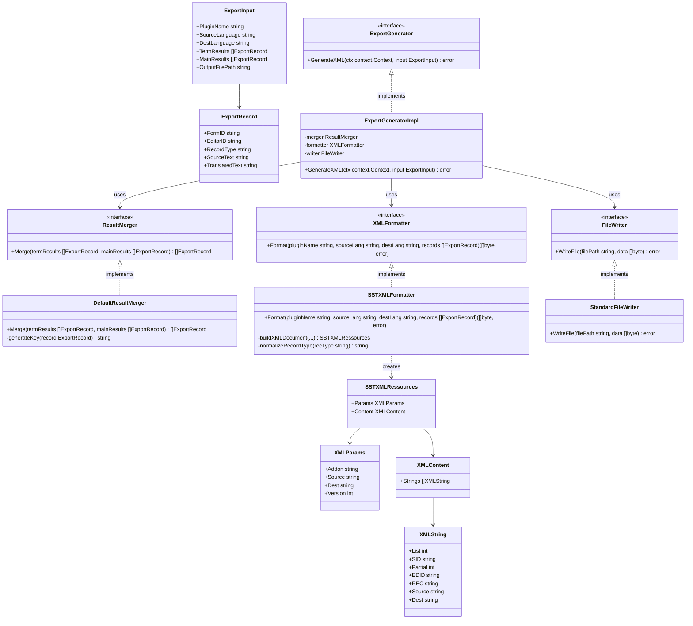

# XMLエクスポート クラス図

## クラス構成

## コンポーネントの説明
- **`ExportGenerator`**: エクスポート処理のエントリポイント。オーケストレーターから呼び出される。
- **`ResultMerger`**: 用語翻訳結果（Pass 1）と本文翻訳結果（Pass 2）を結合する。基本的には重複しない前提だが、設定ミスに備えて `EditorID` と `RecordType` の複合キーで重複チェックを行い、重複時は警告ログを出力しつつ後勝ちで上書きする防衛的ロジックを持つ。
- **`XMLFormatter`**: 統合されたレコードリストを `SSTXMLRessources` 構造体にマッピングし、`encoding/xml` パッケージを用いて XML バイト配列を生成する。
- **`FileWriter`**: 生成された XML バイト配列をファイルシステムに安全に（アトミックな書き込みなどを用いて）保存する。
