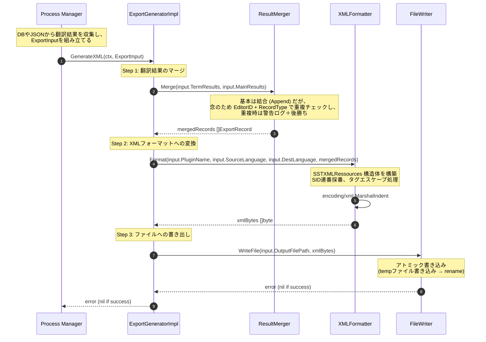
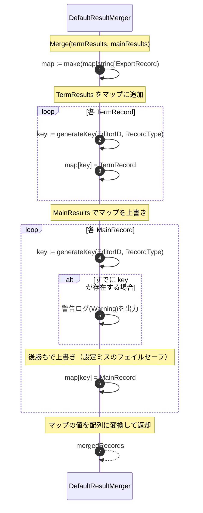

# XMLエクスポート シーケンス図

## 1. エクスポートメインフロー

```mermaid
sequenceDiagram
    autonumber
    participant PM as Process Manager
    participant EG as ExportGeneratorImpl
    participant RM as ResultMerger
    participant XF as XMLFormatter
    participant FW as FileWriter

    Note over PM: DBやJSONから翻訳結果を収集し、<br/>ExportInputを組み立てる
    PM->>EG: GenerateXML(ctx, ExportInput)

    Note over EG: Step 1: 翻訳結果のマージ
    EG->>RM: Merge(input.TermResults, input.MainResults)
    Note over RM: 基本は結合 (Append) だが、<br/>念のため EditorID + RecordType で重複チェックし、<br/>重複時は警告ログ＋後勝ち
    RM-->>EG: mergedRecords []ExportRecord

    Note over EG: Step 2: XMLフォーマットへの変換
    EG->>XF: Format(input.PluginName, input.SourceLanguage, input.DestLanguage, mergedRecords)
    Note over XF: SSTXMLRessources 構造体を構築<br/>SID連番採番、タグエスケープ処理
    XF->>XF: encoding/xml.MarshalIndent
    XF-->>EG: xmlBytes []byte

    Note over EG: Step 3: ファイルへの書き出し
    EG->>FW: WriteFile(input.OutputFilePath, xmlBytes)
    Note over FW: アトミック書き込み<br/>(tempファイル書き込み → rename)
    FW-->>EG: error (nil if success)

    EG-->>PM: error (nil if success)
```

## 2. マージロジック (ResultMerger) 詳細

```mermaid
sequenceDiagram
    autonumber
    participant RM as DefaultResultMerger

    Note over RM: Merge(termResults, mainResults)

    RM->>RM: map := make(map[string]ExportRecord)

    Note over RM: TermResults をマップに追加
    loop 各 TermRecord
        RM->>RM: key := generateKey(EditorID, RecordType)
        RM->>RM: map[key] = TermRecord
    end

    Note over RM: MainResults でマップを上書き
    loop 各 MainRecord
        RM->>RM: key := generateKey(EditorID, RecordType)
        alt すでに key が存在する場合
            RM->>RM: 警告ログ(Warning)を出力
        end
        Note over RM: 後勝ちで上書き（設定ミスのフェイルセーフ）
        RM->>RM: map[key] = MainRecord
    end

    Note over RM: マップの値を配列に変換して返却
    RM-->>RM: mergedRecords
```
