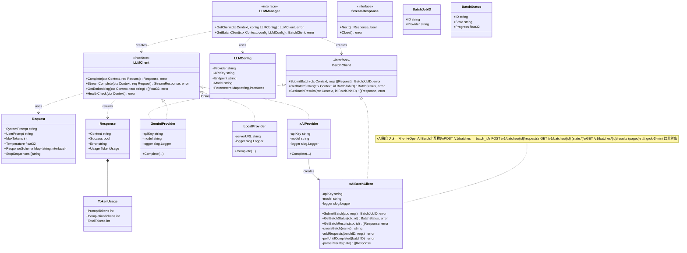

# LLMクライアント クラス図 (LLM Client Class Diagram)

## 主要エンティティの説明

### LLMClient (Interface)
全てのLLMプロバイダーが実装すべき基本インターフェース。同期的なリクエストと埋め込みベクトルの取得を定義する。

### BatchClient (Interface)
xAIやGeminiのBatch APIのように、非同期で大量のリクエストを処理するプロバイダー向けのインターフェース。

### xAIBatchClient — xAI 独自バッチ実装

xAI Batch API は **OpenAI Batch API と非互換**の独自フォーマットを採用する。

| 項目                 | xAI 独自仕様                                                            |
| -------------------- | ----------------------------------------------------------------------- |
| バッチ作成レスポンス | `batch_id`（OpenAI は `id`）                                            |
| リクエスト追加       | `POST /v1/batches/{id}/requests`（別途追加が必要）                      |
| リクエスト形式       | `batch_requests[].batch_request.chat_get_completion`                    |
| ステータス           | `state.{num_requests, num_pending, num_success, num_error}` から導出    |
| 結果取得             | `GET /v1/batches/{id}/results`（`pagination_token` でページネーション） |
| 結果パス             | `batch_result.response.chat_get_completion.choices[0].message.content`  |
| Batch対応モデル      | `grok-3`, `grok-4-*`（`grok-3-mini` は**非対応**）                      |

プライベートメソッドは同一ファイル内に分割（SRP原則）: `_createBatch`, `_addRequests`, `_pollUntilCompleted`, `_parseResults`

### Request / Response (Structs)
リクエストパラメータとレスポンスデータをカプセル化する。`ResponseSchema`はJSON Schemaを保持し、モデルに構造化出力を強制するために使用する。

### Providers (Implementations)
各外部サービスやローカル実行エンジンへの具体的な接続ロジックを持つ。これらは`LLMClient`インターフェースを満たすように実装される。
