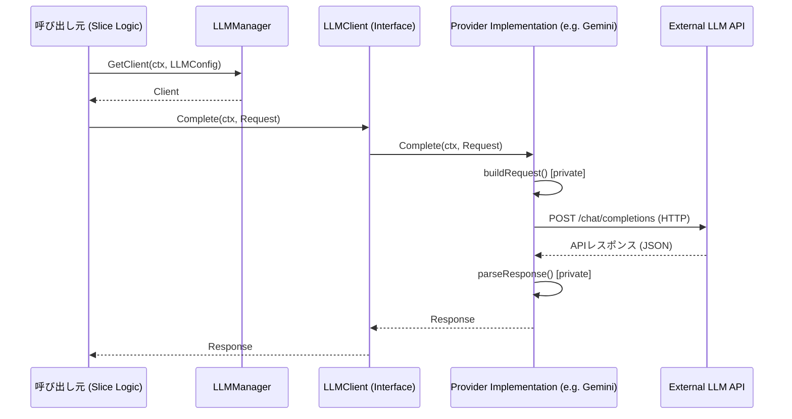
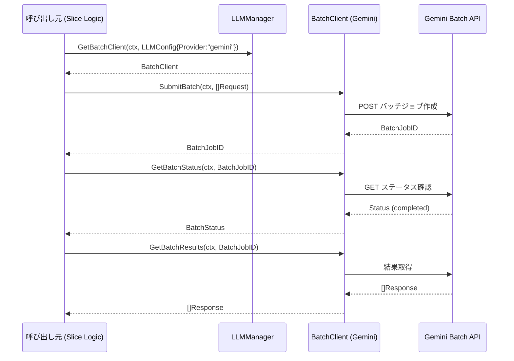
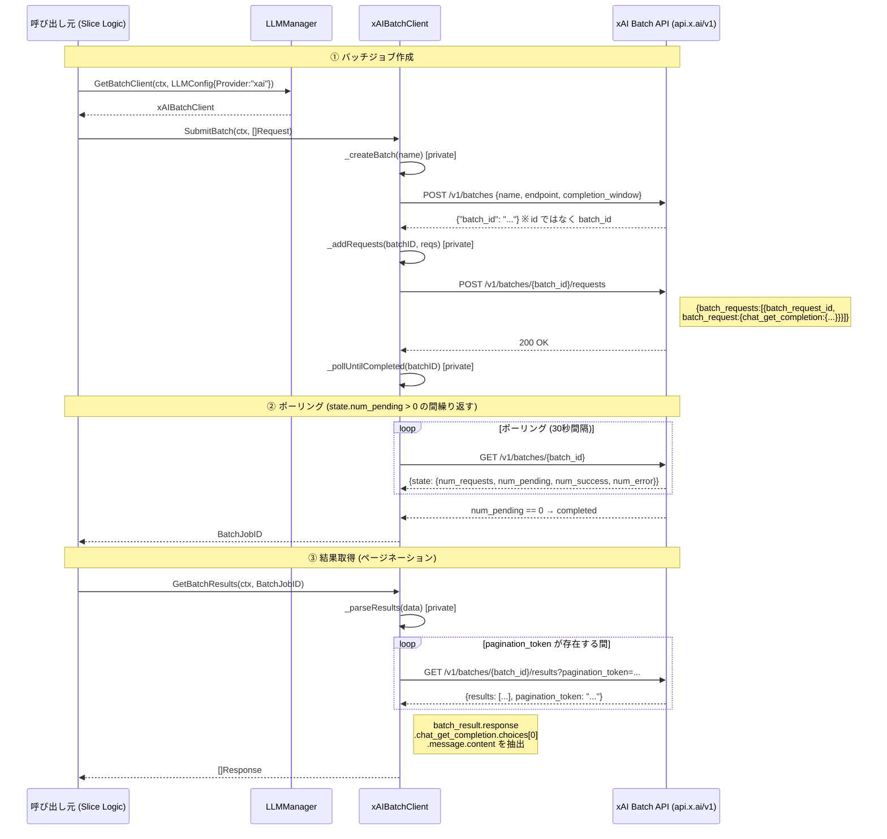
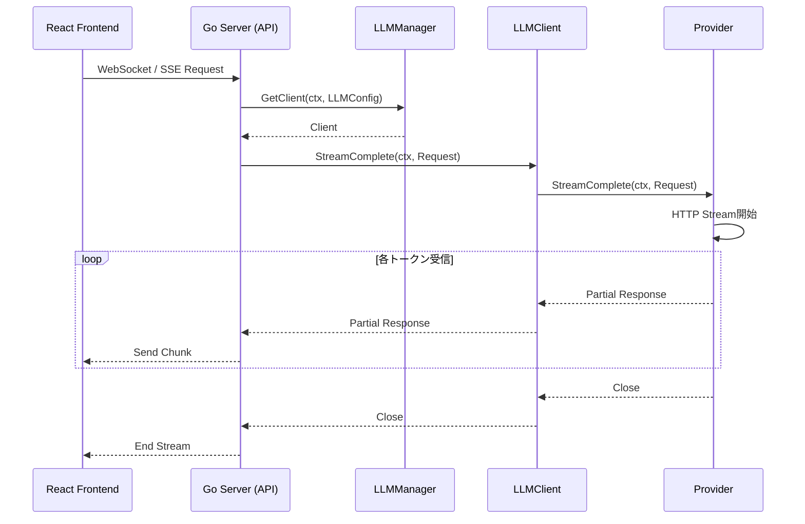

# LLMクライアント シーケンス図 (LLM Client Sequence Diagram)

## 1. 同期リクエスト (Complete)
通常の翻訳処理などで使用される。

## 2. 非同期バッチリクエスト — Gemini (Batch API)
Gemini向けバッチ処理（OpenAI互換フロー）。

## 3. 非同期バッチリクエスト — xAI 独自フロー (BatchClient)
xAI Batch API は OpenAI Batch API と**非互換**の独自フォーマットを使用する。

> **対応モデル**: `grok-3`, `grok-4-*` のみ。`grok-3-mini` は Batch API 非対応。

## 4. ストリーミングリクエスト (StreamComplete)
UIでリアルタイムに生成過程を表示する場合に使用される。

