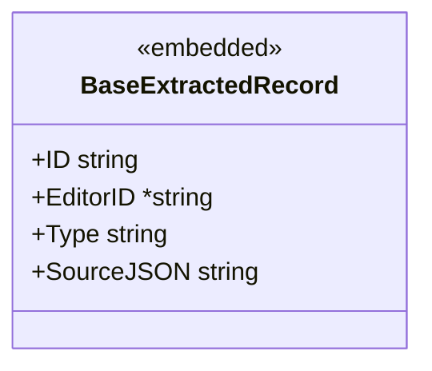
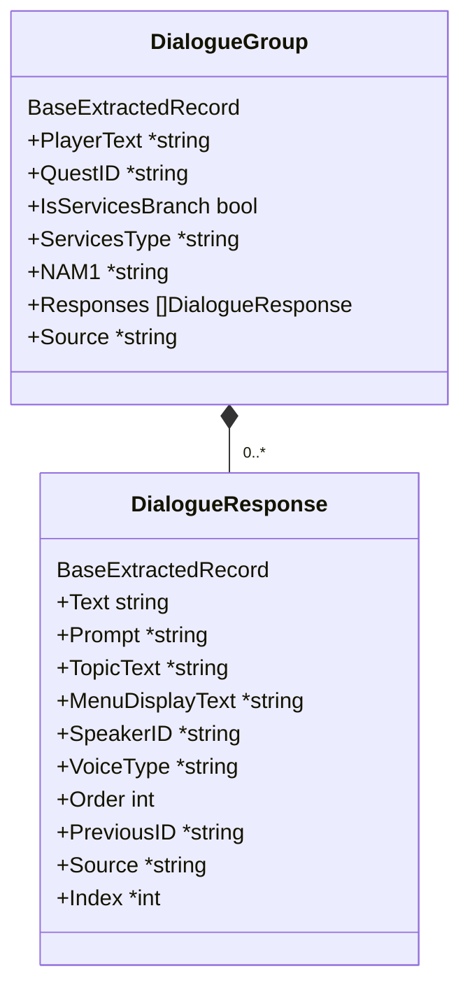
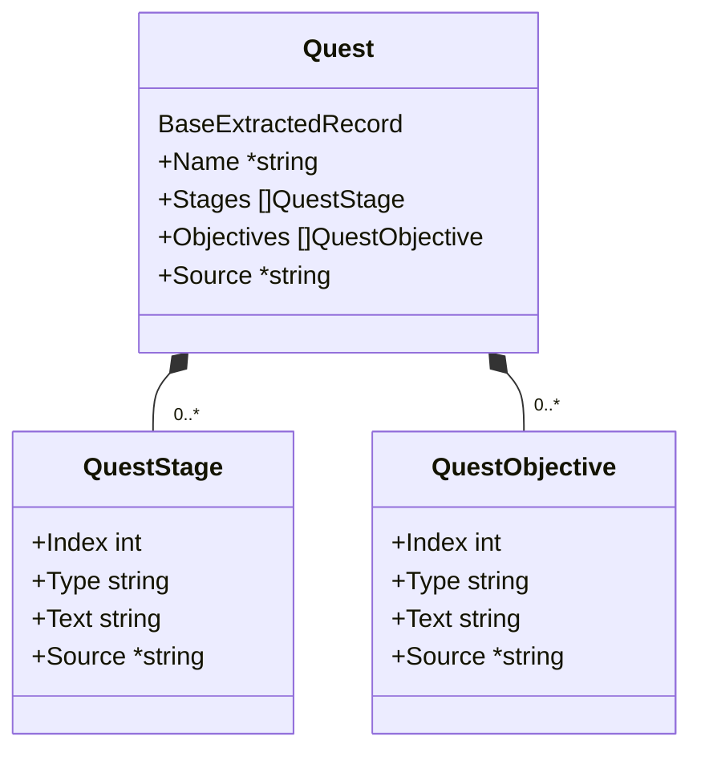
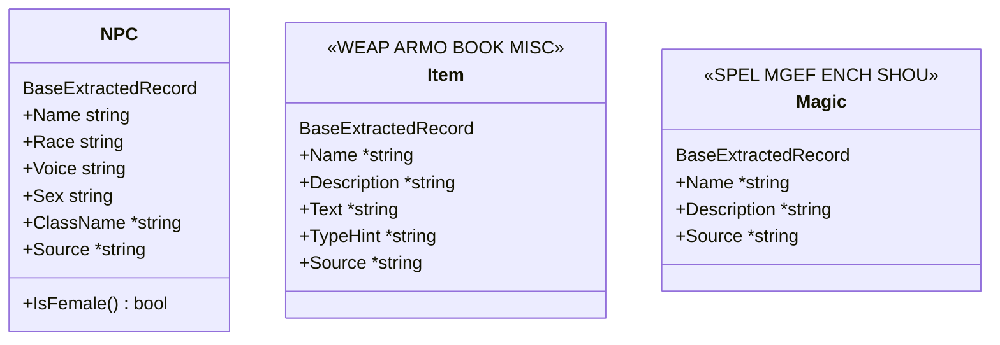
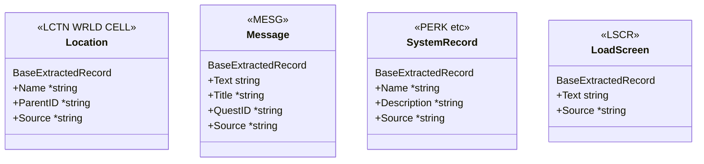
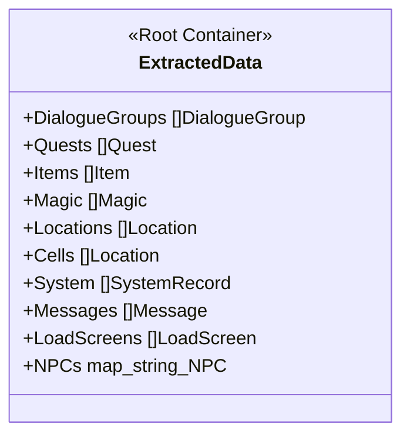

# データスキーマ クラス図

> Phase 1: Data Foundation
> Interface-First 設計に基づく Go Struct 移行
> ※ DSDRecord / Translatable は廃止し、ExtractedData を直接利用する

---

## 1. 共通埋め込み構造体

全ドメインモデルが上記を埋め込む。

---

## 2. ドメインモデル — 会話系

---

## 3. ドメインモデル — クエスト系

---

## 4. ドメインモデル — エンティティ系

---

## 5. ドメインモデル — その他

---

## 6. ルートコンテナ & 依存関係

---

## 凡例

| 記号           | 意味                  |
| -------------- | --------------------- |
| `*--`          | コンポジション (所有) |
| `<<embedded>>` | Go struct 埋め込み    |
