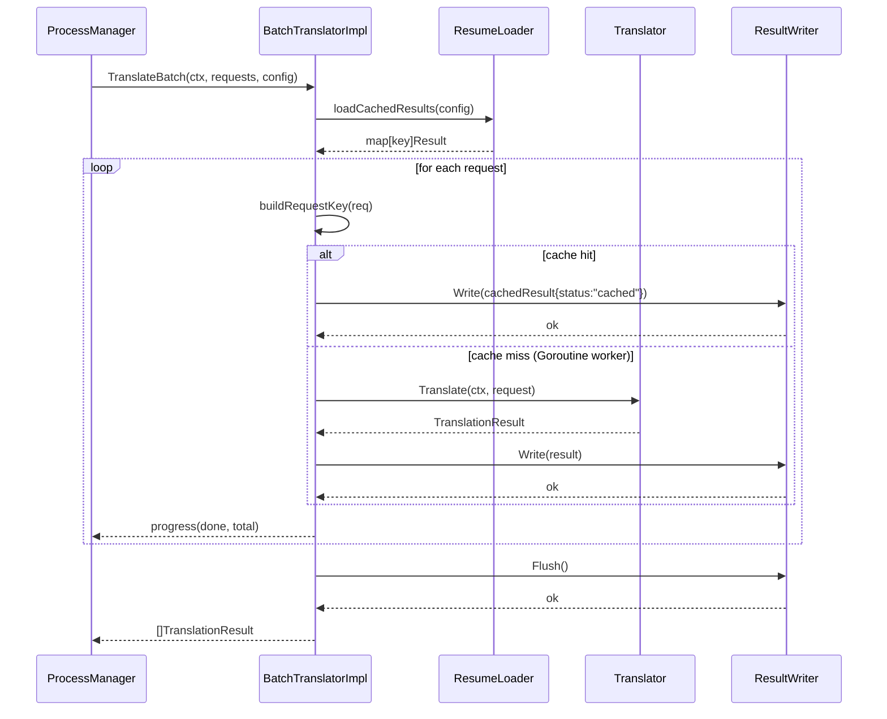
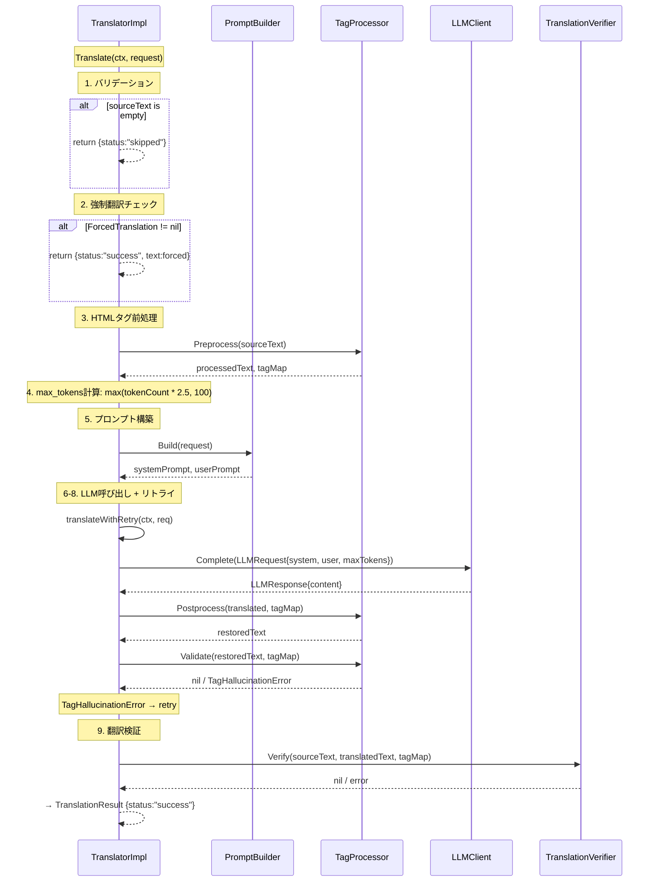
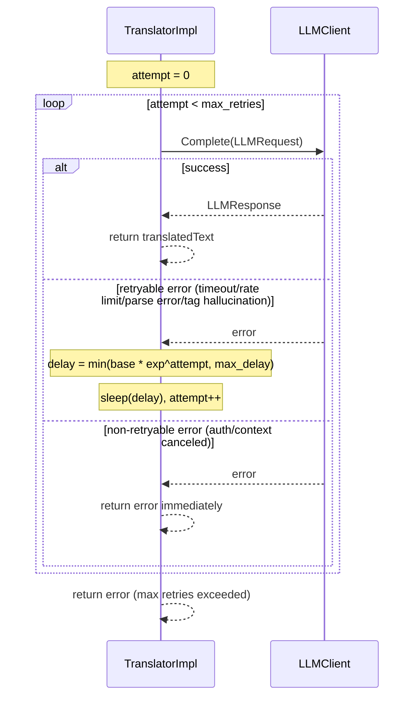
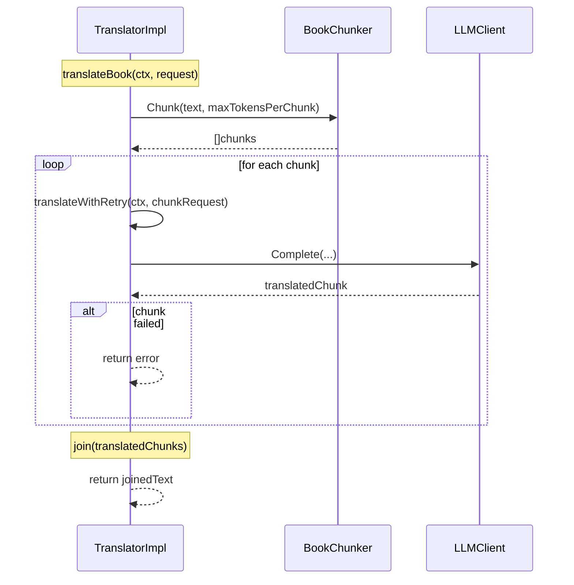
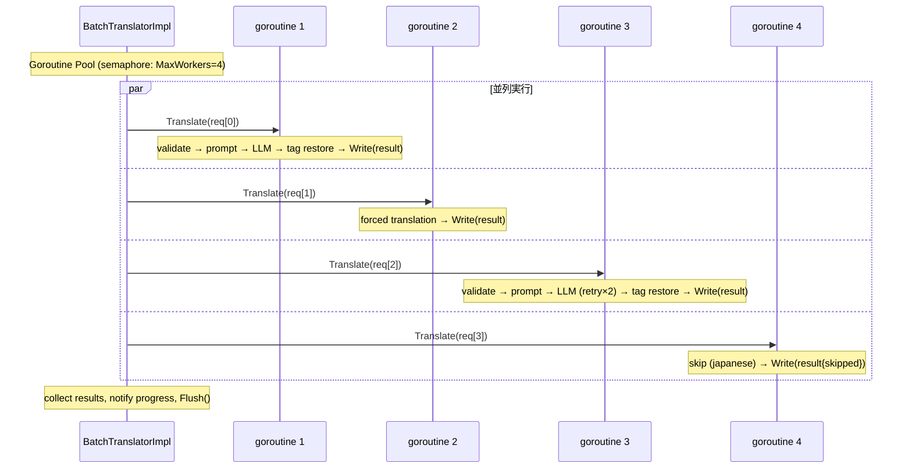
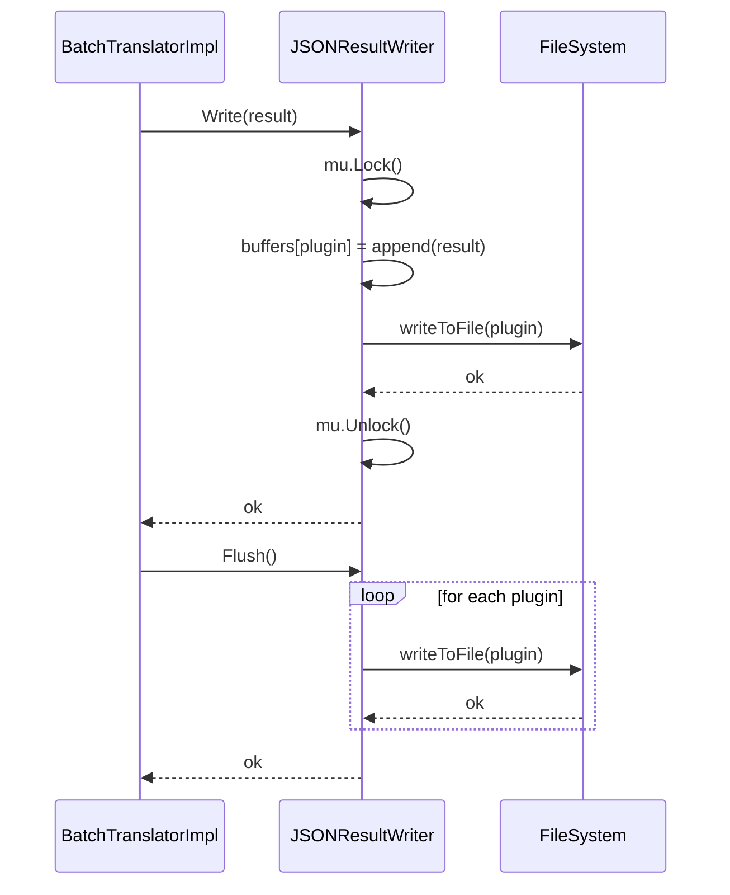

# 本文翻訳 シーケンス図

## 1. バッチ翻訳フロー（TranslateBatch）

```mermaid
sequenceDiagram
    participant PM as ProcessManager
    participant BT as BatchTranslatorImpl
    participant RL as ResumeLoader
    participant TR as Translator
    participant RW as ResultWriter

    PM->>BT: TranslateBatch(ctx, requests, config)
    BT->>RL: loadCachedResults(config)
    RL-->>BT: map[key]Result

    loop for each request
        BT->>BT: buildRequestKey(req)

        alt cache hit
            BT->>RW: Write(cachedResult{status:"cached"})
            RW-->>BT: ok
        else cache miss (Goroutine worker)
            BT->>TR: Translate(ctx, request)
            TR-->>BT: TranslationResult
            BT->>RW: Write(result)
            RW-->>BT: ok
        end

        BT-->>PM: progress(done, total)
    end

    BT->>RW: Flush()
    RW-->>BT: ok
    BT-->>PM: []TranslationResult
```

## 2. 単一リクエスト翻訳フロー（Translate）

```mermaid
sequenceDiagram
    participant TI as TranslatorImpl
    participant PB as PromptBuilder
    participant TP as TagProcessor
    participant LLM as LLMClient
    participant TV as TranslationVerifier

    Note over TI: Translate(ctx, request)

    Note over TI: 1. バリデーション
    alt sourceText is empty
        TI-->>TI: return {status:"skipped"}
    end

    Note over TI: 2. 強制翻訳チェック
    alt ForcedTranslation != nil
        TI-->>TI: return {status:"success", text:forced}
    end

    Note over TI: 3. HTMLタグ前処理
    TI->>TP: Preprocess(sourceText)
    TP-->>TI: processedText, tagMap

    Note over TI: 4. max_tokens計算: max(tokenCount * 2.5, 100)

    Note over TI: 5. プロンプト構築
    TI->>PB: Build(request)
    PB-->>TI: systemPrompt, userPrompt

    Note over TI: 6-8. LLM呼び出し + リトライ
    TI->>TI: translateWithRetry(ctx, req)
    TI->>LLM: Complete(LLMRequest{system, user, maxTokens})
    LLM-->>TI: LLMResponse{content}

    TI->>TP: Postprocess(translated, tagMap)
    TP-->>TI: restoredText

    TI->>TP: Validate(restoredText, tagMap)
    TP-->>TI: nil / TagHallucinationError

    Note over TI: TagHallucinationError → retry

    Note over TI: 9. 翻訳検証
    TI->>TV: Verify(sourceText, translatedText, tagMap)
    TV-->>TI: nil / error

    TI-->>TI: → TranslationResult {status:"success"}
```

## 3. リトライフロー（translateWithRetry）

```mermaid
sequenceDiagram
    participant TI as TranslatorImpl
    participant LLM as LLMClient

    Note over TI: attempt = 0

    loop attempt < max_retries
        TI->>LLM: Complete(LLMRequest)

        alt success
            LLM-->>TI: LLMResponse
            TI-->>TI: return translatedText
        else retryable error (timeout/rate limit/parse error/tag hallucination)
            LLM-->>TI: error
            Note over TI: delay = min(base * exp^attempt, max_delay)
            Note over TI: sleep(delay), attempt++
        else non-retryable error (auth/context canceled)
            LLM-->>TI: error
            TI-->>TI: return error immediately
        end
    end

    TI-->>TI: return error (max retries exceeded)
```

## 4. 書籍長文分割翻訳フロー（translateBook）

```mermaid
sequenceDiagram
    participant TI as TranslatorImpl
    participant BC as BookChunker
    participant LLM as LLMClient

    Note over TI: translateBook(ctx, request)

    TI->>BC: Chunk(text, maxTokensPerChunk)
    BC-->>TI: []chunks

    loop for each chunk
        TI->>TI: translateWithRetry(ctx, chunkRequest)
        TI->>LLM: Complete(...)
        LLM-->>TI: translatedChunk

        alt chunk failed
            TI-->>TI: return error
        end
    end

    Note over TI: join(translatedChunks)
    TI-->>TI: return joinedText
```

## 5. 並列実行モデル

```mermaid
sequenceDiagram
    participant BT as BatchTranslatorImpl
    participant W1 as goroutine 1
    participant W2 as goroutine 2
    participant W3 as goroutine 3
    participant W4 as goroutine 4

    Note over BT: Goroutine Pool (semaphore: MaxWorkers=4)

    par 並列実行
        BT->>W1: Translate(req[0])
        Note over W1: validate → prompt → LLM → tag restore → Write(result)
    and
        BT->>W2: Translate(req[1])
        Note over W2: forced translation → Write(result)
    and
        BT->>W3: Translate(req[2])
        Note over W3: validate → prompt → LLM (retry×2) → tag restore → Write(result)
    and
        BT->>W4: Translate(req[3])
        Note over W4: skip (japanese) → Write(result{skipped})
    end

    Note over BT: collect results, notify progress, Flush()
```

## 6. 逐次保存フロー（ResultWriter）

```mermaid
sequenceDiagram
    participant BT as BatchTranslatorImpl
    participant RW as JSONResultWriter
    participant FS as FileSystem

    BT->>RW: Write(result)
    RW->>RW: mu.Lock()
    RW->>RW: buffers[plugin] = append(result)
    RW->>FS: writeToFile(plugin)
    FS-->>RW: ok
    RW->>RW: mu.Unlock()
    RW-->>BT: ok

    BT->>RW: Flush()
    loop for each plugin
        RW->>FS: writeToFile(plugin)
        FS-->>RW: ok
    end
    RW-->>BT: ok
```
