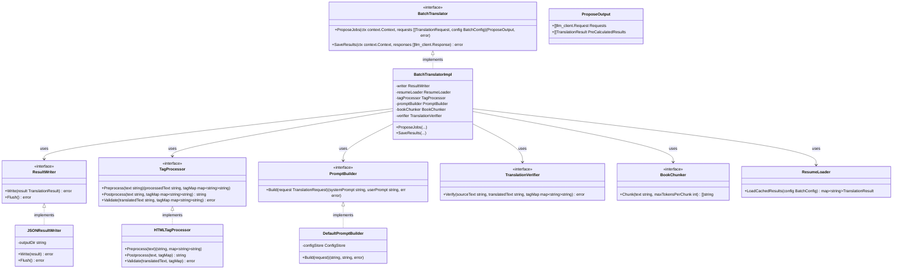
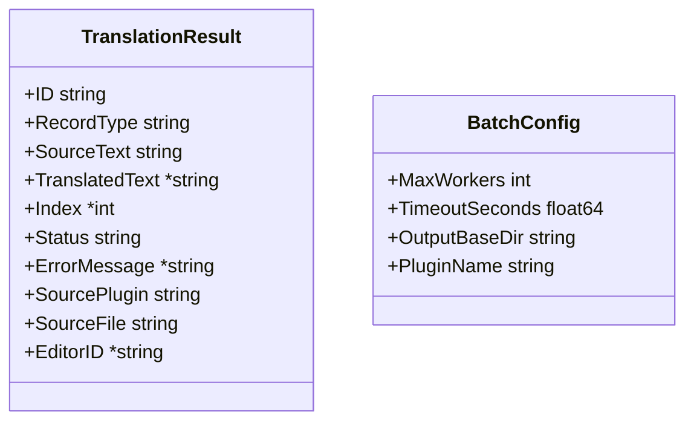

# 本文翻訳 クラス図

## クラス構成

## DTO定義

## アーキテクチャの補足：2フェーズモデル (Propose/Save)
本文翻訳（Pass 2）は膨大なレコードを扱うため、JobQueueおよびバッチAPIに最適化した2フェーズモデルを採用している。
- **Phase 1 (Propose)**: `TranslationRequest` を受け取り、差分更新チェック・タグ保護・プロンプト構築を行い、LLMジョブ（リクエスト群）を生成する。既訳やスキップ対象は即時結果として返す。
- **Phase 2 (Save)**: 外部で実行されたLLMのレスポンス群を受け取り、タグ復元・パース・バリデーションを行い、JSONファイルに逐次保存する。

スライス自身は並列通信を管理せず、リクエスト構築と結果の整合性担保（タグ復元等）および永続化に専念する。
