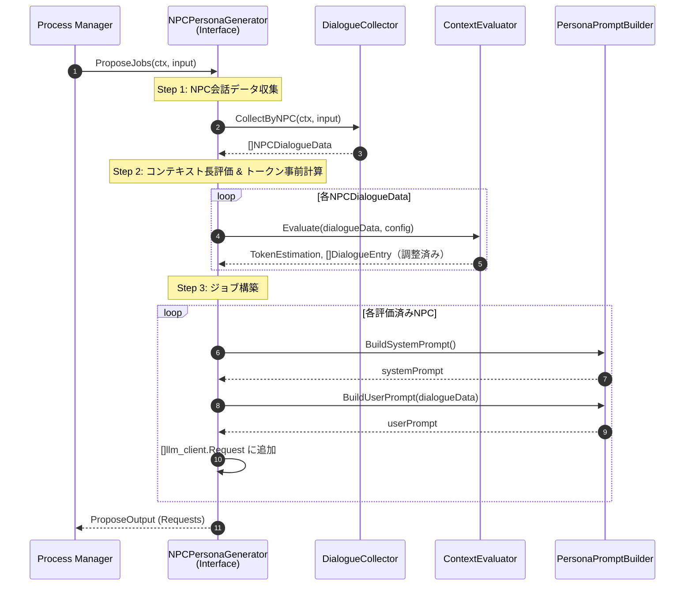
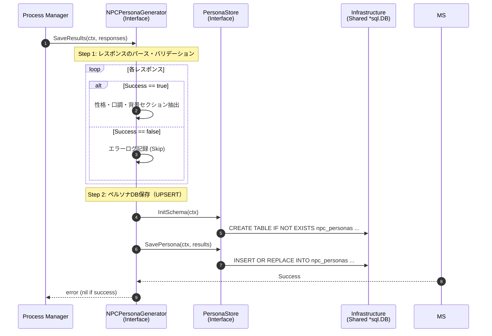
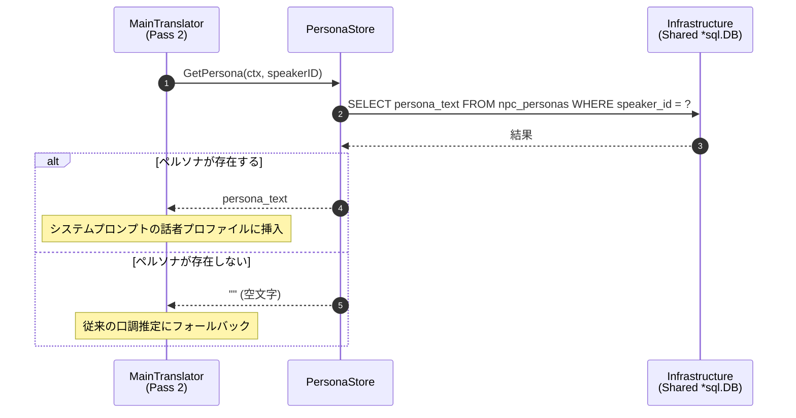

# NPCペルソナ生成 シーケンス図

## 1. ペルソナ生成メインフロー（2フェーズモデル）

2フェーズモデルでは、スライスは「ジョブ提案 (Phase 1)」と「結果保存 (Phase 2)」の2つの独立した Contract メソッドとして呼び出される。

### Phase 1: ペルソナ生成ジョブの提案 (Propose)

### Phase 2: ペルソナ生成結果の保存 (Save)

## 2. Pass 2 でのペルソナ参照フロー

