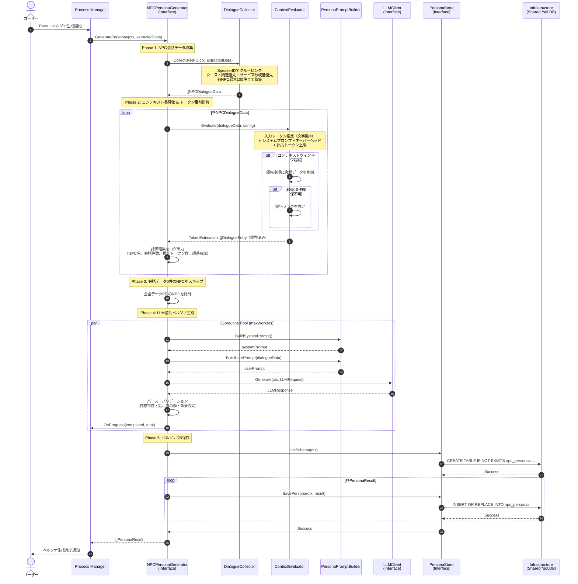
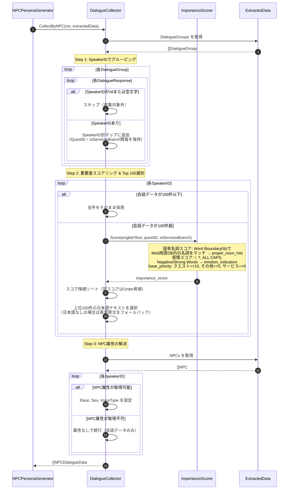
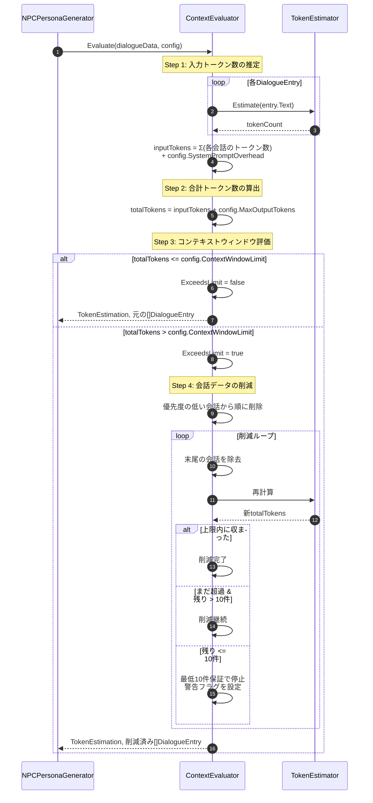
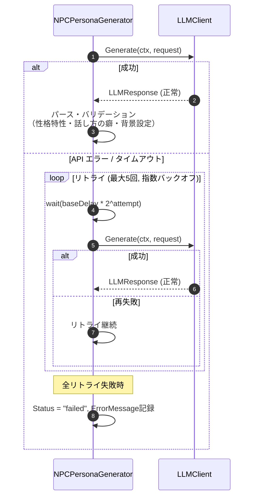
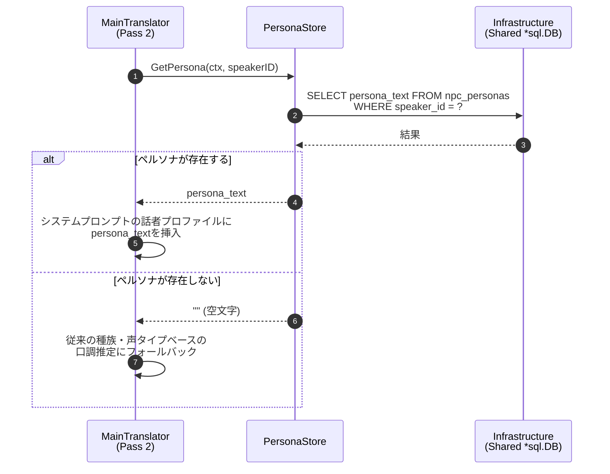

# NPCペルソナ生成 シーケンス図

## 1. ペルソナ生成メインフロー

```mermaid
sequenceDiagram
    autonumber
    actor User as ユーザー
    participant PM as Process Manager
    participant PG as NPCPersonaGenerator<br/>(Interface)
    participant DC as DialogueCollector
    participant CE as ContextEvaluator
    participant PB as PersonaPromptBuilder
    participant LLM as LLMClient<br/>(Interface)
    participant PS as PersonaStore<br/>(Interface)
    participant DB as Infrastructure<br/>(Shared *sql.DB)

    User->>PM: Pass 1 ペルソナ生成開始
    PM->>PG: GeneratePersonas(ctx, extractedData)

    Note over PG: Phase 1: NPC会話データ収集
    PG->>DC: CollectByNPC(ctx, extractedData)
    Note over DC: SpeakerIDでグルーピング<br/>クエスト関連優先・サービス分岐低優先<br/>各NPC最大100件まで収集
    DC-->>PG: []NPCDialogueData

    Note over PG: Phase 2: コンテキスト長評価 & トークン事前計算
    loop 各NPCDialogueData
        PG->>CE: Evaluate(dialogueData, config)
        Note over CE: 入力トークン推定（文字数/4）<br/>+ システムプロンプトオーバーヘッド<br/>+ 出力トークン上限
        alt コンテキストウィンドウ超過
            CE->>CE: 優先度順に会話データを削減
            alt 最低10件確保不可
                CE->>CE: 警告フラグを設定
            end
        end
        CE-->>PG: TokenEstimation, []DialogueEntry（調整済み）
        PG->>PG: 評価結果をログ出力<br/>（NPC名、会話件数、推定トークン数、超過有無）
    end

    Note over PG: Phase 3: 会話データ0件のNPCをスキップ
    PG->>PG: 会話データ0件のNPCを除外

    Note over PG: Phase 4: LLM並列ペルソナ生成
    par Goroutine Pool (maxWorkers)
        PG->>PB: BuildSystemPrompt()
        PB-->>PG: systemPrompt
        PG->>PB: BuildUserPrompt(dialogueData)
        PB-->>PG: userPrompt
        PG->>LLM: Generate(ctx, LLMRequest)
        LLM-->>PG: LLMResponse
        PG->>PG: パース・バリデーション<br/>（性格特性・話し方の癖・背景設定）
        PG->>PM: OnProgress(completed, total)
    end

    Note over PG: Phase 5: ペルソナDB保存
    PG->>PS: InitSchema(ctx)
    PS->>DB: CREATE TABLE IF NOT EXISTS npc_personas ...
    DB-->>PS: Success

    loop 各PersonaResult
        PG->>PS: SavePersona(ctx, result)
        PS->>DB: INSERT OR REPLACE INTO npc_personas
        DB-->>PS: Success
    end
    PS-->>PG: Success

    PG-->>PM: []PersonaResult
    PM-->>User: ペルソナ生成完了通知
```

## 2. 会話データ収集の詳細フロー

```mermaid
sequenceDiagram
    autonumber
    participant PG as NPCPersonaGenerator
    participant DC as DialogueCollector
    participant IS as ImportanceScorer
    participant ED as ExtractedData

    PG->>DC: CollectByNPC(ctx, extractedData)

    DC->>ED: DialogueGroups を取得
    ED-->>DC: []DialogueGroup

    Note over DC: Step 1: SpeakerIDでグルーピング
    loop 各DialogueGroup
        loop 各DialogueResponse
            alt SpeakerIDがnilまたは空文字
                DC->>DC: スキップ（収集対象外）
            else SpeakerIDあり
                DC->>DC: SpeakerID別マップに追加<br/>（QuestID・IsServicesBranch情報を保持）
            end
        end
    end

    Note over DC: Step 2: 重要度スコアリング & Top 100選別
    loop 各SpeakerID
        alt 会話データが100件以下
            DC->>DC: 全件をそのまま採用
        else 会話データが100件超
            DC->>IS: Score(englishText, questID, isServicesBranch)
            Note over IS: 固有名詞スコア: Word Boundary(\b)で<br/>Mod用語DB内の名詞をマッチ → proper_noun_hits<br/>感情スコア: !, ?, ALL CAPS,<br/>Negative/Strong Words → emotion_indicators<br/>base_priority: クエスト=+10, その他=+5, サービス=+0
            IS-->>DC: importance_score
            DC->>DC: スコア降順ソート（同スコアはOrder昇順）
            DC->>DC: 上位100件の日本語テキストを選択<br/>（日本語なしの場合は英語原文をフォールバック）
        end
    end

    Note over DC: Step 3: NPC属性の解決
    DC->>ED: NPCs を取得
    ED-->>DC: []NPC
    loop 各SpeakerID
        alt NPC属性が取得可能
            DC->>DC: Race, Sex, VoiceType を設定
        else NPC属性が取得不可
            DC->>DC: 属性なしで続行（会話データのみ）
        end
    end

    DC-->>PG: []NPCDialogueData
```

## 3. コンテキスト長評価の詳細フロー

```mermaid
sequenceDiagram
    autonumber
    participant PG as NPCPersonaGenerator
    participant CE as ContextEvaluator
    participant TE as TokenEstimator

    PG->>CE: Evaluate(dialogueData, config)

    Note over CE: Step 1: 入力トークン数の推定
    loop 各DialogueEntry
        CE->>TE: Estimate(entry.Text)
        TE-->>CE: tokenCount
    end
    CE->>CE: inputTokens = Σ(各会話のトークン数)<br/>+ config.SystemPromptOverhead

    Note over CE: Step 2: 合計トークン数の算出
    CE->>CE: totalTokens = inputTokens + config.MaxOutputTokens

    Note over CE: Step 3: コンテキストウィンドウ評価
    alt totalTokens <= config.ContextWindowLimit
        CE->>CE: ExceedsLimit = false
        CE-->>PG: TokenEstimation, 元の[]DialogueEntry
    else totalTokens > config.ContextWindowLimit
        CE->>CE: ExceedsLimit = true
        Note over CE: Step 4: 会話データの削減
        CE->>CE: 優先度の低い会話から順に削除
        loop 削減ループ
            CE->>CE: 末尾の会話を除去
            CE->>TE: 再計算
            TE-->>CE: 新totalTokens
            alt 上限内に収まった
                CE->>CE: 削減完了
            else まだ超過 & 残り > 10件
                CE->>CE: 削減継続
            else 残り <= 10件
                CE->>CE: 最低10件保証で停止<br/>警告フラグを設定
            end
        end
        CE-->>PG: TokenEstimation, 削減済み[]DialogueEntry
    end
```

## 4. リトライフロー

```mermaid
sequenceDiagram
    autonumber
    participant PG as NPCPersonaGenerator
    participant LLM as LLMClient

    PG->>LLM: Generate(ctx, request)

    alt 成功
        LLM-->>PG: LLMResponse (正常)
        PG->>PG: パース・バリデーション<br/>（性格特性・話し方の癖・背景設定）
    else API エラー / タイムアウト
        loop リトライ (最大5回, 指数バックオフ)
            PG->>PG: wait(baseDelay * 2^attempt)
            PG->>LLM: Generate(ctx, request)
            alt 成功
                LLM-->>PG: LLMResponse (正常)
            else 再失敗
                PG->>PG: リトライ継続
            end
        end
        Note over PG: 全リトライ失敗時
        PG->>PG: Status = "failed", ErrorMessage記録
    end
```

## 5. Pass 2でのペルソナ参照フロー

```mermaid
sequenceDiagram
    autonumber
    participant MT as MainTranslator<br/>(Pass 2)
    participant PS as PersonaStore
    participant DB as Infrastructure<br/>(Shared *sql.DB)

    MT->>PS: GetPersona(ctx, speakerID)
    PS->>DB: SELECT persona_text FROM npc_personas<br/>WHERE speaker_id = ?
    DB-->>PS: 結果

    alt ペルソナが存在する
        PS-->>MT: persona_text
        MT->>MT: システムプロンプトの話者プロファイルに<br/>persona_textを挿入
    else ペルソナが存在しない
        PS-->>MT: "" (空文字)
        MT->>MT: 従来の種族・声タイプベースの<br/>口調推定にフォールバック
    end
```
