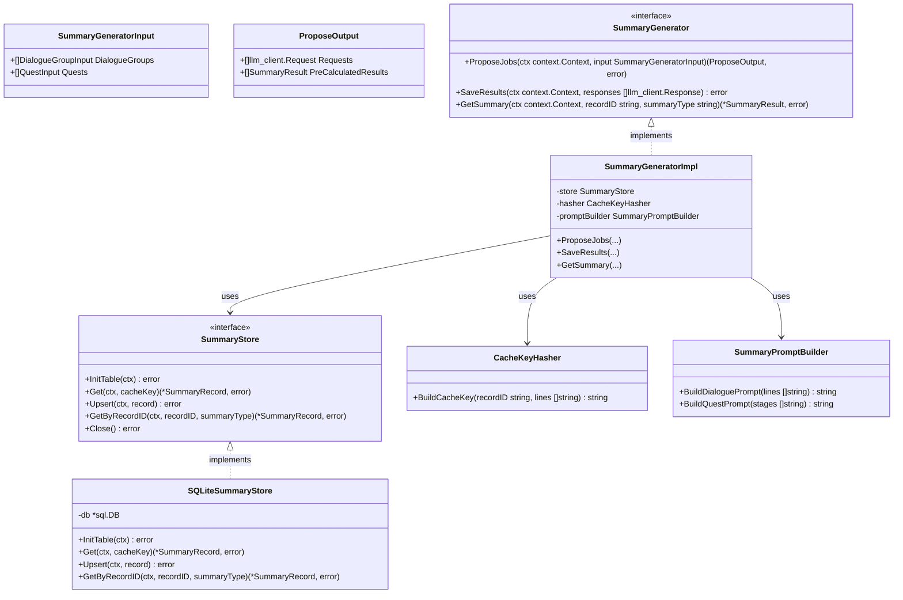
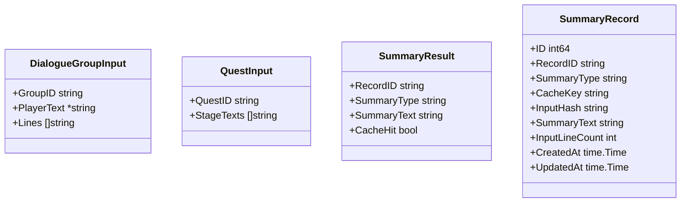

# 要約ジェネレータ クラス図

## クラス構成

## DTO定義

## アーキテクチャの補足：2フェーズモデル (Propose/Save)
本スライスはバッチAPIや長時間実行ジョブに対応するため、**「プロンプト生成(ProposeJobs)」**と**「結果保存(SaveResults)」**の2フェーズに分割されている。
- **Phase 1 (Propose)**: 入力データを解析し、キャッシュヒット判定を行う。既訳がない場合はLLMプロンプトを生成してリクエスト群として返す。既訳がある場合は即時結果として返す。
- **Phase 2 (Save)**: JobQueue等を通じて取得されたLLMのレスポンス群を受け取り、パースしてSQLiteキャッシュに永続化する。

スライス自身はLLM Clientを直接呼び出さず、呼び出し元のオーケストレーター（ProcessManager）が通信を制御する。
