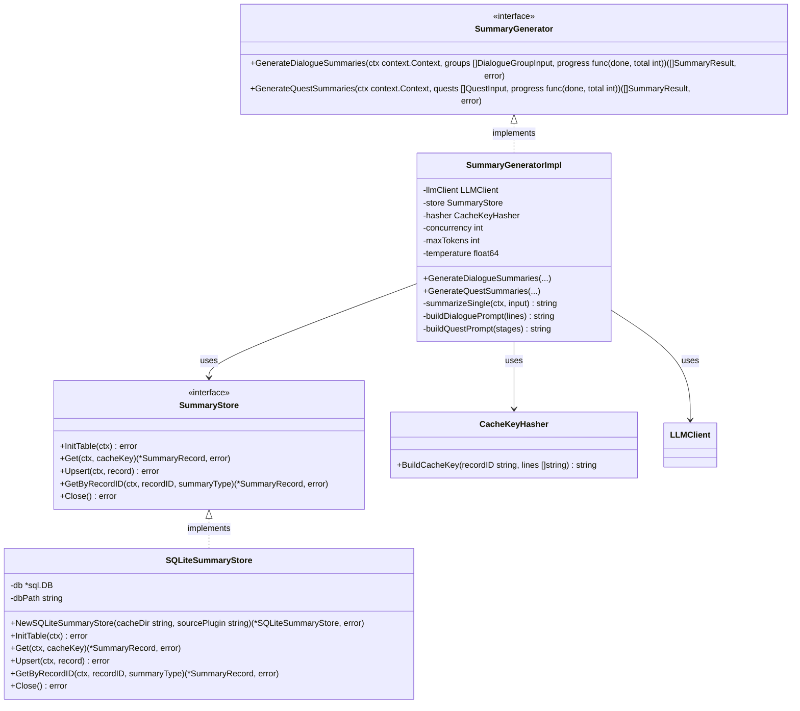
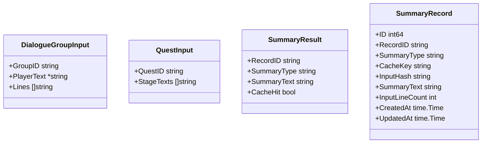

# 要約ジェネレータ クラス図

## クラス構成



## DTO定義



## ソースファイル単位キャッシュの構成

```
cache_dir/
├── Skyrim.esm_summary_cache.db        ← Skyrim.esm 用
│   └── summaries テーブル
├── Dawnguard.esm_summary_cache.db     ← Dawnguard.esm 用
│   └── summaries テーブル
└── MyMod.esp_summary_cache.db         ← MyMod.esp 用
    └── summaries テーブル
```

- `NewSQLiteSummaryStore(cacheDir, sourcePlugin)` がソースファイル名からDBファイルパスを決定し、接続を確立する。
- 命名規則: `{sourcePlugin}_summary_cache.db`
- 各DBファイルは独立しており、Mod単位での削除・再生成・配布が容易。

## 依存関係

- `SummaryGeneratorImpl` → `LLMClient` (共通インフラ): LLM呼び出し
- `SummaryGeneratorImpl` → `SummaryStore`: キャッシュの読み書き
- `SummaryGeneratorImpl` → `CacheKeyHasher`: キャッシュキー生成
- `SQLiteSummaryStore` → `*sql.DB` (内部生成): ソースファイル単位のDB接続
- Process Manager → `SummaryGenerator`: 要約生成の起動
