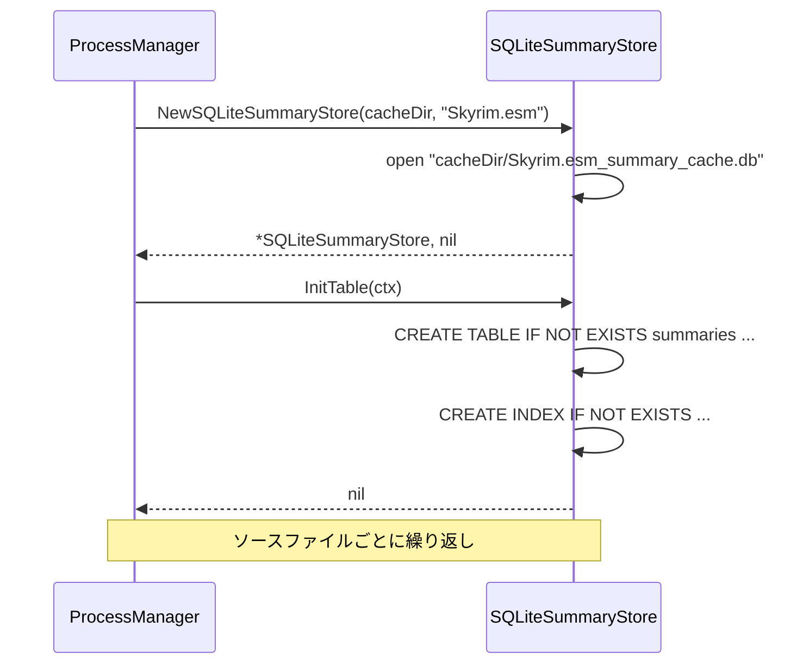
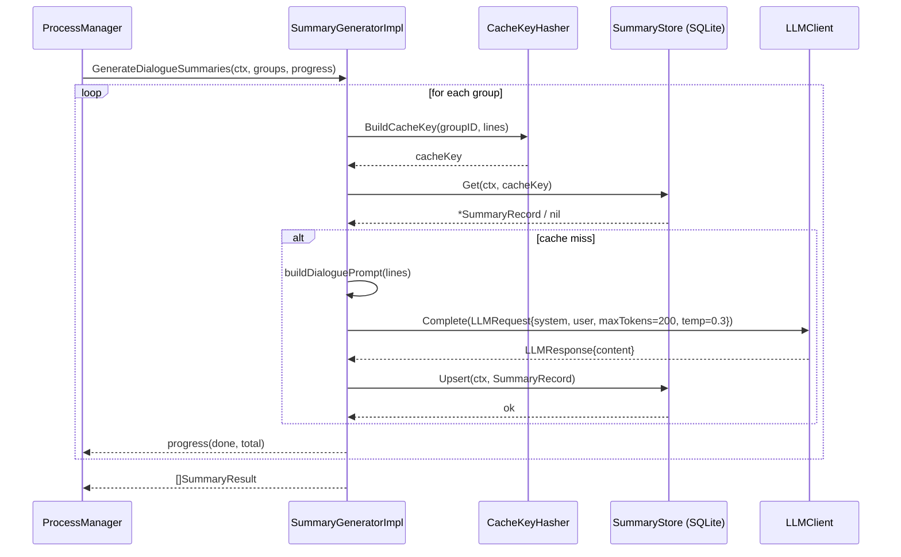
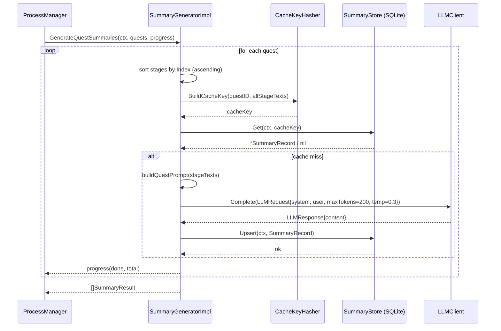
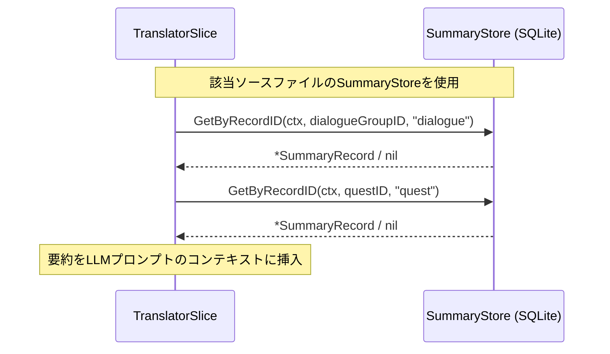
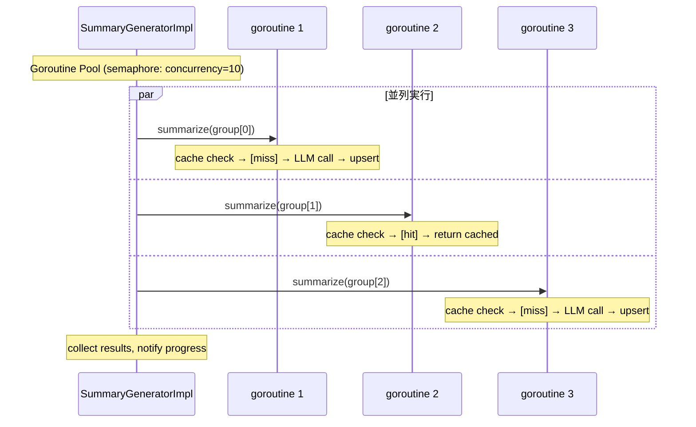

# 要約ジェネレータ シーケンス図

## 0. ソースファイル単位のStore初期化フロー

```mermaid
sequenceDiagram
    participant PM as ProcessManager
    participant SS as SQLiteSummaryStore

    PM->>SS: NewSQLiteSummaryStore(cacheDir, "Skyrim.esm")
    SS->>SS: open "cacheDir/Skyrim.esm_summary_cache.db"
    SS-->>PM: *SQLiteSummaryStore, nil

    PM->>SS: InitTable(ctx)
    SS->>SS: CREATE TABLE IF NOT EXISTS summaries ...
    SS->>SS: CREATE INDEX IF NOT EXISTS ...
    SS-->>PM: nil

    Note over PM,SS: ソースファイルごとに繰り返し
```

## 1. 会話要約生成フロー

```mermaid
sequenceDiagram
    participant PM as ProcessManager
    participant SG as SummaryGeneratorImpl
    participant CK as CacheKeyHasher
    participant SS as SummaryStore (SQLite)
    participant LLM as LLMClient

    PM->>SG: GenerateDialogueSummaries(ctx, groups, progress)

    loop for each group
        SG->>CK: BuildCacheKey(groupID, lines)
        CK-->>SG: cacheKey

        SG->>SS: Get(ctx, cacheKey)
        SS-->>SG: *SummaryRecord / nil

        alt cache miss
            SG->>SG: buildDialoguePrompt(lines)
            SG->>LLM: Complete(LLMRequest{system, user, maxTokens=200, temp=0.3})
            LLM-->>SG: LLMResponse{content}
            SG->>SS: Upsert(ctx, SummaryRecord)
            SS-->>SG: ok
        end

        SG-->>PM: progress(done, total)
    end

    SG-->>PM: []SummaryResult
```

## 2. クエスト要約生成フロー（累積的処理）

```mermaid
sequenceDiagram
    participant PM as ProcessManager
    participant SG as SummaryGeneratorImpl
    participant CK as CacheKeyHasher
    participant SS as SummaryStore (SQLite)
    participant LLM as LLMClient

    PM->>SG: GenerateQuestSummaries(ctx, quests, progress)

    loop for each quest
        SG->>SG: sort stages by Index (ascending)

        SG->>CK: BuildCacheKey(questID, allStageTexts)
        CK-->>SG: cacheKey

        SG->>SS: Get(ctx, cacheKey)
        SS-->>SG: *SummaryRecord / nil

        alt cache miss
            SG->>SG: buildQuestPrompt(stageTexts)
            SG->>LLM: Complete(LLMRequest{system, user, maxTokens=200, temp=0.3})
            LLM-->>SG: LLMResponse{content}
            SG->>SS: Upsert(ctx, SummaryRecord)
            SS-->>SG: ok
        end

        SG-->>PM: progress(done, total)
    end

    SG-->>PM: []SummaryResult
```

## 3. Pass 2 参照フロー

```mermaid
sequenceDiagram
    participant TS as TranslatorSlice
    participant SS as SummaryStore (SQLite)

    Note over TS,SS: 該当ソースファイルのSummaryStoreを使用

    TS->>SS: GetByRecordID(ctx, dialogueGroupID, "dialogue")
    SS-->>TS: *SummaryRecord / nil

    TS->>SS: GetByRecordID(ctx, questID, "quest")
    SS-->>TS: *SummaryRecord / nil

    Note over TS: 要約をLLMプロンプトのコンテキストに挿入
```

## 4. 並列実行モデル

```mermaid
sequenceDiagram
    participant SG as SummaryGeneratorImpl
    participant W1 as goroutine 1
    participant W2 as goroutine 2
    participant W3 as goroutine 3

    Note over SG: Goroutine Pool (semaphore: concurrency=10)

    par 並列実行
        SG->>W1: summarize(group[0])
        Note over W1: cache check → [miss] → LLM call → upsert
    and
        SG->>W2: summarize(group[1])
        Note over W2: cache check → [hit] → return cached
    and
        SG->>W3: summarize(group[2])
        Note over W3: cache check → [miss] → LLM call → upsert
    end

    Note over SG: collect results, notify progress
```
