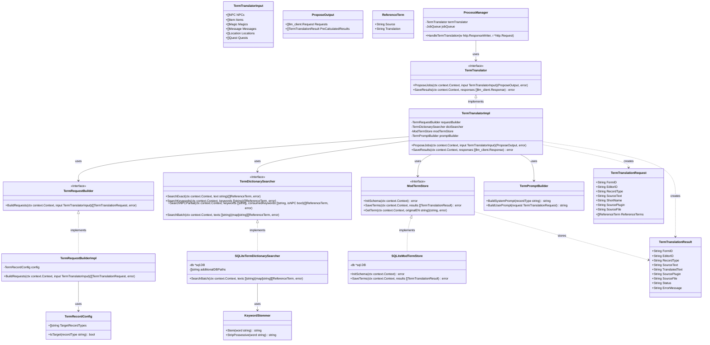

# 用語翻訳・Mod用語DB保存 クラス図

## アーキテクチャの補足：2フェーズモデル (Propose/Save)
本スライスはバッチAPIや長時間実行ジョブに対応するため、**「プロンプト生成(ProposeJobs)」**と**「結果保存(SaveResults)」**の2フェーズに分割されている。
- **Phase 1 (Propose)**: 入力データを解析し、辞書検索の結果に基づいたコンテキストを含むLLMリクエストを生成する。既訳がある場合はLLMを介さず即時結果として返す。
- **Phase 2 (Save)**: JobQueue等を通じて取得されたLLMのレスポンス群を受け取り、パースしてMod用語DBに永続化する。

スライス自身はLLM Clientを直接呼び出さず、呼び出し元のオーケストレーター（ProcessManager）がリクエストの実行順序や並列度を制御する。
