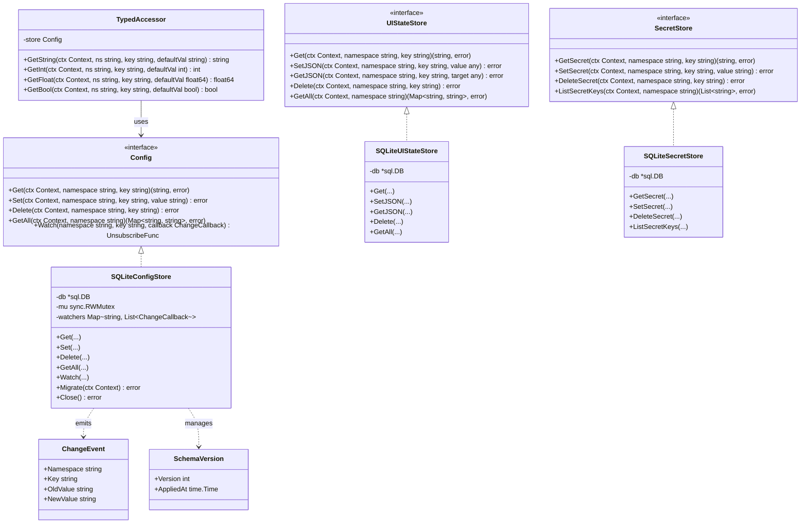

# 設定・レイアウト保存インフラ クラス図 (Config Class Diagram)

## 主要エンティティの説明

### Config (Interface)
バックエンド設定値の読み書き・削除・監視を行うコアインターフェース。名前空間とキーの組み合わせで**プレーン文字列**を管理する。JSON値の格納は許可しない。

### UIStateStore (Interface)
UIレイアウトやUI設定等、フロントエンド固有の状態を管理するインターフェース。**JSON形式の構造化データ**を格納できる。バックエンドはこのデータを解釈せず、透過的に保存・返却する。

### SecretStore (Interface)
APIキー等の機密情報を管理するインターフェース。`Config`とテーブルを分離し、将来的な暗号化やOS Keychain連携への拡張ポイントとする。

### TypedAccessor
`Config`をラップし、`GetString`, `GetInt`, `GetFloat`, `GetBool`の型安全なアクセスとデフォルト値を提供するヘルパー。`config`テーブル専用であり、JSON操作は含まない。

### SQLiteConfigStore / SQLiteUIStateStore / SQLiteSecretStore
SQLiteを用いた具体的な永続化実装。`SQLiteConfigStore`は変更通知（Watch）機能を内蔵し、設定変更時にコールバックを発火する。

### ChangeEvent
設定変更時に通知されるイベント。変更前後の値を含む。
