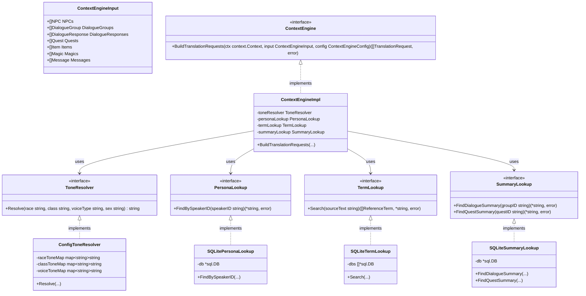
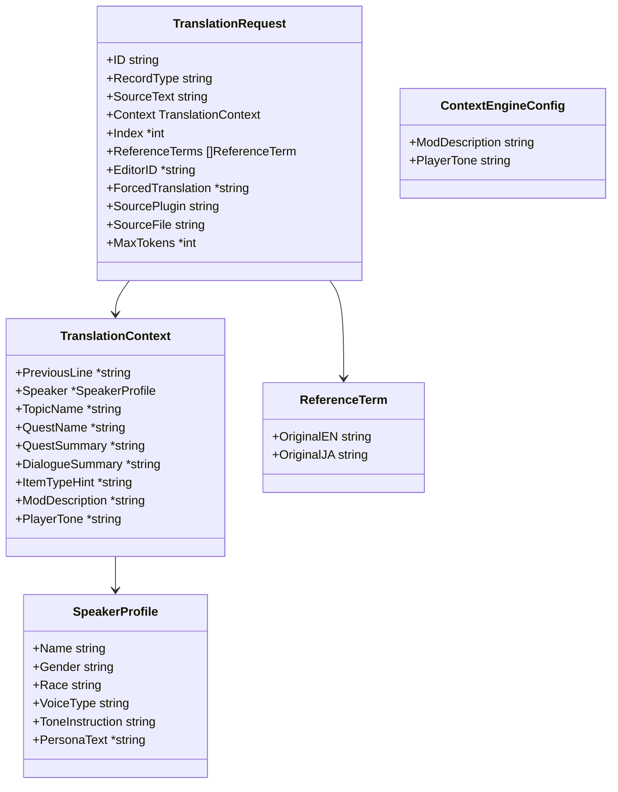

# コンテキストエンジン クラス図

## クラス構成

## DTO定義

## 依存関係
- `ContextEngineImpl` → `ToneResolver`: 属性からの口調指示生成
- `ContextEngineImpl` → `PersonaLookup`: 保存済みNPCペルソナの検索 (Phase 1)
- `ContextEngineImpl` → `TermLookup`: 既訳辞書からの用語抽出・強制翻訳判定 (Phase 1)
- `ContextEngineImpl` → `SummaryLookup`: 保存済み要約の検索 (Phase 1)
- Process Manager → `ContextEngine`: 翻訳ジョブ（リクエスト群）の構築
