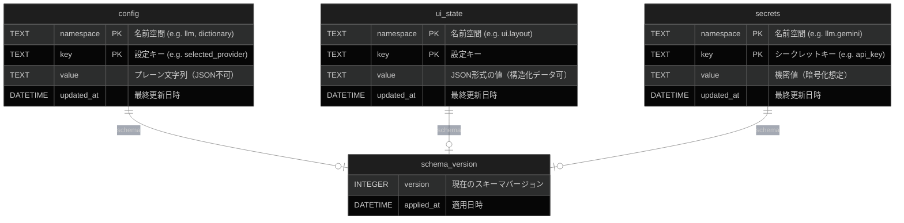
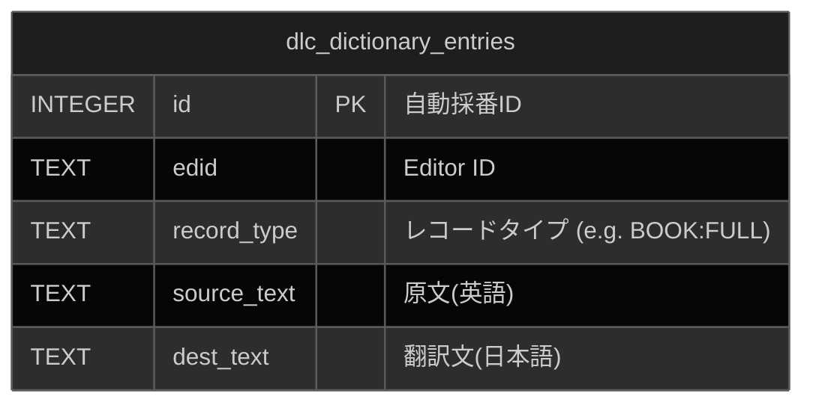
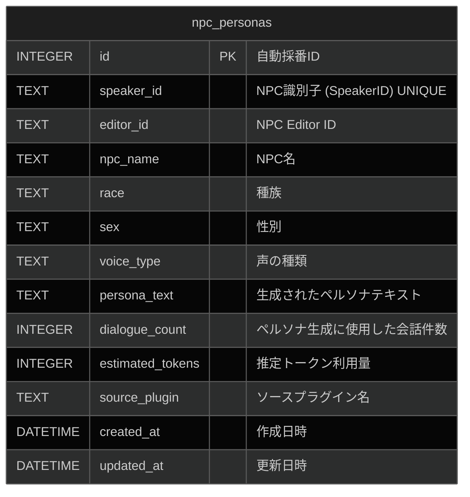
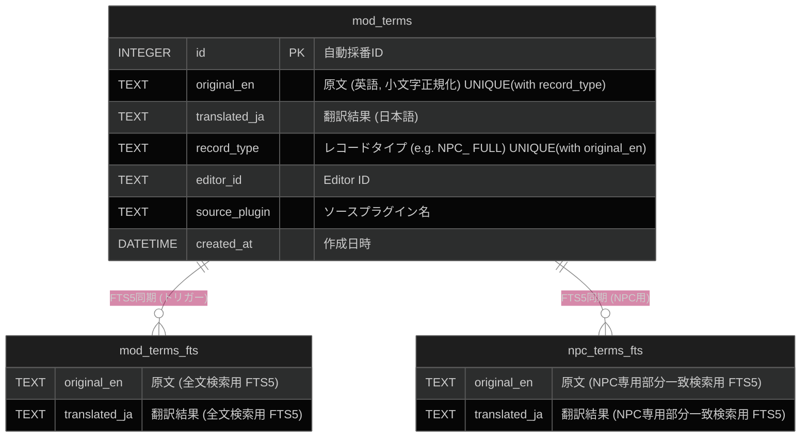
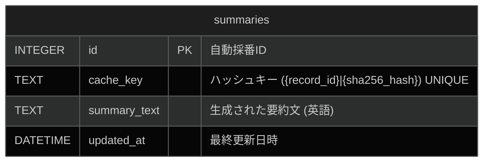
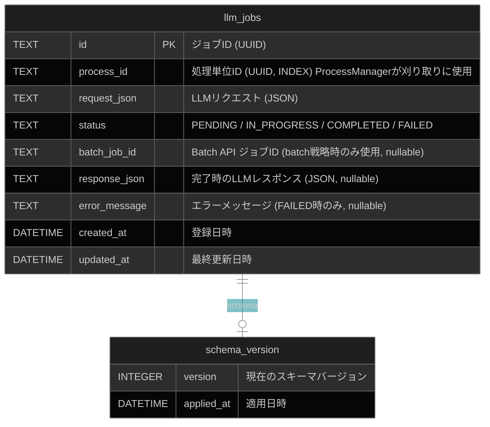
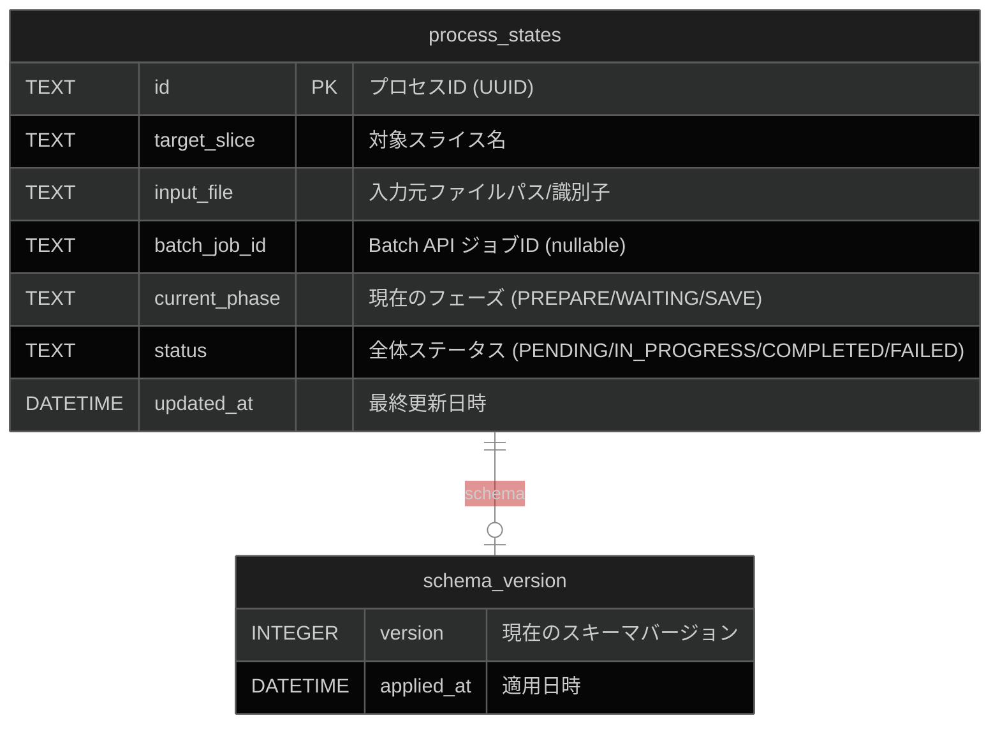

# データベースER図

Interface-First AIDD v2アーキテクチャおよびVertical Slice Architecture (VSA)に従った、各Sliceのデータベース設計を以下に示します。各Sliceは独自の責務範囲に応じて、独立したコンテキスト（ファイル・テーブル群）として管理されます。

## config (設定・レイアウト保存)

共通の設定やUI状態を永続化するインフラストラクチャ層のコンテキストです。
**データベース名:** `config.db` (システム設定・全Mod共通)

## dictionary (辞書構築)

公式DLCや基本辞書など、xTranslatorフォーマットから構築される汎用辞書データのコンテキストです。
**データベース名:** `dictionary.db` (システム辞書・全Mod共通)

## persona (ペルソナ生成)

NPCの会話履歴から生成された性格や口調のペルソナ情報を管理するコンテキストです。
**データベース名:** `{PluginName}_persona.db` (生成元Mod専用データベース・テーブル同居)

## terminology (Mod用語翻訳)

対象Mod固有の固有名詞翻訳結果と、その部分一致検索用のFTS（全文検索）テーブルを管理するコンテキストです。
**データベース名:** `{PluginName}_terms.db` (翻訳対象Mod専用データベース)

## summary (要約キャッシュ)

会話やクエストの背景情報をLLMで要約し、再利用するためのキャッシュを管理するコンテキストです。
**データベース名:** `{PluginName}_summary_cache.db` (ソースプラグイン別)

## queue (LLMジョブキュー)

インフラ層の汎用ジョブキュー。ドメイン知識を一切持たず、`ProcessID` と `Request` のペアを永続化します。完了済みジョブはスライスへの結果渡し後に即時物理削除（Hard Delete）されるため、テーブルは常に最小サイズを維持します。
**データベース名:** `llm_jobs.db` (インフラ専用・全Mod共通)

## pipeline (進行状態管理)

各スライスの実行状態やJobQueueとの紐付けを管理し、プロセスのレジューム（再開）を可能にするコンテキストです。
**データベース名:** `pipeline.db` (管理用データベース)

## 補足事項
- **Vertical Slice Architecture の原則**: VSAの原則（Architecture Section 5）に基づき、上記テーブルはDRY原則を避け「あえて分断」されています。各Slice（`config`, `dictionary`, `persona`, `terminology`）は自身が必要とするテーブルのみに依存し、他Sliceのテーブルに直接クエリを発行することはありません。
